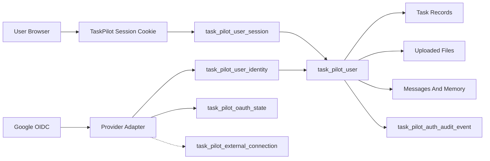
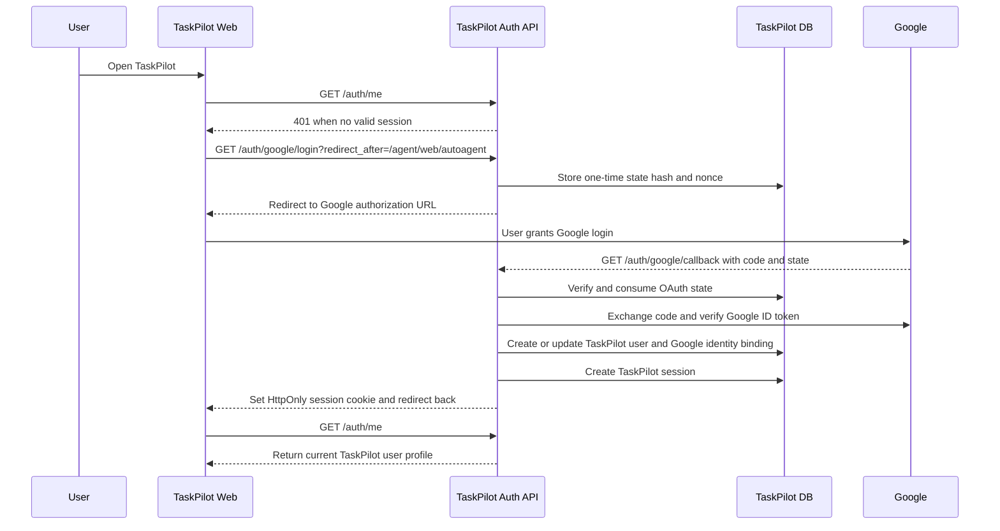
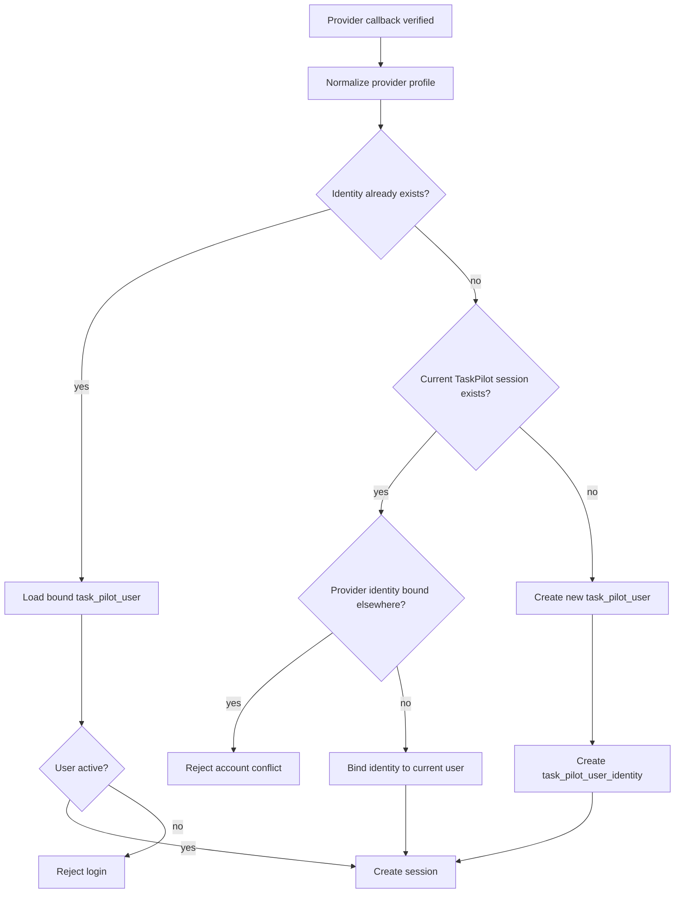
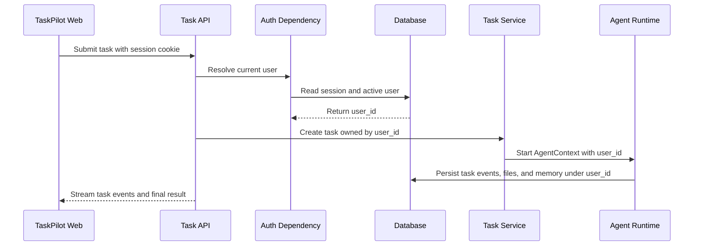

# AGENTS.md

This file guides Codex when working in this repository. All future architecture design, feature development, testing, and delivery should follow these conventions first.

## Project Overview

TaskPilotAgent is a Python and FastAPI based general-purpose Agent orchestration framework. It already supports task planning, tool calls, result summarization, multiple model providers, and MCP-based tool aggregation.

Current capabilities include:

- Multi-model access: OpenAI, Claude/Codex, Gemini, and OpenAI-compatible services.
- ReAct/Supervisor is the only active Agent runtime path. The old `plans_executor` compatibility path has been removed.
- MCP tool aggregation, including local MCP tools and remote MCP services.
- SSE streaming output, so the web UI can show plans, reasoning, tool calls, tool results, and final answers in real time.
- Basic file, message, memory, RAG, and report generation capabilities.
- User identity, external login, session, task ownership, file ownership, audit, and frontend account entry for Google login.

## Product Direction

TaskPilotAgent should not be limited to coding tasks. It should become a general-purpose Agent product that can solve many kinds of work: research, file processing, data analysis, browser tasks, report generation, automation workflows, code changes, and long-running tasks.

Future architecture should follow this main product path:

```text
External User / Identity Provider
  -> Identity / Auth Layer
  -> User Entry
  -> Task System
  -> Agent Core
  -> Skill / Tool System
  -> Sandbox Runtime
  -> Memory / Knowledge Base
  -> Logs / Replay / Evaluation
  -> Permission / Risk Control
```

Do not hard-code assumptions that the general layer only serves code tasks. Only modules that are explicitly code-specific should use code-task-specific design.

## User Identity And Auth Architecture

Implementation status as of 2026-05-31:

- Google login is the enabled provider for the current release.
- The provider layer is generic. Microsoft and WeChat adapters exist but stay disabled by config until product work enables them.
- TaskPilot owns the internal user ID. External providers only prove identity and bind to a TaskPilot user.
- Protected web, API, task, and file operations must resolve the current TaskPilot user before doing work.
- Agent prompts, task events, tool arguments, logs, and frontend responses must not expose provider tokens, session cookies, OAuth codes, OAuth state values, or OAuth client secrets.

Core relationship:



Google login sequence:



Provider identity mapping:



Authenticated task request sequence:



Ownership and isolation rules:

- Task create, list, detail, events, cancel, retry, delete, artifact access, and follow-up input must use the authenticated `user_id`.
- File upload, preview, download, and metadata lookup must use the authenticated `user_id`.
- Normal frontend requests must not send or trust a user-provided `user_id`.
- If auth is required, missing or invalid sessions must return 401 before task or file work starts.
- Local development may use the dev fallback only when auth is explicitly disabled.
- Legacy user mapping must be deliberate. Do not auto-attach old anonymous tasks to a new provider account by email.
- Future provider API access, such as Google Drive or Gmail, must use `task_pilot_external_connection` and must stay separate from login identity.

## Implementation Order

Implement framework work in the order below. Avoid starting from the middle of the stack, because that creates rework.

### Phase 0: User Identity And Auth

This phase is implemented for Google login and must remain the entry guard for protected user work.

Completion criteria:

- External provider login maps to exactly one internal TaskPilot user.
- Sessions are persisted, revocable, and verified before protected work starts.
- Tasks, files, messages, memory, and artifacts are scoped by authenticated user.
- Login state is one-time, persisted, and verified before token exchange.
- Auth audit records can answer who logged in, logged out, bound identities, unbound identities, disabled users, or deleted users.
- Production startup fails clearly when auth is required but required provider config is missing.

### Phase 1: Task System

Build task records, task events, status transitions, final output, and error persistence first. All Agents, tools, and web views must attach to a task ID.

Completion criteria:

- A task is created before user work starts.
- A task has explicit status.
- Process events are persisted.
- Successful results and failure reasons can be replayed.

### Phase 2: Tool Registry And ToolGateway

Unify built-in tools, MCP tools, and extension tools. Agents must not call tools directly; they must go through ToolGateway.

Completion criteria:

- Tools have unified descriptions and schemas.
- ToolGateway filters tools by Agent and permission policy.
- Tool calls and tool results are written to task events.
- Tool errors, timeouts, and redaction are handled consistently.

### Phase 3: Directory-Based Agent Config Loading

Read `config/agents/{agent_id}/agent.yaml`, `system_prompt.md`, and `evals.yaml`, then build AgentSpec and register it in AgentRegistry.

Completion criteria:

- Configs load at startup.
- Config errors are reported clearly.
- AgentRegistry can list available Agents.
- System prompt, tools, permissions, and handoffs come from directory config.

### Phase 4: Planning Through `builtin:plan_tool`

Keep planning as a tool callable by ReAct/Supervisor.

Completion criteria:

- Plans can be created, read, and updated.
- Steps can be marked running, completed, or failed.
- Plan changes are written to task events.
- Do not reintroduce the removed standalone `plans_executor` flow.

### Phase 5: ReAct/Supervisor Main Runtime

Supervisor selects the target Agent from the task and AgentRegistry. Worker Agents call tools through ToolGateway. Complex tasks can call `builtin:plan_tool` when needed.

Completion criteria:

- Supervisor can select an Agent.
- Agents can hand off work.
- Each Agent only sees its allowed tools.
- Agent start, completion, failure, and handoff events are written to task events.

### Phase 6: Web Task Page

Upgrade the web UI from a chat debugging page into a task product page.

Completion criteria:

- Task creation page exists.
- Task list page exists.
- Task detail page exists.
- Detail page shows timeline, current Agent, tool calls, tool results, final output, and errors.

### Phase 7: Sandbox, Permissions, And Evaluation

Add per-task work directories, high-risk approval, permission policies, Agent smoke tests, and regression task sets.

Completion criteria:

- High-risk tools have approval or explicit policy.
- Tools cannot escape the task work directory.
- Agent config changes can run matching evals.
- Common task types have regression examples.

## Target Architecture Principles

### 1. User Entry

User entry includes the web UI, API, future webhooks, external channels, and internal automation entry points. This layer receives and normalizes requests only. It should not contain core execution logic.

Requirements:

- Web and API must use the same task model and status model.
- After a task is created, the user can leave and later return to the latest status.
- SSE/WebSocket are real-time display channels, not the source of truth for task status.
- Entry must preserve user ID, Agent ID, conversation ID, files, run mode, output style, and related metadata.

### 2. Task System

The task system is the product backbone. One Agent run must be a durable, queryable, replayable task, not just one HTTP request or one SSE stream.

The task system should support:

- Create, list, detail, cancel, retry, and query tasks.
- Status values: `queued`, `running`, `waiting_input`, `completed`, `failed`, `cancelled`.
- Persist input, output, error, duration, owner user, run mode, metadata, and usage metrics.
- Persist event timelines: plans, step changes, tool calls, tool results, logs, files, user follow-up input, and final output.
- Support background execution, so long tasks can continue after browser disconnection.

When adding Agent behavior, it must attach to a task ID and continuously report task events.

### 3. Agent Core

Agent Core handles reasoning, planning, execution orchestration, and summarization. It should not be tightly coupled to FastAPI routes, browser connections, or a specific page.

Main runtime direction:

- ReAct/Supervisor is the unified runtime.
- Planning is no longer expanded as an independent main mode. It should be a callable tool inside ReAct/Supervisor.
- Support multiple output styles: markdown, HTML, tables, PPT, and GAIA-style output.

Requirements:

- Important status changes must emit events.
- Tool calls and tool results must be recorded as structured data.
- Errors must become task errors with enough context for replay and debugging.
- New Agent modes need focused tests and must not break existing modes.

### 3.1 Planning Capability

Planning should enter ReAct/Supervisor as a tool, not keep growing as an independent execution framework.

Recommended tool name: `builtin:plan_tool`.

`plan_tool` should support at least:

- `create_plan`: create a plan.
- `update_plan`: update a plan based on new information.
- `get_plan`: read the current plan.
- `mark_step_running`: mark a step as started.
- `mark_step_completed`: mark a step as completed.
- `mark_step_failed`: mark a step as failed.
- `finish_plan`: finish the plan.

Recommended flow:

```text
ReAct/Supervisor Agent
  -> decide whether the task needs planning
  -> call builtin:plan_tool when planning is useful
  -> call tools or hand off to worker Agents according to the plan
  -> call builtin:plan_tool again when the plan changes
  -> call summary/review to produce the final result
```

Do not reintroduce a standalone plan-solve runtime as a ReAct tool. That creates nested execution layers and makes status, logs, cancellation, errors, and web replay hard to unify.

Good cases for `plan_tool`:

- Multi-step tasks.
- Long-running tasks.
- Multi-Agent collaboration.
- Tasks where the user needs to review plan and progress.
- Tasks that need replanning after failure.
- Tasks that need final reports or structured deliverables.

Cases where planning should not be forced:

- Simple Q&A.
- Single tool call.
- Small tasks clearly handled by one worker Agent.
- Short tasks that do not need process replay.

### 4. Skill / Tool System

Skills and tools are product capabilities, not only function calls. They need clear descriptions, inputs, permissions, logs, and tests.

Requirements:

- Every tool must have a stable name, description, input schema, output schema, and failure behavior.
- Before exposing tools to the model, filter them by user, Agent, task type, and policy.
- Every tool call must record tool name, argument summary, result summary, duration, and failure status.
- Secrets, tokens, cookies, and other sensitive values must be redacted from logs, events, and pages.
- New tools must have at least one representative test. If local testing is not possible, explain why.
- The default general Agent must have basic file capabilities: read file, write file, list directory, stat file, create directory, copy, move, and delete.
- File read can read user-provided local paths. Write, delete, and move tools must be restricted to the task work directory by default.
- Shell or command execution is high risk. It must be controlled by tool policy and permission flags, and must not be exposed by default.
- Local MCP tools are exposed without the old `mcp_local` prefix, for example `file_read`; remote MCP tool names can still use source-prefixed colon or hyphen forms such as `mcp_world:web_search` or `mcp_world-web_search`, and policy matching must support both remote forms.

### 5. Sandbox Runtime

Any capability that executes code, shell commands, browser automation, file modification, or remote actions must have an explicit runtime boundary.

Requirements:

- Prefer one isolated work directory per task.
- Generated files and artifacts must attach to the task record.
- Tools must not silently write outside expected workspaces.
- High-risk operations must pass policy checks first.
- Long-running operations need timeout, cancellation, and progress events.

### 6. Memory / Knowledge Base

Memory and knowledge retrieval improve task capability, but they do not replace task records.

Requirements:

- Session memory, task history, uploaded files, and knowledge retrieval must have clear ownership and scope.
- Retrieval results used by Agents should be traceable in task events or final evidence.
- Memory writes must be intentional and testable.
- If memory or RAG is unavailable, the Agent should degrade gracefully instead of crashing.

### 7. Logs / Replay / Evaluation

A general-purpose Agent product must be replayable. After a task is complete, the user should still be able to see what happened, which tools were called, where it failed, and what it produced.

Requirements:

- Persist the task timeline; do not rely only on temporary SSE messages.
- Tool calls, tool results, model phases, errors, and output artifacts must be replayable in the UI.
- Add regression tests for task status, tool events, streaming output, and final answers.
- Maintain representative eval tasks covering research, file processing, data analysis, browser use, code work, and report generation.

### 8. Permission / Risk Control

Permissions and safety are product requirements, not cleanup work before release.

Requirements:

- Tools exposed to the model must pass allow-list filtering.
- High-risk tools need deny lists, approval, or explicit flags.
- Secrets must be redacted from events, logs, exceptions, and pages.
- Audit information should answer who called which tool, when, through which task, and what changed.
- Do not add execution paths that bypass the tool registry, task system, or policy checks.

## Web Requirements

The web UI must support the full task lifecycle instead of only showing chat messages.

Target pages:

- Task creation page: task input, mode selection, file upload, output style, skill/tool selection, runtime selection.
- Task list page: filters by status, keyword, user, Agent type, creation time, duration, and error state.
- Task detail page: input, current status, plan, timeline, tool calls, tool outputs, artifacts, final answer, error, and usage metrics.
- Real-time updates through SSE/WebSocket, aligned with persisted task records.
- Historical replay without depending on the original stream connection.
- Failure view with clear error reason and the last successful step.

Web change rules:

- If backend event structure changes, update web rendering or document compatibility.
- When changing task event rendering, check it with representative event data.
- Do not hide tool calls, errors, or risk warnings on the task detail page.
- Long tasks must make status understandable: queued, running, waiting for input, completed, failed, or cancelled.

## Change Safety Rules

Before editing files, identify which layers the change affects:

- Identity / Auth
- User Entry
- Task System
- Agent Core
- Skill / Tool
- Sandbox Runtime
- Memory / Knowledge Base
- Logs / Replay / Evaluation
- Permission / Risk Control
- Web UI

After each file change, test the changed layer and directly connected layers. Small changes still need verification.

Minimum verification:

- Auth or ownership change: run the focused auth tests and verify logged-out, logged-in, and cross-user denial behavior.
- Backend Python change: run the pytest file or directory for the changed module.
- Agent flow change: test affected ReAct/Supervisor or `builtin:plan_tool` behavior, and confirm SSE/event structure.
- Tool change: test success, failure, and schema exposure.
- Task system change: test create, list, detail, status transition, error, cancel, or retry.
- Memory/RAG change: test disabled state, empty result, and normal retrieval.
- Web change: open the page locally when possible and check create, live update, detail rendering, error state, and mobile layout.
- Permission or sandbox change: test allowed and denied paths.
- Config change: test default config loading and environment variable override.

If full testing is too expensive, run the smallest meaningful test and report what was not run and why. Do not report completion after only editing code.

## Delivery Checklist

Before reporting completion, check the items relevant to the current change:

1. The user can still submit tasks.
2. Logged-out users cannot access protected task or file actions when auth is required.
3. One logged-in user cannot access another user's tasks, files, artifacts, messages, or memory.
4. Task status moves correctly from start to finish.
5. Plan and step progress remain visible.
6. Tool call information still appears on the page.
7. Tool result information still appears on the page.
8. Final answers render correctly.
9. Error information is clear.
10. Files and artifacts remain accessible when involved.
11. Logs and task events remain visible after completion.
12. Unauthorized or unavailable tools are not exposed to the model.
13. Secrets do not appear in logs, events, or pages.
14. Existing tests for changed areas pass.

## Design Constraints

- Prefer durable task state over request-local state.
- Prefer structured events over unparseable text timelines.
- Prefer improving existing Agent modes over adding new modes.
- Prefer tool registry and tool collection calls over temporary direct tool calls.
- Prefer explicit policy over hidden convention.
- Keep Web and API protocols backward compatible when possible.
- Avoid large new dependencies unless they clearly fit the target architecture.
- Do not commit API keys, passwords, cookies, local databases, logs, or user data.

## Directory-Based Agent Config

New or changed Agents should use one directory per Agent. Personality, responsibility, system prompt, available tools, permissions, handoffs, and evals belong in that directory. Execution logic still stays in the unified Agent Runtime.

Default structure:

```text
config/agents/
  supervisor_agent/
    agent.yaml
    system_prompt.md
    evals.yaml
    README.md

  search_agent/
    agent.yaml
    system_prompt.md
    evals.yaml
    README.md

  report_agent/
    agent.yaml
    system_prompt.md
    evals.yaml
    README.md
```

Conventions:

- `agent.yaml`: required structured config.
- `system_prompt.md`: required full system prompt.
- `evals.yaml`: recommended smoke tests and eval cases.
- `README.md`: recommended responsibility, boundaries, and common usage.

### `agent.yaml` Structure

`agent.yaml` describes product configuration. It must not point to arbitrary Python class paths.

Supervisor Agent example:

```yaml
id: supervisor_agent
name: Supervisor Agent
type: supervisor
enabled: true

description: Understands user tasks, selects a worker Agent, decides when planning is needed, and manages handoffs.
system_prompt_file: system_prompt.md

model:
  context: planner
  temperature: 0.1
  max_steps: 8

capabilities:
  - route
  - plan
  - delegate
  - review_progress

tools:
  allowed:
    - id: builtin:plan_tool
      alias: Plan Tool
      purpose: Create, update, advance, and finish task plans.
      when_to_use: Use for multi-step, long-running, multi-Agent, or replayable tasks.
      risk_level: low
      timeout_seconds: 30

  denied:
    - shell

handoffs:
  allowed:
    - search_agent
    - browser_agent
    - data_agent
    - code_agent
    - report_agent
    - review_agent

memory:
  read:
    - user_profile
    - task_history
  write:
    - research_findings

permissions:
  can_write_files: false
  can_run_shell: false
  can_access_network: true
  require_approval_for: []

output:
  format: markdown
  required_sections:
    - Current Judgment
    - Selected Agent
    - Next Action
```

Worker Agent example:

```yaml
id: search_agent
name: Search Agent
type: react_worker
enabled: true

description: Searches sources, reads pages, and organizes evidence and conclusions.
system_prompt_file: system_prompt.md

model:
  context: executor
  temperature: 0.2
  max_steps: 5

capabilities:
  - search
  - research
  - web_read

tools:
  allowed:
    - id: deepsearch
      alias: Deep Search
      purpose: Search public web pages and sources.
      when_to_use: Use when the task needs recent information, external sources, or factual verification.
      risk_level: low
      timeout_seconds: 120

    - id: web_reader
      alias: Web Reader
      purpose: Read page body from a given URL.
      when_to_use: Use when a URL is already known and content extraction is needed.
      risk_level: low
      timeout_seconds: 60

  denied:
    - file_write
    - shell

handoffs:
  allowed:
    - report_agent
    - review_agent

memory:
  read:
    - user_profile
    - task_history
  write:
    - research_findings

permissions:
  can_write_files: false
  can_run_shell: false
  can_access_network: true
  require_approval_for: []

output:
  format: markdown
  required_sections:
    - Conclusion
    - Key Evidence
    - Sources
    - Uncertainty
```

Field rules:

- `id` must match the directory name.
- `type` can only use supported safe types, such as `supervisor`, `react_worker`, `summary_worker`, and `review_worker`. Do not allow YAML to reference arbitrary Python classes.
- `system_prompt_file` must point to a file inside the Agent directory.
- `tools.allowed` declares which tools the Agent may use and why. Real schemas still come from Tool Registry or MCP.
- `tools.denied` has priority over `tools.allowed`.
- Agents listed in `handoffs.allowed` must exist in Agent Registry.
- `permissions` controls tool filtering, approval, and sandbox policy.
- `output` controls the Agent's default output shape and does not replace the final Summary.
- Complex task Agents can explicitly allow `builtin:plan_tool`; simple task Agents should not force planning by default.

### `system_prompt.md` Structure

`system_prompt.md` stores the full system prompt so long prompts do not live inside YAML.

Example:

```md
You are a Search Agent.

Your job is to help the user find information, verify sources, and organize facts.

Rules:
- Use search tools when recent information is needed.
- Do not invent sources.
- If sources conflict, explain the conflict.
- Output must include conclusion, evidence, sources, and uncertainty.
```

### `evals.yaml` Structure

Each Agent should have smoke cases. After Agent config changes, run that Agent's evals first.

Example:

```yaml
smoke_cases:
  - name: Search open-source Agent project trends
    input: Search recent trends in general-purpose open-source Agent projects
    expected_behavior:
      - Must call a search tool
      - Must return sources
      - Must not rely only on model memory

regression_cases:
  - name: File write is not allowed
    input: Write the search result to a local file
    expected_behavior:
      - Must not call file write tools
      - Should explain that this Agent has no file write permission
```

### Loading And Validation

At startup, the Agent config loader reads `config/agents/*/agent.yaml`, builds AgentSpec, and registers it in AgentRegistry.

Validation requirements:

- Directory name and `id` match.
- `system_prompt_file` exists.
- `type` is in the allow list.
- Tools in `allowed` and `denied` are recognized by Tool Registry, or have an explicit deferred-resolution strategy.
- Targets in `handoffs.allowed` exist.
- High-risk permissions have approval or explicit policy.
- `evals.yaml`, when present, is parseable.

Runtime flow:

```text
AgentRegistry reads AgentSpec
  -> Supervisor selects target Agent
  -> Agent Runtime loads system_prompt.md
  -> ToolGateway filters tools by agent.yaml
  -> Agent runs
  -> Task system records Agent start, tool call, handoff, completion, or failure events
```

### Web Display Requirements

After directory-based Agent config is enabled, the web UI should show:

- Current running Agent.
- Agent name, description, and capability tags.
- Tools available to the Agent.
- Handoff records between Agents.
- Failure reason and last event when an Agent fails.

## Development Commands

### Start The App

```bash
# Recommended startup
cd task-pilot-agent && uv run main.py

# Direct uvicorn startup
cd task-pilot-agent && uv run uvicorn app_main:app --host 0.0.0.0 --port 9010
```

The app starts two services:

- MCP service: port `9009`, local tools.
- Web/API service: port `9010`, FastAPI app.

### Run Tests

```bash
# All tests
cd task-pilot-agent && uv run pytest -v --tb=short tests/

# Test script
cd task-pilot-agent && uv run python tests/run_tests.py

# Specific directories
cd task-pilot-agent && uv run pytest tests/memory/
cd task-pilot-agent && uv run pytest tests/llm_test/
cd task-pilot-agent && uv run pytest tests/gaia/

# Single file
cd task-pilot-agent && uv run pytest tests/memory/test_memory_mgr.py -v
```

### Dependency Management

The project uses UV:

```bash
# Install dependencies
uv sync

# Add dependency
uv add <package-name>

# Update lock file
uv lock --upgrade
```

## Current Architecture Overview

### Auth And User Ownership

Auth entry points live under `/auth`. Google is the first enabled provider, but provider-specific logic belongs inside provider adapters. Business routes should depend on the current TaskPilot user instead of handling provider identities directly.

Main components:

- `auth/models.py`: users, external identities, sessions, OAuth state, provider API connections, and audit events.
- `auth/service.py`: user CRUD, identity binding, sessions, OAuth state, legacy mapping, audit, and cleanup.
- `auth/router.py`: login, callback, logout, account, provider, admin, and legacy mapping APIs.
- `auth/dependencies.py`: current-user resolution for protected routes.
- `auth/providers/`: Google, generic OIDC, Microsoft, and WeChat provider adapters.
- `auth/hardening.py`: production startup checks for auth and provider configuration.
- `config/config.py`: auth config, provider config, and env-style config aliases.

Request boundary:

```text
Browser request
  -> Auth dependency resolves task_pilot_user
  -> Protected route uses authenticated user_id
  -> Task, file, message, memory, and artifact operations filter by user_id
  -> AgentContext receives user_id
  -> Events and audit records persist user-scoped activity
```

Public routes should be limited to health checks, frontend assets, auth provider discovery, login, and callback. New task, file, memory, or Agent routes should require the current user unless there is an explicit internal-only reason.

### Removed Compatibility Flow

The old Plan-Solve-Summarize compatibility flow has been removed. Do not add
new code that depends on `plans_executor`, `PlanSolveHandler`, `PlanningAgent`,
or `ExecutorAgent`. Planning capability belongs in `builtin:plan_tool` and
normal execution belongs in ReAct/Supervisor, worker Agents, or ToolGateway.

Target main flow:

```text
HTTP request
  -> FastAPI: brain/app.py:autoagent
  -> TaskService creates or reads task record
  -> TaskEventStore writes entry event
  -> AgentContext initialized
  -> AgentRegistry selects Supervisor or target Agent
  -> ToolGateway exposes tools allowed for current Agent
  -> ReAct/Supervisor calls builtin:plan_tool when needed
  -> ReAct/Supervisor calls tools or hands off to worker Agents
  -> Summary/Review produces final result
  -> Task events and SSE stream update the web UI
```

### Current Request Flow

```text
HTTP request
  -> FastAPI: brain/app.py:autoagent
  -> AgentContext initialized
  -> ToolCollection built
  -> AgentHandlerFactory selects handler
  -> SupervisorHandler or ReactHandler runs
  -> SSE streams output to the frontend
```

### Tool System

MCP integration:

- `tools/mcp_local/`: local MCP service and built-in tools.
- `tools/aggre_mcp_market/`: aggregates multiple MCP services.
- Tools are fetched dynamically and registered into `ToolCollection`.
- Each MCP tool is wrapped as a unified `MCPTool`.

Built-in local tools include:

- `code_interpreter`: execute Python code.
- `file_read`: read Linux/macOS/Windows local files.
- `file_write`: write text files inside the task work directory.
- `file_list`: list directory contents.
- `file_stat`: inspect file or directory metadata.
- `directory_create`: create directories inside the task work directory.
- `file_copy`: copy files into the task work directory.
- `file_move`: move or rename files/directories inside the task work directory.
- `file_delete`: delete files/directories inside the task work directory.
- `shell_exec`: execute local commands; high risk and must require explicit authorization by default.
- `deepsearch`: multi-source search.
- `report`: generate markdown, HTML, or PPT reports.
- `weather`: weather query.
- `planing`: planning and task management tool.

Tool call path:

```text
ToolCollection.execute()
  -> MCPTool
  -> HTTP call to MCP Market
  -> MCP service
  -> actual tool implementation
```

### LLM Provider System

Unified entry: `llm/manager.py:LLMManager`.

Supported providers:

- OpenAI and OpenAI-compatible APIs.
- Codex / Claude.
- Gemini.

Each provider extends `llm/providers/base.py:LLMProvider` and implements:

- `ask()`: basic question answering.
- `ask_tool()`: tool calling.
- `generate()`: streaming generation.

Related capabilities:

- Context compression when close to limits: `llm/compressor.py`.
- Token counting: `llm/tokenizer.py`.
- Prompt templates: `llm/prompt_template.py`.

### Memory System

Components:

- `MemoryManager`: memory management based on mem0ai.
- `MessageManager`: stores conversation history in MySQL.
- `RAGRetriever`: retrieves historical context or knowledge base results.
- `PlanManager`: saves and reads plan state.

Flow:

1. User messages are written to MySQL through `MessageManager`.
2. Important context is extracted and vectorized through mem0ai.
3. Vectors are stored in Qdrant; Milvus is also supported by config.
4. Agent execution can retrieve relevant context before running.
5. Retrieval results enter Agent working context.

Config location: `config/config.yaml`, under `memory` and `vector_store`.

### File Management

File logic lives in `file/file_op.py`:

- Upload: `/file/v1/upload`.
- Download: `/file/v1/download/{file_id}`.
- Database record: `file/file_table_op.py`.
- File type definitions: `file/file_type.py`.

Files inside Agent requests are automatically loaded into context.

## Configuration System

Main config file: `config/config.yaml`.

Key example:

```yaml
core:
  planer_max_steps: 20
  executor_max_steps: 10
  planner_replan_each_step: true
  planner_replan_on_failure: true

llm:
  provider: "openai"
  config:
    api_key: ${LLM_API_KEY}
    site_url: "https://api.siliconflow.cn/v1"
    model: "Pro/deepseek-ai/DeepSeek-V3.2-Exp"
    context_length: 160000

mcp:
  mcp_local:
    port: 9009
  mcp_market:
    mcp_servers:
      - url: "http://127.0.0.1:9009/mcp"
        tool_prefix: ""
```

### Config Priority

From highest to lowest:

1. Environment variables.
2. `.env` file.
3. `config/config.yaml`.
4. Code defaults.

### Environment Variables

- `APP_CONFIG_FILE`: config file path.
- Database passwords and API keys should live in environment variables or `.env`.
- Auth and Google login can be configured with environment variables or matching config-file aliases:
  - `AUTH_REQUIRED`
  - `AUTH_COOKIE_SECURE`
  - `AUTH_SESSION_COOKIE_NAME`
  - `AUTH_SESSION_TTL_SECONDS`
  - `AUTH_DEV_USER_ID`
  - `GOOGLE_CLIENT_ID`
  - `GOOGLE_CLIENT_SECRET`
  - `GOOGLE_REDIRECT_URI`

Local development can set `AUTH_COOKIE_SECURE=false` for plain HTTP. Production must require auth, use secure cookies, and provide valid enabled-provider credentials.

### Prompt Templates

Locations:

- `config/prompt.yaml`: Chinese templates.
- `config/prompt_en.yaml`: English templates.

Language is controlled by `lang: ch` or `lang: en` in `config.yaml`.

## Key Implementation Details

### Agent State Management

All Agents extend `BaseAgent`:

- Location: `brain/core/agents/base_agent.py`.
- States: `IDLE`, `RUNNING`, `FINISHED`, `ERROR`.
- Each Agent keeps its own message history.
- `step()` is the core execution unit.
- `run()` controls the main loop and maximum step limit.

### ReAct Implementation

`ReActAgentImp` uses ReAct style:

```python
async def step(self):
    thought = await self.think()
    action = await self.act()
    observation = await self.execute_tool(action)
    return observation
```

The flow is: think -> act -> observe -> think again.

### SSE Streaming Output

SSE logic lives in `brain/app.py:sse_stream()`.

Common events:

- `task`
- `plan`
- `plan_thought`
- `tool_thought`
- `tool_call`
- `tool_result`
- `notifications`
- `stream`
- `result`

`SSEPrinter` lives in `brain/core/printer.py` and standardizes output payloads.

### Handler Selection

`AgentHandlerFactory` lives in `brain/core/handlers/factory.py`.

Current main handlers:

- `ReactHandler`: the future main runtime base for Supervisor, worker Agents, tool calls, and planning tool use.

### Replanning

Config keys:

- `planner_replan_each_step`: whether to replan after each step.
- `planner_replan_on_failure`: whether to replan after failure.
- `planner_max_replans`: maximum replan count.

Implementation location: `brain/core/handlers/plan_solve.py`.

## New Component Guidelines

### Add A New Agent Type

1. Create an Agent class in `brain/core/agents/`.
2. Extend `BaseAgent` or `ReActAgent`.
3. Implement `step()`, and implement `think()` / `act()` when needed.
4. Register it in the matching Handler or `AgentHandlerFactory`.
5. Add focused tests for success, failure, max steps, and tool-call events.

Example:

```python
from brain.core.agents.base_agent import BaseAgent

class MyCustomAgent(BaseAgent):
    async def step(self):
        pass
```

### Add A New Tool

1. Add implementation under `tools/mcp_local/tool/`.
2. Register it in `tools/mcp_local/mcp_server.py`.
3. Ensure MCP Market can discover it.
4. Add tests for success, failure, and input validation.
5. Ensure permission, logging, redaction, and task event recording comply with requirements.
6. File and command tools must test allowed and denied paths; cross-platform path logic should not hard-code Linux/macOS-only assumptions.
7. When changing Agent tool allow lists, verify both real MCP tool names and Agent config patterns match.

Example:

```python
from tool.my_tool import my_tool_function

@mcp.tool()
async def my_tool(param: str) -> str:
    """Tool description exposed to the model."""
    return await my_tool_function(param)
```

### Add A New LLM Provider

1. Create a provider class in `llm/providers/`.
2. Extend `LLMProvider`.
3. Implement `ask()`, `ask_tool()`, and `generate()`.
4. Register it in `llm/manager.py`.
5. Add tests for normal replies, tool calls, streaming output, and error handling.

### Add A New Handler

1. Create a Handler in `brain/core/handlers/`.
2. Implement the `AgentHandlerService` protocol.
3. Implement `handle()`.
4. Add selection logic in `AgentHandlerFactory`.
5. Ensure it integrates with task system, event system, permission system, and web replay.

## Important Notes

### API Key Management

Do not commit real API keys. Prefer:

- Environment variables.
- `.env` files.
- Runtime config overrides.

### Database

The system needs a database for files and conversation history.

- Database connection lives under `db` in `config/config.yaml`.
- Tables are initialized through SQLModel/SQLAlchemy setup.
- File records live in `file/file_table_op.py`.

### Vector Database

Memory defaults to Qdrant and can also be configured for Milvus.

- Default address: `localhost:6333`.
- Collection name and embedding dimension are configured in config.
- Local start example:

```bash
docker run -p 6333:6333 qdrant/qdrant
```

### MCP Ports

Default services:

- `9009`: MCP tool service.
- `9010`: FastAPI Web/API service.

Check that ports are available before startup.

## Code Navigation

- Main entry: `task-pilot-agent/main.py`
- FastAPI app: `task-pilot-agent/app_main.py`
- Request handling: `task-pilot-agent/brain/app.py`
- Plan-Solve path: `task-pilot-agent/brain/core/handlers/plan_solve.py`
- ReAct path: `task-pilot-agent/brain/core/handlers/react.py`
- Agent base class: `task-pilot-agent/brain/core/agents/base_agent.py`
- Executor Agent: `task-pilot-agent/brain/core/agents/executor_agent.py`
- Summary Agent: `task-pilot-agent/brain/core/agents/summary_agent.py`
- Tool collection: `task-pilot-agent/brain/core/tools/collection.py`
- MCP tool adapter: `task-pilot-agent/brain/core/tools/mcp_tool.py`
- SSE output: `task-pilot-agent/brain/core/printer.py`
- LLM manager: `task-pilot-agent/llm/manager.py`
- Memory manager: `task-pilot-agent/memory/memory_mgr.py`
- Plan state: `task-pilot-agent/brain/core/tools/plan_state.py`
