# TaskPilotAgent

[English](README.md) | [简体中文](README.zh-CN.md)

TaskPilotAgent is a FastAPI-based general-purpose Agent orchestration service. It turns user requests into durable tasks, runs configurable Agents, calls built-in and MCP tools through a policy-aware gateway, streams progress to the web UI, and keeps every task replayable after completion.

It supports multiple model providers, including OpenAI, Claude/Codex, Gemini, and OpenAI-compatible services. Tools are aggregated through MCP, with both local tools and external MCP servers supported.

## Reading The Code

- Start with [`task-pilot-agent/CODE_INDEX.md`](task-pilot-agent/CODE_INDEX.md) for the current module map.
- Read [`docs/agent-runtime-architecture.md`](docs/agent-runtime-architecture.md) for the full runtime architecture. Chinese version: [`docs/agent-runtime-architecture.zh-CN.md`](docs/agent-runtime-architecture.zh-CN.md).

## Agent Architecture

TaskPilotAgent is organized around this product path:

```text
User Entry
  -> Task System
  -> Agent Core
  -> Skill / Tool System
  -> Sandbox Runtime
  -> Memory / Knowledge Base
  -> Logs / Replay / Evaluation
  -> Permission / Risk Control
```

### System Overview

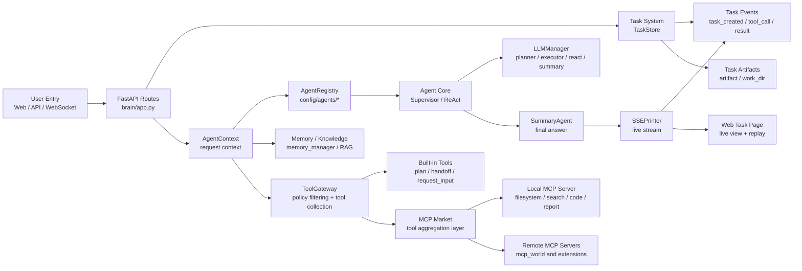

### Core Components

| Component | Main Files | Responsibility |
| --- | --- | --- |
| Process startup | `task-pilot-agent/main.py`, `task-pilot-agent/app_main.py` | Start FastAPI workers and the local MCP subprocess |
| User entry | `task-pilot-agent/brain/app.py` | Expose `/agent/autoagent`, task APIs, and the web page |
| Task system | `task-pilot-agent/brain/core/tasks.py` | Persist tasks, events, artifacts, status, and work directories |
| Agent registry | `task-pilot-agent/brain/core/agent_registry.py` | Load `config/agents/*/agent.yaml`, system prompts, and evals |
| Agent runtime | `task-pilot-agent/brain/core/handlers/*.py` | Select Supervisor or ReAct flow |
| ReAct Agent | `task-pilot-agent/brain/core/agents/ReActAgentImp.py` | Decide tool usage and run the think-act-observe loop |
| Summary Agent | `task-pilot-agent/brain/core/agents/summary_agent.py` | Summarize evidence and tool results into the final answer |
| Tool gateway | `task-pilot-agent/brain/core/tools/gateway.py` | Filter tools by Agent config, permission policy, and approvals |
| Tool collection | `task-pilot-agent/brain/core/tools/collection.py` | Expose tool schemas, execute tools, and emit tool events |
| MCP adapter | `task-pilot-agent/brain/core/tools/mcp_tool.py` | Convert Agent tool calls into MCP Market calls |
| Local MCP tools | `task-pilot-agent/tools/mcp_local/mcp_server.py` | Provide filesystem, search, code, report, weather, and media tools |
| Web UI | `task-pilot-agent/frontend/src/App.vue` | Create sessions, submit messages, replay timelines, approve tools, inspect artifacts, and show final output |

## Component Flowcharts And Sequence Diagrams

### 1. User Entry

User entry points include the web UI, SSE API, WebSocket API, and background task API. This layer receives requests, fills defaults, creates or resumes tasks, and delegates execution to the shared Agent runner.

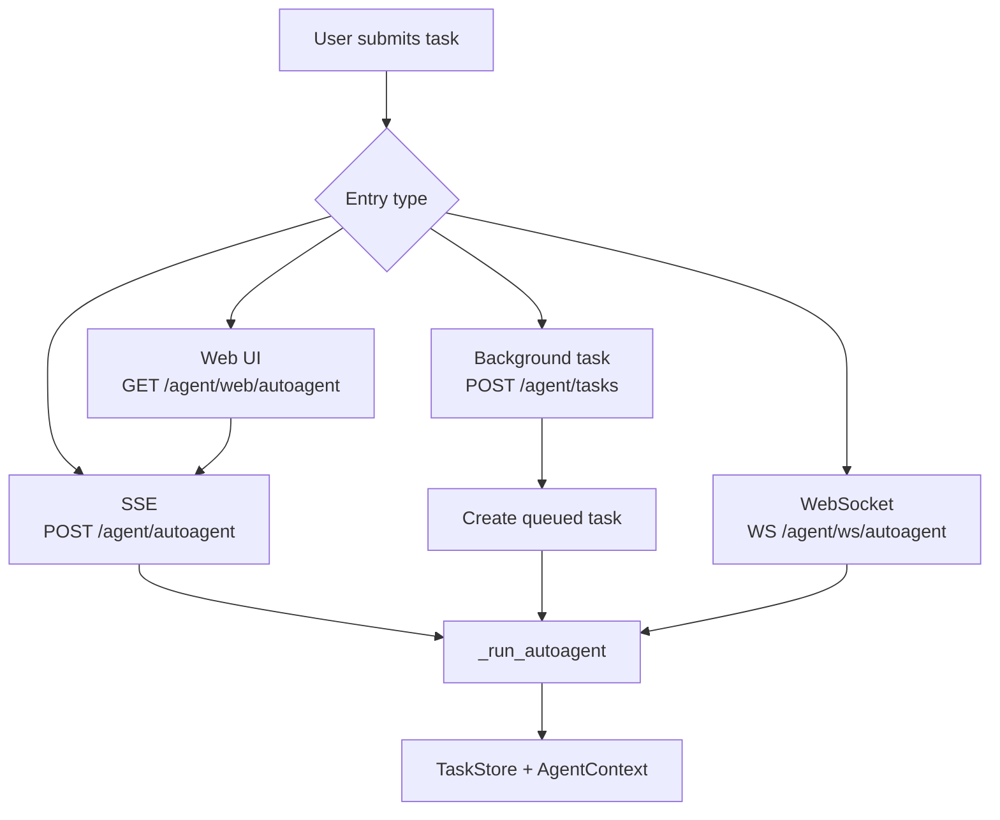

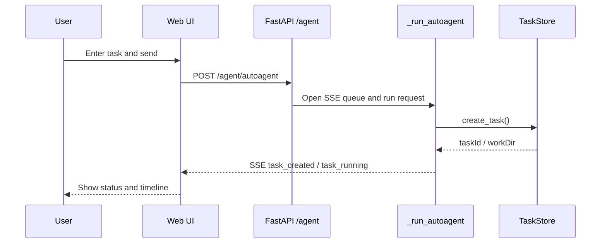

### 2. Task System

Every Agent run is a durable task. Input, output, errors, tool calls, tool results, artifacts, and lifecycle changes are all attached to the same `taskId`.

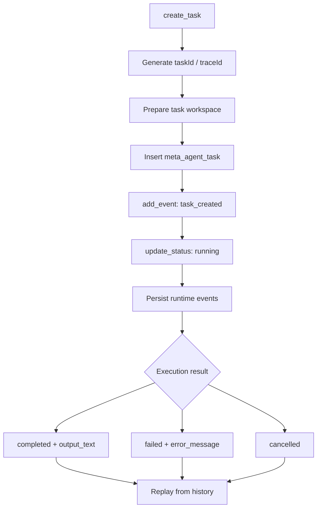

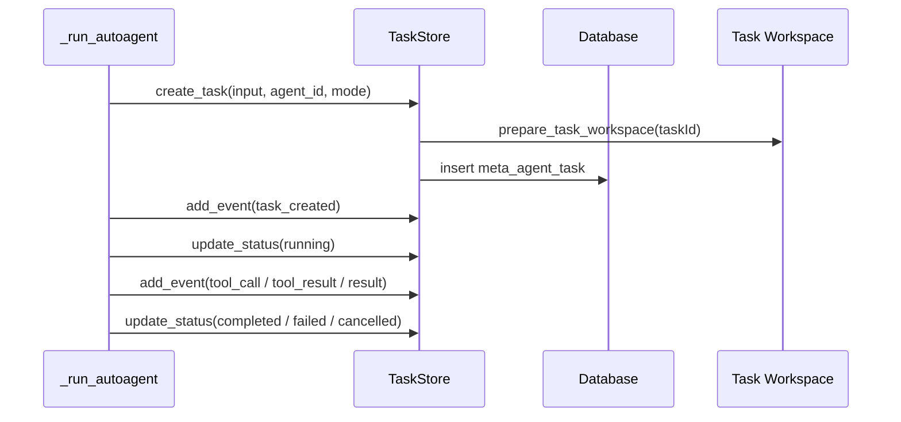

### 3. Agent Registry

Each Agent has its own directory. `agent.yaml` defines role, type, tools, permissions, and handoffs. `system_prompt.md` stores the full system prompt. `evals.yaml` stores smoke and regression cases.

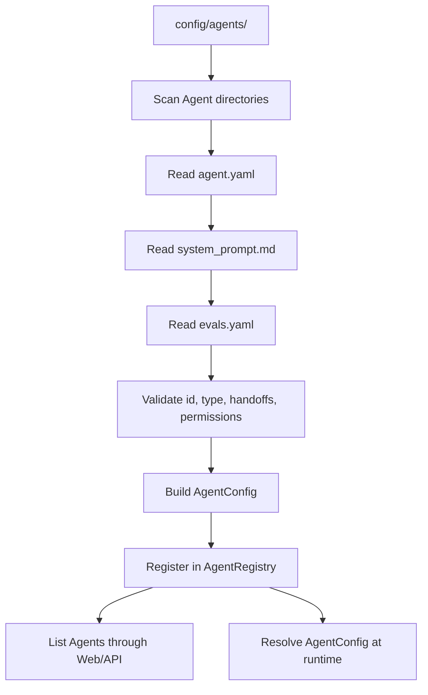

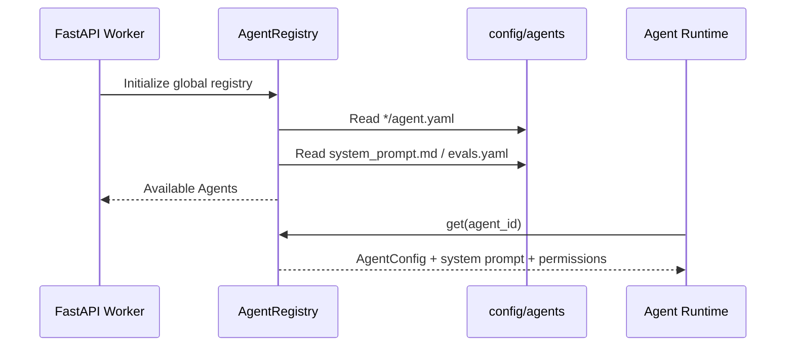

### 4. Agent Core Runtime

The main path is ReAct/Supervisor. The old `plans_executor` compatibility path has been removed; new capabilities should go into ReAct/Supervisor and the tool system.

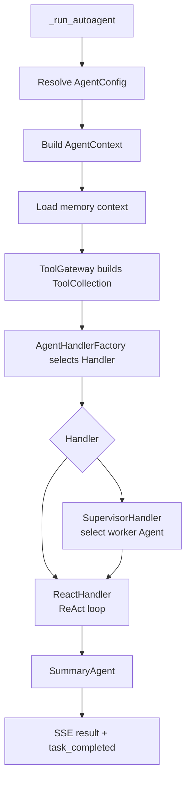

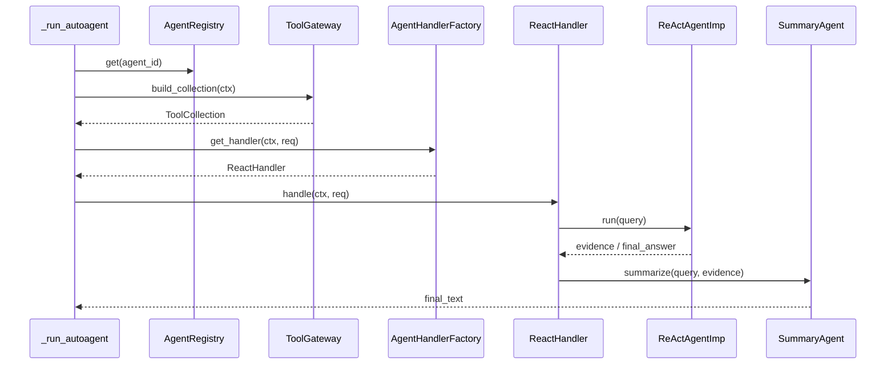

### 5. Tool System

Agents do not call tools directly. All tools pass through `ToolGateway -> ToolCollection -> MCPTool` so schema exposure, policy checks, timeout handling, audit data, tool-call events, and tool-result events stay consistent.

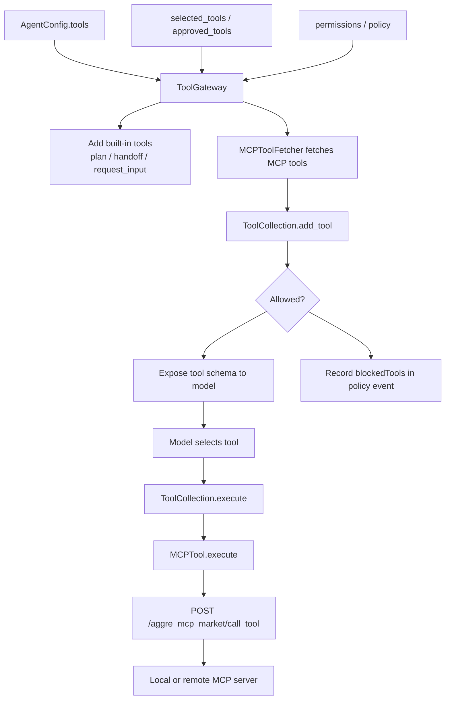

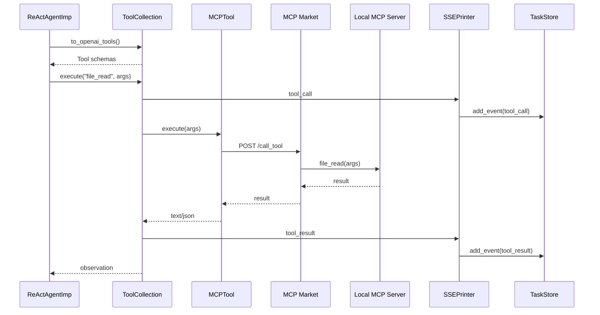

### 6. Memory / Knowledge

Memory augments the task context. It does not replace durable task records. Read and write scopes are controlled by each Agent's `memory.read` and `memory.write` configuration.

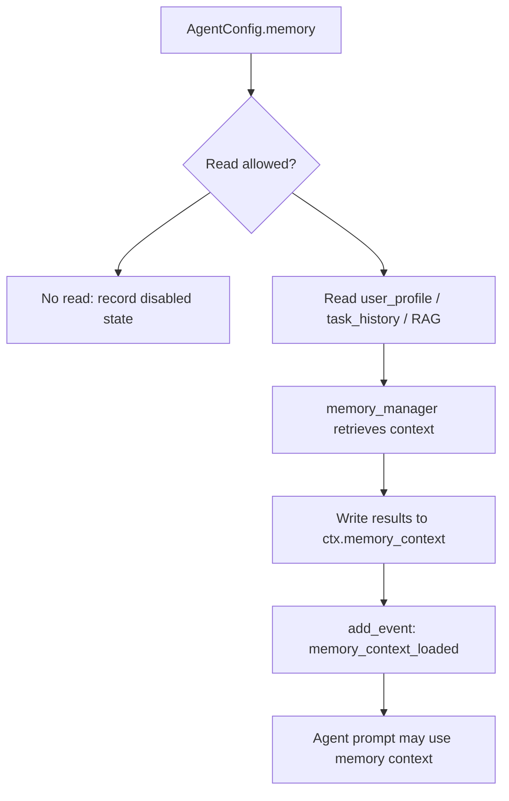

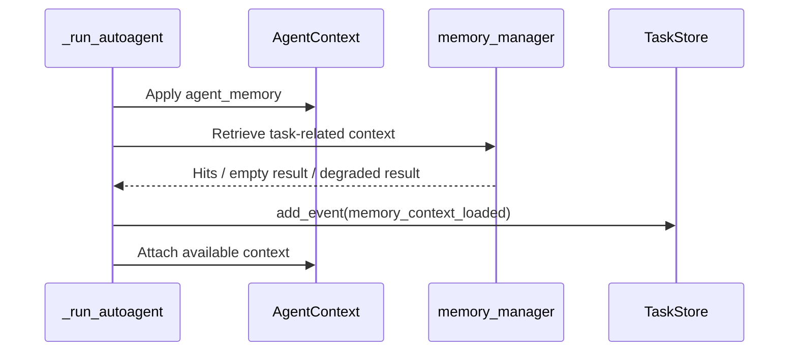

### 7. Logs / Replay / Evaluation

Live streaming and historical replay share the same event structure. SSE is only the live transport. After a task finishes, the web UI can replay it through task APIs.

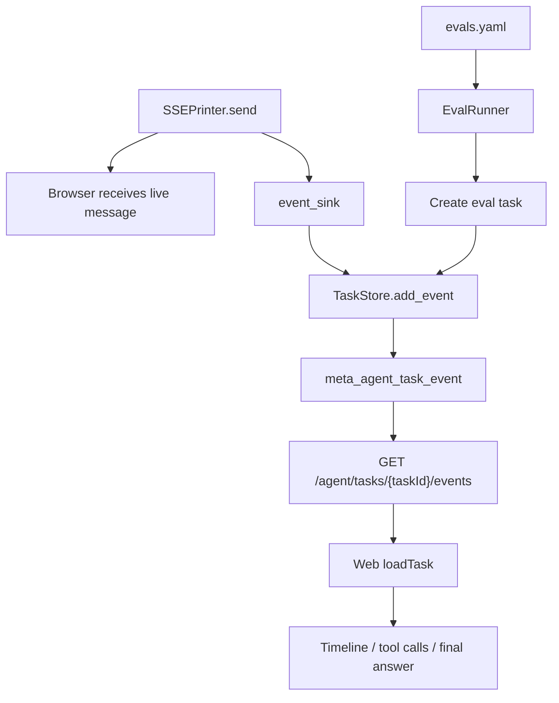

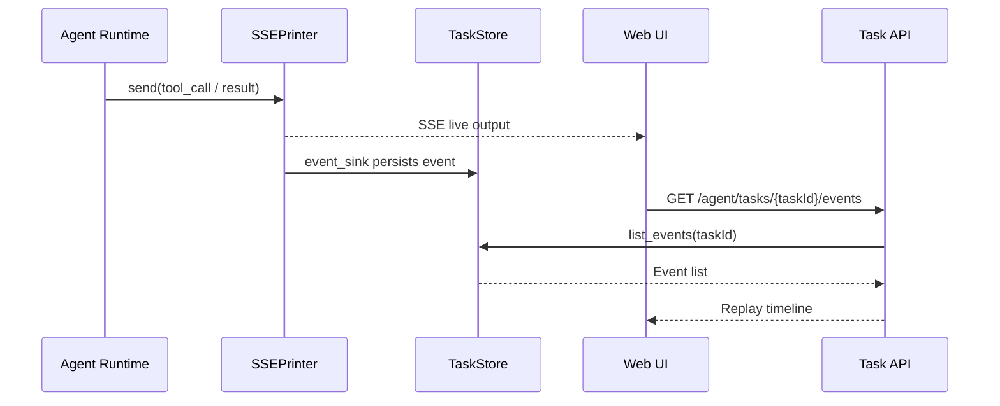

### 8. Permission / Risk Control / Sandbox

Permissions come from Agent config, user approvals, tool policy, and runtime environment. High-risk tools require explicit approval by default. In sandbox mode, path arguments must stay inside the task workspace.

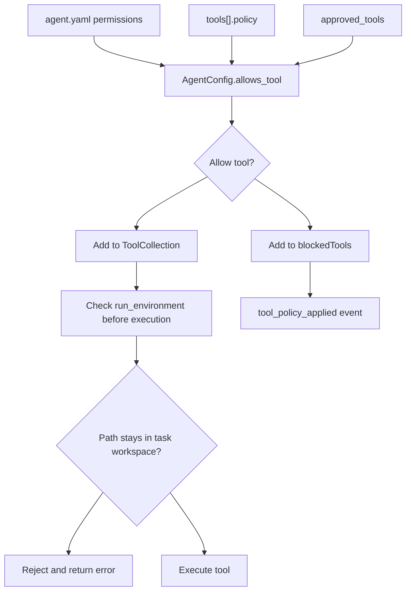

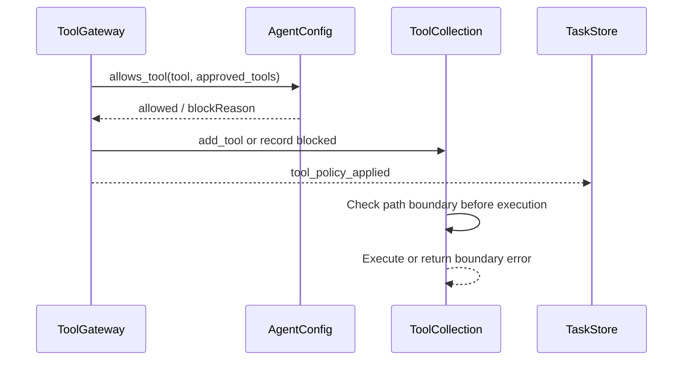

## Real Request Demo

This demo shows a request where the default general Agent reads the repository README and summarizes how to start the project. It triggers the ReAct runtime, the file-read tool, tool event persistence, and final summary generation.

### Request

```json
{
  "trace_id": "demo-readme-001",
  "user_id": "demo-user",
  "conversation_id": "demo-session-001",
  "agent_id": "task-pilot-agent",
  "mode": "react",
  "outputStyle": "markdown",
  "run_environment": "local",
  "messages": [
    {
      "role": "user",
      "content": "Read /path/to/task-pilot-agent/README.md and summarize how to start the project in three sentences."
    }
  ]
}
```

### Request Sequence

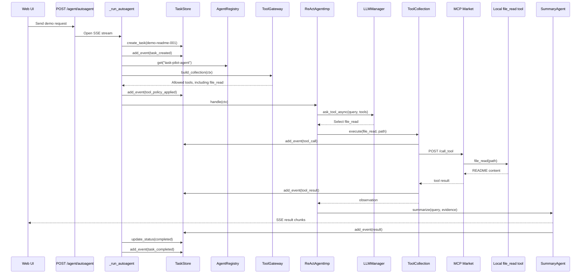

### Demo Task Record

```json
{
  "taskId": "demo-readme-001",
  "traceId": "demo-readme-001",
  "conversationId": "demo-session-001",
  "userId": "demo-user",
  "agentId": "task-pilot-agent",
  "mode": "react",
  "outputStyle": "markdown",
  "status": "completed",
  "input": "Read /path/to/task-pilot-agent/README.md and summarize how to start the project in three sentences.",
  "workDir": "uploads/tasks/demo-readme-001"
}
```

### Demo Event Payloads

```json
[
  {
    "eventType": "task_created",
    "source": "autoagent",
    "payload": {
      "mode": "react",
      "agentConfigId": "task-pilot-agent",
      "runEnvironment": "local"
    }
  },
  {
    "eventType": "tool_policy_applied",
    "source": "policy",
    "payload": {
      "agentId": "task-pilot-agent",
      "availableTools": [
        "file_read",
        "file_list",
        "file_stat"
      ],
      "blockedTools": [
        "shell_exec"
      ],
      "blockedToolReasons": {
        "shell_exec": "high_risk_requires_approval"
      }
    }
  },
  {
    "eventType": "tool_call",
    "source": "sse",
    "payload": {
      "messageType": "tool_call",
      "resultMap": {
        "tool": "file_read",
        "argumentsSummary": "{\"path\":\"/path/to/task-pilot-agent/README.md\"}",
        "taskId": "demo-readme-001",
        "agentId": "task-pilot-agent",
        "runEnvironment": "local"
      }
    }
  },
  {
    "eventType": "tool_result",
    "source": "sse",
    "payload": {
      "messageType": "tool_result",
      "resultMap": {
        "tool": "file_read",
        "durationMs": 18,
        "failed": false,
        "resultSummary": "{\"path\":\"/path/to/task-pilot-agent/README.md\",\"bytes\":4096,\"content\":\"# TaskPilotAgent...\"}"
      }
    }
  },
  {
    "eventType": "result",
    "source": "sse",
    "payload": {
      "messageType": "result",
      "result": "Install dependencies with uv, copy config.yaml.example to config.yaml, and fill required settings. Start from the task-pilot-agent directory with uv run main.py. By default, the app starts the Web/API service on port 9010 and the local MCP tool service on port 9009."
    }
  },
  {
    "eventType": "task_completed",
    "source": "autoagent",
    "payload": {
      "status": "completed"
    }
  }
]
```

Replay APIs:

```bash
curl http://127.0.0.1:9010/agent/tasks/demo-readme-001
curl http://127.0.0.1:9010/agent/tasks/demo-readme-001/events
curl http://127.0.0.1:9010/agent/tasks/demo-readme-001/artifacts
```

## Repository Layout

- `config/`: runtime config and prompts
  - `config/config.yaml.example`: safe config template
  - `config/prompt.yaml`, `config/prompt_en.yaml`: prompt templates
  - `config/agents/`: directory-based Agent configs
- `task-pilot-agent/`: FastAPI service, Agent runtime, MCP integration, and local tools
  - `task-pilot-agent/main.py`: startup entry point
  - `task-pilot-agent/app_main.py`: FastAPI app registration
  - `task-pilot-agent/brain/`: Agent API, runtime, task system, and web page
  - `task-pilot-agent/tools/mcp_local/`: local MCP server and built-in tools
  - `task-pilot-agent/tools/aggre_mcp_market/`: MCP aggregation layer

## Quick Start

### 1. Install Dependencies

```bash
cd task-pilot-agent
uv sync
```

### 2. Prepare Config

```bash
cp ../config/config.yaml.example ../config/config.yaml
```

Search for `CHANGE_ME` and fill the required fields before starting the service.

Important config areas:

- `db`: database URL or host/user/password/name.
- `llm`: primary model provider, API base URL, model, and API key.
- `embedder` and `vector_store`: memory/RAG support.
- `mcp`: local MCP and MCP Market settings.
- `core.agent_id`: default Agent, currently `task-pilot-agent`.
- `core.default_run_environment`: default runtime environment, usually `local`.

Do not commit real API keys, passwords, cookies, local databases, logs, or user data. Use environment variables or local ignored config files for secrets.

### 3. Start The Service

Run from the `task-pilot-agent/` directory:

```bash
cd task-pilot-agent
uv run main.py
```

Default services:

- Web/API service: `http://0.0.0.0:9010`
- Local MCP service: `http://0.0.0.0:9009/mcp`

Health check:

```bash
curl http://127.0.0.1:9010/health
```

## Common APIs

### Agent APIs

- `POST /agent/autoagent`: SSE streaming Agent run.
- `GET /agent/web/autoagent`: Web task console.
- `WS /agent/ws/autoagent`: WebSocket Agent run.
- `POST /agent/tasks`: create a background task.
- `GET /agent/tasks`: list tasks.
- `GET /agent/tasks/{task_id}`: get task detail.
- `GET /agent/tasks/{task_id}/events`: replay task events.
- `POST /agent/tasks/{task_id}/cancel`: cancel a running task.
- `POST /agent/tasks/{task_id}/retry`: retry a task.

SSE example:

```bash
curl -N http://127.0.0.1:9010/agent/autoagent \
  -H 'Content-Type: application/json' \
  -d '{
    "agent_id":"task-pilot-agent",
    "mode":"react",
    "outputStyle":"markdown",
    "messages":[{"role":"user","content":"Summarize this project startup flow"}]
  }'
```

### File APIs

- `POST /file/v1/upload_file_form`: upload through form data.
- `POST /file/v1/upload_file_data`: multipart upload with `requestId`.
- `GET /file/v1/preview_file/{request_id}/{file_name}`: preview a file.
- `GET /file/v1/download_file/{request_id}/{file_name}`: download a file.

### MCP Market APIs

- `GET /aggre_mcp_market/tools`: list aggregated MCP tools.
- `GET /aggre_mcp_market/prompt`: generate a tool prompt fragment.
- `POST /aggre_mcp_market/call_tool`: call a tool directly.

## Configuration Overrides

The project uses Pydantic Settings. Environment variables can override YAML fields with prefix `APP_` and nested keys separated by `__`.

Examples:

```bash
APP_SERVER__PORT=9010
APP_LLM__CONFIG__API_KEY=...
UVICORN_WORKERS=5
```

Optional environment variables:

- `JINA_SEARCH_API_KEY`, `BOCHA_SEARCH_API_KEY`, `SERPER_SEARCH_API_KEY`
- `FILE_DB_URL`
- `APP_AGENT_CONFIG_DIR`
- `APP_TASK_WORKSPACE_ROOT`

## Tests

Run all tests:

```bash
cd task-pilot-agent
uv run pytest -v --tb=short tests/
```

Run focused task/Agent tests:

```bash
cd task-pilot-agent
uv run pytest tests/tasks/test_agent_registry.py -q
uv run pytest tests/tasks/test_autoagent_web.py -q
uv run pytest tests/tasks/test_tool_gateway.py -q
```

## More Documentation

- Chinese README: [README.zh-CN.md](README.zh-CN.md)
- Server-side source guide: [task-pilot-agent/README.md](task-pilot-agent/README.md)
- Config template: [config/config.yaml.example](config/config.yaml.example)
