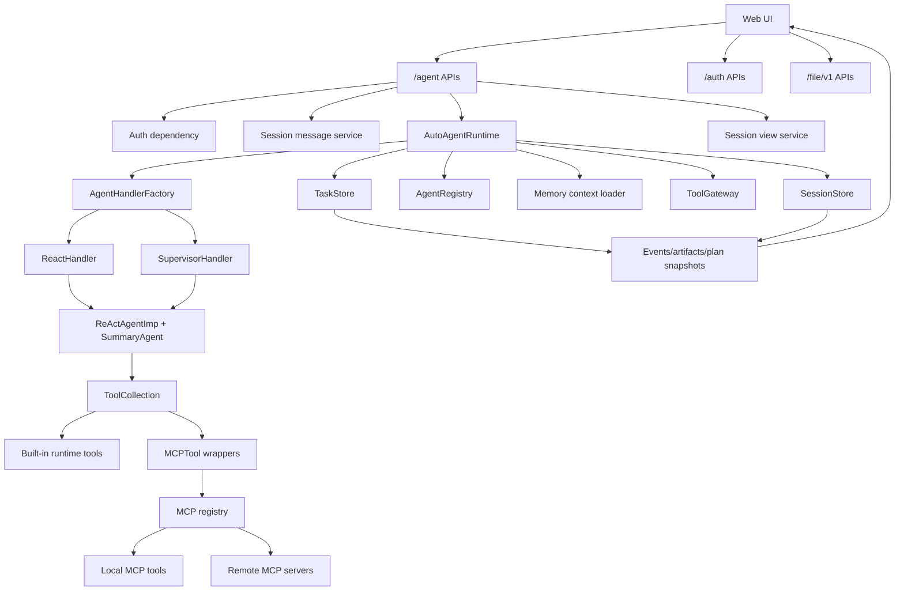
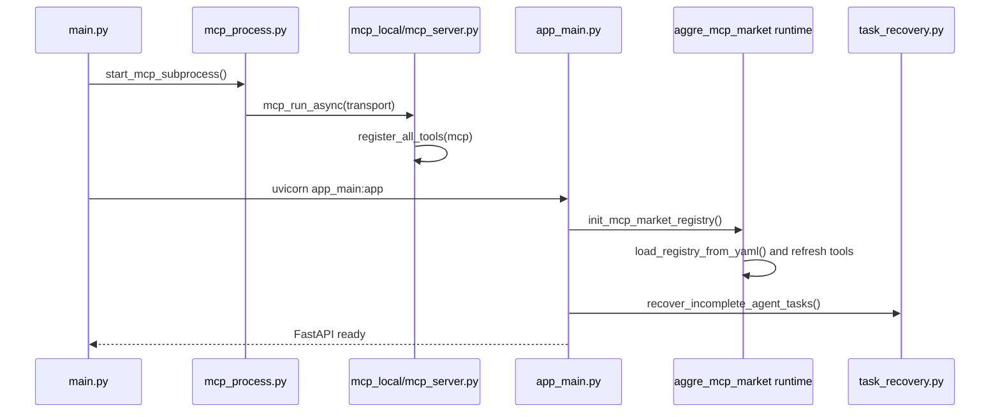
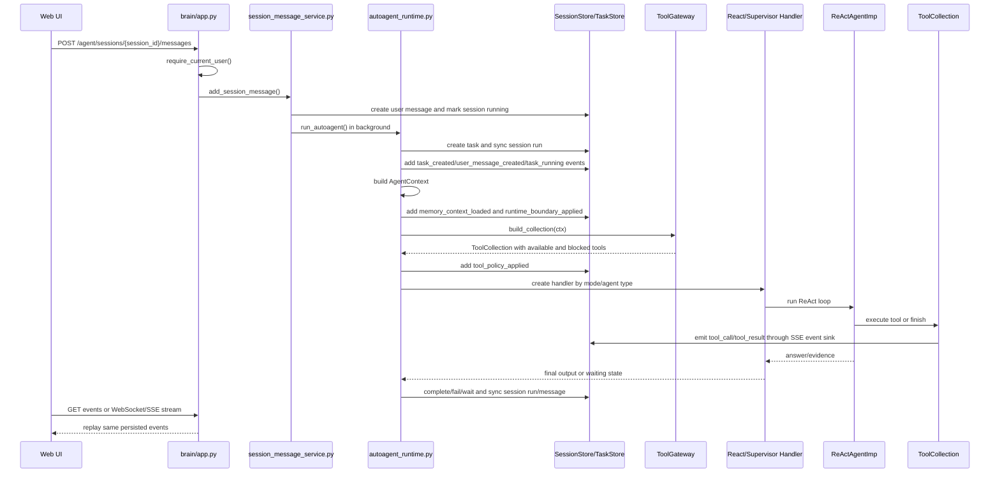
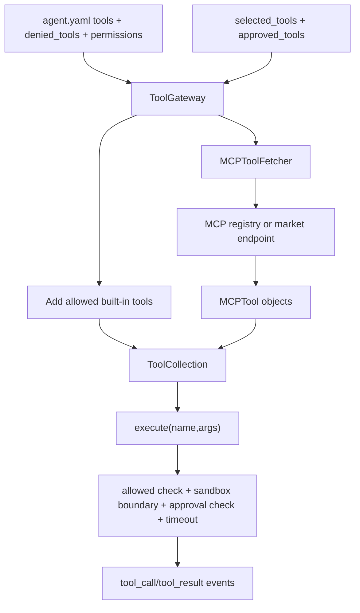
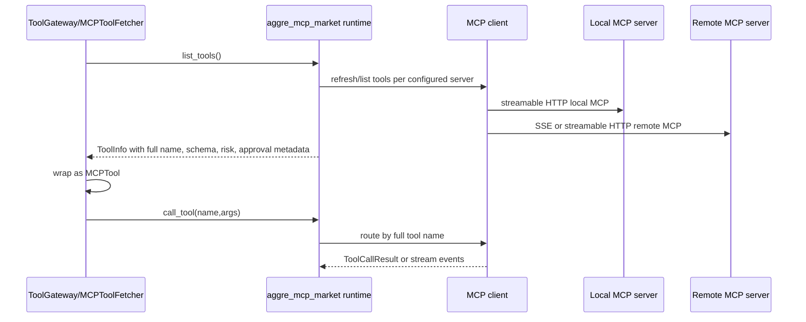
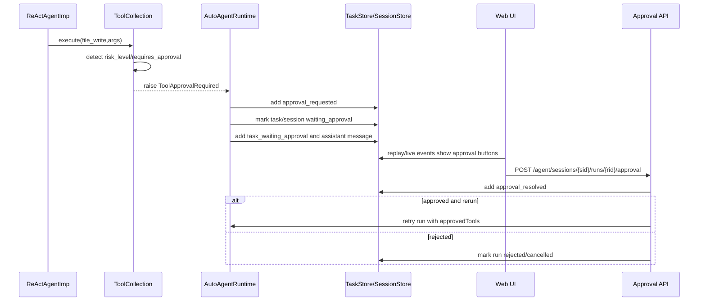
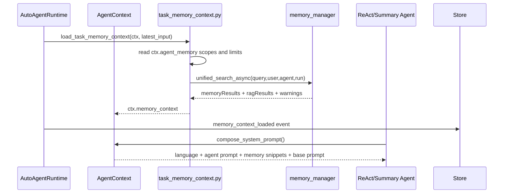
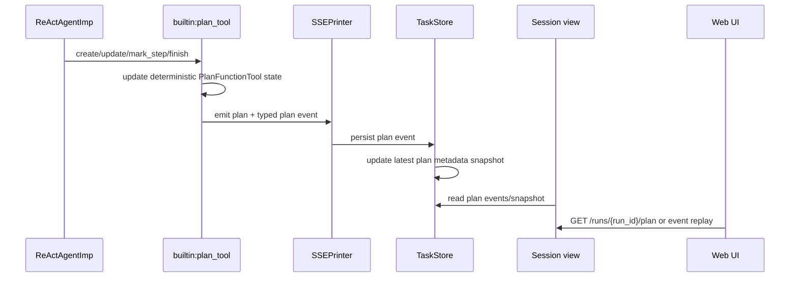
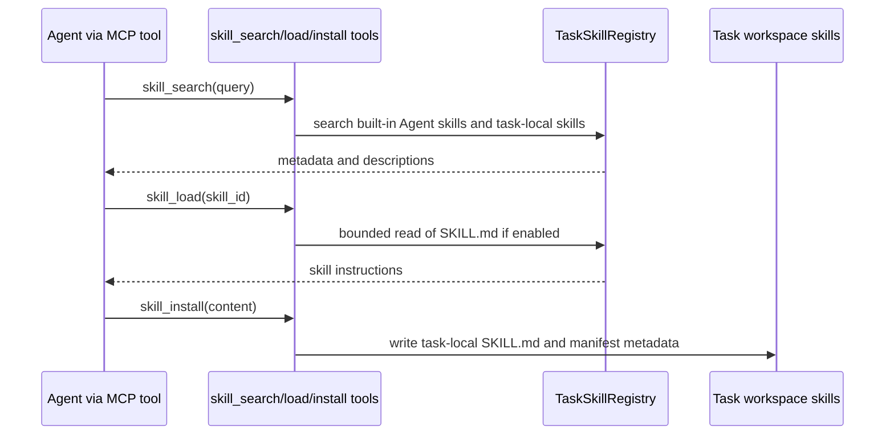

# TaskPilotAgent Runtime Architecture

Chinese version: [`agent-runtime-architecture.zh-CN.md`](agent-runtime-architecture.zh-CN.md)

This document describes the current TaskPilotAgent implementation. It is based
on the code paths listed in the "Source Evidence" sections, not on a target-only
design.

## What The System Is

TaskPilotAgent is now a session-based Agent product with a durable task/run
ledger underneath it.

- A **session** is the user-visible conversation container.
- A **message** is a user or assistant turn inside a session.
- A **run** is one Agent execution triggered by a user message.
- An **event** records what happened during a run: status changes, tool calls,
  plan updates, approvals, artifacts, errors, and final output.
- A **task** is still the primary durable execution ledger used by the runtime.
  Session runs mirror that ledger for the web UI and replay APIs.

Source evidence:

| Area | Code |
| --- | --- |
| FastAPI routers and startup | [`task-pilot-agent/app_main.py`](../task-pilot-agent/app_main.py), [`task-pilot-agent/main.py`](../task-pilot-agent/main.py) |
| Session/message/run/event tables and store | [`task-pilot-agent/brain/core/sessions.py`](../task-pilot-agent/brain/core/sessions.py) |
| Task/event/artifact execution ledger | [`task-pilot-agent/brain/core/tasks.py`](../task-pilot-agent/brain/core/tasks.py) |
| Main runtime lifecycle | [`task-pilot-agent/brain/core/autoagent_runtime.py`](../task-pilot-agent/brain/core/autoagent_runtime.py) |
| Session message entry and resume logic | [`task-pilot-agent/brain/core/session_message_service.py`](../task-pilot-agent/brain/core/session_message_service.py) |
| Session replay payloads | [`task-pilot-agent/brain/core/session_view_service.py`](../task-pilot-agent/brain/core/session_view_service.py) |

## Layer Map

## Startup Sequence

Implementation notes:

- `main.py` starts the local MCP subprocess before Uvicorn.
- `app_main.py` registers `/aggre_mcp_market`, `/auth`, `/agent`, and
  `/file/v1`.
- The app lifespan initializes the MCP registry and recovers queued or
  interrupted Agent tasks.

Source evidence:

| Behavior | Code |
| --- | --- |
| Start local MCP subprocess | [`task-pilot-agent/main.py`](../task-pilot-agent/main.py), [`task-pilot-agent/mcp_process.py`](../task-pilot-agent/mcp_process.py) |
| Register FastAPI routers | [`task-pilot-agent/app_main.py`](../task-pilot-agent/app_main.py) |
| Initialize MCP market registry | [`task-pilot-agent/tools/aggre_mcp_market/app.py`](../task-pilot-agent/tools/aggre_mcp_market/app.py), [`task-pilot-agent/tools/aggre_mcp_market/service/runtime.py`](../task-pilot-agent/tools/aggre_mcp_market/service/runtime.py) |
| Register local MCP tools | [`task-pilot-agent/tools/mcp_local/mcp_server.py`](../task-pilot-agent/tools/mcp_local/mcp_server.py), [`task-pilot-agent/tools/mcp_local/tool_registrars/all_tools.py`](../task-pilot-agent/tools/mcp_local/tool_registrars/all_tools.py) |

## Main Session Run Sequence

Key points:

- The main user path is session-based: `POST /agent/sessions/{id}/messages`.
- Each new message creates a run ID and then calls `run_autoagent()`.
- The runtime still creates a task record because task events are the primary
  execution ledger.
- Frontend live display and historical replay come from the same event records.

Source evidence:

| Behavior | Code |
| --- | --- |
| Session message creates run | [`task-pilot-agent/brain/core/session_message_service.py`](../task-pilot-agent/brain/core/session_message_service.py) |
| Runtime creates session run and task | [`task-pilot-agent/brain/core/autoagent_runtime.py`](../task-pilot-agent/brain/core/autoagent_runtime.py) |
| Runtime records stream events into task events | [`task-pilot-agent/brain/core/autoagent_runtime.py`](../task-pilot-agent/brain/core/autoagent_runtime.py) |
| WebSocket/SSE session event replay | [`task-pilot-agent/brain/app.py`](../task-pilot-agent/brain/app.py) |
| Frontend merges replay and live events | [`task-pilot-agent/frontend/src/App.vue`](../task-pilot-agent/frontend/src/App.vue) |

## Interface Layer

All paths below are mounted by `app_main.py`.

### `/agent` APIs

| Method | Path | Function |
| --- | --- | --- |
| GET | `/agent/agents` | List configured Agents for the UI. |
| GET | `/agent/agents/diagnostics` | Return Agent config diagnostics. |
| GET | `/agent/agents/{agent_id}` | Read one Agent config snapshot. |
| GET | `/agent/tools` | List currently visible tools with policy/risk metadata. |
| GET | `/agent/mcp/servers` | List MCP server status. |
| POST | `/agent/mcp/tools/refresh` | Refresh all MCP tools from the registry. |
| POST | `/agent/mcp/servers/{server_id}/refresh` | Refresh one MCP server. |
| POST | `/agent/mcp/tools/{tool_id}/dry-run` | Test one MCP tool through the same policy checks. |
| POST | `/agent/sessions` | Create a user session. |
| GET | `/agent/sessions` | List user sessions. |
| GET | `/agent/sessions/{session_id}` | Read session detail, messages, runs, events, artifacts, and pending approval. |
| PATCH | `/agent/sessions/{session_id}` | Update session metadata such as title. |
| POST | `/agent/sessions/{session_id}/archive` | Archive a session. |
| DELETE | `/agent/sessions/{session_id}` | Soft-delete/archive a session and cancel active work. |
| GET | `/agent/sessions/{session_id}/messages` | Page through session messages. |
| POST | `/agent/sessions/{session_id}/messages` | Add a user message and start/resume a run. |
| GET | `/agent/sessions/{session_id}/events` | List session run events for replay. |
| GET | `/agent/sessions/{session_id}/stream` | SSE stream for session events. |
| GET | `/agent/sessions/{session_id}/runs/current` | Get current run. |
| GET | `/agent/sessions/{session_id}/runs` | List session runs. |
| GET | `/agent/sessions/{session_id}/runs/{run_id}` | Read one session run. |
| GET | `/agent/sessions/{session_id}/runs/{run_id}/plan` | Read latest run plan snapshot. |
| POST | `/agent/sessions/{session_id}/runs/{run_id}/cancel` | Cancel a running run. |
| POST | `/agent/sessions/{session_id}/runs/{run_id}/retry` | Retry a run using stored input and metadata. |
| POST | `/agent/sessions/{session_id}/runs/{run_id}/approval` | Approve or reject a pending high-risk operation. |
| GET | `/agent/sessions/{session_id}/artifacts` | List session artifacts. |
| GET | `/agent/sessions/{session_id}/artifacts/{artifact_id}` | Download a session artifact. |
| GET | `/agent/sessions/{session_id}/runs/{run_id}/artifacts` | List artifacts for one run. |
| GET | `/agent/sessions/{session_id}/tools` | List tools available in a session context. |
| POST | `/agent/sessions/{session_id}/tools/test` | Test a tool in a session context. |
| GET | `/agent/agents/{agent_id}/evals` | List Agent eval cases. |
| POST | `/agent/agents/{agent_id}/evals/run` | Run all evals for an Agent. |
| POST | `/agent/agents/{agent_id}/evals/{case_id}/run` | Run one eval case. |
| POST | `/agent/tasks/{task_id}/eval-result` | Evaluate a completed task result. |
| GET | `/agent/tasks` | Compatibility task list. |
| POST | `/agent/tasks` | Compatibility task creation. |
| GET | `/agent/tasks/{task_id}` | Compatibility task detail. |
| GET | `/agent/tasks/{task_id}/events` | Compatibility task event list. |
| POST | `/agent/tasks/{task_id}/cancel` | Compatibility task cancel. |
| DELETE | `/agent/tasks/{task_id}` | Compatibility task delete. |
| POST | `/agent/tasks/{task_id}/retry` | Compatibility task retry. |
| POST | `/agent/tasks/{task_id}/input` | Resume a task waiting for user input. |
| GET | `/agent/tasks/{task_id}/artifacts` | Compatibility task artifacts. |
| GET | `/agent/tasks/{task_id}/artifacts/{artifact_id}` | Compatibility task artifact download. |
| GET | `/agent/web/assets/{asset_path}` | Serve built frontend assets. |
| GET | `/agent/web/autoagent` | Serve the web UI. |
| POST | `/agent/autoagent` | Legacy direct autoagent request path. |
| WS | `/agent/ws/sessions/{session_id}` | WebSocket session event stream. |
| WS | `/agent/ws/autoagent` | Legacy direct autoagent WebSocket path. |
| GET | `/agent/web/health` | Web UI health check. |

Source evidence: [`task-pilot-agent/brain/app.py`](../task-pilot-agent/brain/app.py).

### `/auth` APIs

| Method | Path | Function |
| --- | --- | --- |
| GET | `/auth/providers` | List enabled auth providers. |
| GET | `/auth/me` | Return current authenticated user. |
| POST | `/auth/logout` | Revoke current session cookie. |
| POST | `/auth/logout-all` | Revoke all sessions for the user. |
| GET | `/auth/users/me` | Read current user profile. |
| PATCH | `/auth/users/me` | Update current user profile. |
| GET | `/auth/users/me/identities` | List linked provider identities. |
| DELETE | `/auth/users/me/identities/{identity_id}` | Unlink one identity. |
| GET | `/auth/admin/users` | Admin user list. |
| POST | `/auth/admin/users` | Admin user creation. |
| PATCH | `/auth/admin/users/{user_id}` | Admin user update. |
| POST | `/auth/admin/users/{user_id}/disable` | Disable user. |
| DELETE | `/auth/admin/users/{user_id}` | Soft-delete user. |
| POST | `/auth/admin/legacy-users` | Create legacy user mapping input. |
| POST | `/auth/admin/legacy-users/{legacy_user_id}/map` | Map legacy user to TaskPilot user. |
| GET | `/auth/admin/audit-events` | Read auth audit events. |
| POST | `/auth/admin/cleanup` | Cleanup auth records. |
| POST | `/auth/{provider}/link` | Start provider account linking. |
| DELETE | `/auth/{provider}/link/{identity_id}` | Remove provider link. |
| GET | `/auth/{provider}/login` | Start provider login. |
| GET | `/auth/{provider}/callback` | Provider callback handler. |
| GET | `/auth/whoami` | Legacy/debug identity endpoint. |

Source evidence: [`task-pilot-agent/auth/router.py`](../task-pilot-agent/auth/router.py).

### `/aggre_mcp_market` APIs

| Method | Path | Function |
| --- | --- | --- |
| GET | `/aggre_mcp_market/tools` | List aggregated MCP tools, including risk and approval metadata. |
| GET | `/aggre_mcp_market/servers` | List MCP server status. |
| POST | `/aggre_mcp_market/refresh` | Refresh registry tool snapshots. |
| GET | `/aggre_mcp_market/prompt` | Build a prompt fragment from current MCP tools. |
| POST | `/aggre_mcp_market/call_tool` | Call an MCP tool, optionally streaming SSE tool events. |

Source evidence: [`task-pilot-agent/tools/aggre_mcp_market/app.py`](../task-pilot-agent/tools/aggre_mcp_market/app.py).

### `/file/v1` APIs

| Method | Path | Function |
| --- | --- | --- |
| POST | `/file/v1/get_file` | Read file metadata by request/file ID. |
| POST | `/file/v1/upload_file` | Upload a file by JSON payload. |
| POST | `/file/v1/upload_file_data` | Upload raw file data. |
| POST | `/file/v1/upload_file_form` | Upload a multipart browser file. |
| POST | `/file/v1/get_file_list` | List uploaded files for a request. |
| GET | `/file/v1/download_file/{request_id}/{file_name}` | Download uploaded file content. |
| GET | `/file/v1/preview_file/{request_id}/{file_name}` | Preview uploaded file content with ownership checks. |

Source evidence: [`task-pilot-agent/file/file_op.py`](../task-pilot-agent/file/file_op.py).

## Agent Configuration And Runtime Selection

Agent config lives under `config/agents/{agent_id}`:

- `agent.yaml`: identity, type, mode, tools, denied tools, handoffs, memory,
  permissions, and output defaults.
- `system_prompt.md`: the Agent-specific system prompt.
- `evals.yaml`: smoke/regression evals.

Default configured Agents currently include:

- `task-pilot-agent`
- `supervisor_agent`
- `search_agent`
- `browser_agent`
- `data_agent`
- `code_agent`
- `report_agent`

The default Agent is a `react_worker` using `mode: react`. Its config allows
general file, search, browser, media, report, config-read, skill, memory, and
remote MCP tools. It denies `deepsearch`, disables shell execution through
permissions, and requires approval for high-risk tools.

Source evidence:

| Behavior | Code |
| --- | --- |
| Agent model and validation | [`task-pilot-agent/brain/core/agent_registry.py`](../task-pilot-agent/brain/core/agent_registry.py) |
| Default Agent config | [`config/agents/task-pilot-agent/agent.yaml`](../config/agents/task-pilot-agent/agent.yaml) |
| Handler selection | [`task-pilot-agent/brain/core/handlers/factory.py`](../task-pilot-agent/brain/core/handlers/factory.py) |
| React handler | [`task-pilot-agent/brain/core/handlers/react.py`](../task-pilot-agent/brain/core/handlers/react.py) |
| Supervisor handler | [`task-pilot-agent/brain/core/handlers/supervisor.py`](../task-pilot-agent/brain/core/handlers/supervisor.py) |

## Tool System

### Built-in runtime tools

| Tool | Purpose | Source |
| --- | --- | --- |
| `builtin:plan_tool` | Create/update/mark/finish visible plan state. | [`builtin_plan_tool.py`](../task-pilot-agent/brain/core/tools/builtin_plan_tool.py) |
| `builtin:set_todo_list` | Project short progress into a visible TODO list. | [`builtin_todo_tool.py`](../task-pilot-agent/brain/core/tools/builtin_todo_tool.py) |
| `builtin:handoff` | Start child work for another allowed Agent. | [`builtin_handoff_tool.py`](../task-pilot-agent/brain/core/tools/builtin_handoff_tool.py) |
| `builtin:request_input` | Pause a run and ask the user for missing input. | [`builtin_request_input_tool.py`](../task-pilot-agent/brain/core/tools/builtin_request_input_tool.py) |

### Local MCP tool groups

These are registered by `register_all_tools(mcp)`.

| Group | Tools |
| --- | --- |
| Filesystem | `file_read`, `file_write`, `file_edit`, `file_list`, `file_stat`, `file_glob`, `file_grep`, `directory_create`, `file_copy`, `file_move`, `file_delete` |
| Web/search/weather | `web_search`, `fetch_url`, `web_reader`, `get_current_weather`, `get_weather_forecast` |
| Browser/media/report/code | `browser_agent`, `audio_tool`, `image_tool`, `video_tool`, `text_to_image`, `report`, `code_interpreter` |
| Process/config/MCP management | `shell_exec`, `process_command_*`, `config_read`, `config_update`, `mcp_manager_*` |
| Skill and memory | `skill_search`, `skill_load`, `skill_install`, `skill_enable/disable`, `memory_search`, `memory_add`, `memory_delete` |
| Messaging/sub-agent | `message_send`, `create_subagent` |

Source evidence:

| Behavior | Code |
| --- | --- |
| Build policy-filtered collection | [`task-pilot-agent/brain/core/tools/gateway.py`](../task-pilot-agent/brain/core/tools/gateway.py) |
| Execute tools and emit events | [`task-pilot-agent/brain/core/tools/collection.py`](../task-pilot-agent/brain/core/tools/collection.py) |
| Wrap MCP tools | [`task-pilot-agent/brain/core/tools/mcp_tool.py`](../task-pilot-agent/brain/core/tools/mcp_tool.py) |
| Register local MCP tools | [`task-pilot-agent/tools/mcp_local/tool_registrars/all_tools.py`](../task-pilot-agent/tools/mcp_local/tool_registrars/all_tools.py) |
| Filesystem sandbox behavior | [`task-pilot-agent/tools/mcp_local/tool/filesystem.py`](../task-pilot-agent/tools/mcp_local/tool/filesystem.py) |

## MCP Architecture

Current implementation details:

- The local MCP server still runs as its own subprocess.
- The app also keeps an in-process MCP registry object for listing, refreshing,
  and calling tools without routing every internal operation through a route
  handler.
- The registry supports remote MCP clients through the common
  `MCPClientBase` interface.
- Tool metadata includes `risk_level` and `requires_approval`, and the registry
  can infer high-risk status for known dangerous tools.

Source evidence:

| Behavior | Code |
| --- | --- |
| Registry runtime singleton | [`task-pilot-agent/tools/aggre_mcp_market/service/runtime.py`](../task-pilot-agent/tools/aggre_mcp_market/service/runtime.py) |
| Registry refresh, cache, risk inference, call routing | [`task-pilot-agent/tools/aggre_mcp_market/service/registry.py`](../task-pilot-agent/tools/aggre_mcp_market/service/registry.py) |
| MCP client abstraction | [`task-pilot-agent/tools/aggre_mcp_market/mcp_clients/base.py`](../task-pilot-agent/tools/aggre_mcp_market/mcp_clients/base.py) |
| Streamable HTTP MCP client | [`task-pilot-agent/tools/aggre_mcp_market/mcp_clients/http_client.py`](../task-pilot-agent/tools/aggre_mcp_market/mcp_clients/http_client.py) |
| SSE MCP client | [`task-pilot-agent/tools/aggre_mcp_market/mcp_clients/sse_client.py`](../task-pilot-agent/tools/aggre_mcp_market/mcp_clients/sse_client.py) |
| Local MCP subprocess | [`task-pilot-agent/mcp_process.py`](../task-pilot-agent/mcp_process.py) |

## Approval Flow

There are two approval checkpoints:

- Before a selected high-risk tool is exposed: `ToolGateway` and Agent config
  can block it and create an approval request.
- At actual execution time: `ToolCollection` checks `risk_level` and
  `requires_approval` on the tool object, so MCP registry metadata is enforced
  even if the tool was exposed.

Source evidence:

| Behavior | Code |
| --- | --- |
| Blocked high-risk selected tool approval | [`task-pilot-agent/brain/core/tools/gateway.py`](../task-pilot-agent/brain/core/tools/gateway.py), [`task-pilot-agent/brain/core/autoagent_runtime.py`](../task-pilot-agent/brain/core/autoagent_runtime.py) |
| Runtime tool approval exception | [`task-pilot-agent/brain/core/tools/collection.py`](../task-pilot-agent/brain/core/tools/collection.py), [`task-pilot-agent/brain/core/agents/ReActAgentImp.py`](../task-pilot-agent/brain/core/agents/ReActAgentImp.py) |
| Approval resolution and rerun | [`task-pilot-agent/brain/core/approval_service.py`](../task-pilot-agent/brain/core/approval_service.py) |
| Approval endpoint | [`task-pilot-agent/brain/app.py`](../task-pilot-agent/brain/app.py) |
| Frontend approval buttons | [`task-pilot-agent/frontend/src/App.vue`](../task-pilot-agent/frontend/src/App.vue) |
| Approval tests | [`task-pilot-agent/tests/tasks/test_task_control_api.py`](../task-pilot-agent/tests/tasks/test_task_control_api.py), [`task-pilot-agent/tests/tasks/test_tool_collection_policy.py`](../task-pilot-agent/tests/tasks/test_tool_collection_policy.py) |

## Memory And Knowledge Retrieval

Implementation details:

- Agent config controls memory read scopes.
- `AgentContext.compose_system_prompt()` injects language, Agent prompt, and
  memory/knowledge snippets.
- Memory has graceful degradation. If mem0 or vector search is unavailable,
  disabled/fallback clients return empty results and warnings instead of
  crashing the run.
- Memory can also be used as MCP tools: `memory_search`, `memory_add`, and
  `memory_delete`.

Source evidence:

| Behavior | Code |
| --- | --- |
| Runtime memory loading | [`task-pilot-agent/brain/core/autoagent_runtime.py`](../task-pilot-agent/brain/core/autoagent_runtime.py) |
| Memory scope, search, summarization | [`task-pilot-agent/brain/core/task_memory_context.py`](../task-pilot-agent/brain/core/task_memory_context.py) |
| Prompt injection | [`task-pilot-agent/brain/core/context.py`](../task-pilot-agent/brain/core/context.py) |
| Memory manager and fallbacks | [`task-pilot-agent/memory/memory_mgr.py`](../task-pilot-agent/memory/memory_mgr.py) |
| RAG retriever | [`task-pilot-agent/memory/rag_retriever.py`](../task-pilot-agent/memory/rag_retriever.py) |
| Memory MCP tools | [`task-pilot-agent/tools/mcp_local/tool/management_tools.py`](../task-pilot-agent/tools/mcp_local/tool/management_tools.py) |

## Plan Flow

Implementation details:

- Planning is a tool inside ReAct/Supervisor, not a standalone executor mode.
- `run_events.py` defines plan event names and maps plan commands to typed
  events such as `plan_created`, `plan_step_completed`, and `plan_completed`.
- `ReActAgentImp` can sync plan step status after tool results.
- `session_view_service.py` exposes the latest plan for a run.

Source evidence:

| Behavior | Code |
| --- | --- |
| Plan tool | [`task-pilot-agent/brain/core/tools/builtin_plan_tool.py`](../task-pilot-agent/brain/core/tools/builtin_plan_tool.py), [`task-pilot-agent/brain/core/tools/plan_tool.py`](../task-pilot-agent/brain/core/tools/plan_tool.py) |
| Plan event taxonomy | [`task-pilot-agent/brain/core/run_events.py`](../task-pilot-agent/brain/core/run_events.py) |
| Latest plan snapshots | [`task-pilot-agent/brain/core/plan_snapshots.py`](../task-pilot-agent/brain/core/plan_snapshots.py) |
| Plan step sync after tools | [`task-pilot-agent/brain/core/agents/ReActAgentImp.py`](../task-pilot-agent/brain/core/agents/ReActAgentImp.py) |
| Plan replay API | [`task-pilot-agent/brain/app.py`](../task-pilot-agent/brain/app.py), [`task-pilot-agent/brain/core/session_view_service.py`](../task-pilot-agent/brain/core/session_view_service.py) |

## Skill Flow

Implementation details:

- Skills are exposed through local MCP management tools, not as a separate
  runtime mode.
- Task-local skills are stored under the task work directory and bounded by safe
  IDs and size limits.
- Agent config can allow or deny skill tools like any other tool.

Source evidence:

| Behavior | Code |
| --- | --- |
| Task-local skill registry | [`task-pilot-agent/tools/mcp_local/tool/skill_registry.py`](../task-pilot-agent/tools/mcp_local/tool/skill_registry.py) |
| Skill MCP tools | [`task-pilot-agent/tools/mcp_local/tool/management_tools.py`](../task-pilot-agent/tools/mcp_local/tool/management_tools.py) |
| Tool registration | [`task-pilot-agent/tools/mcp_local/tool_registrars/all_tools.py`](../task-pilot-agent/tools/mcp_local/tool_registrars/all_tools.py) |
| Tool policy exposure | [`task-pilot-agent/brain/core/tools/gateway.py`](../task-pilot-agent/brain/core/tools/gateway.py) |

## Frontend Replay And Controls

The Vue UI does not own the source of truth. It:

- creates sessions and posts messages,
- opens WebSocket first and falls back to SSE,
- merges persisted events with live events,
- renders progress items, tools, approvals, artifacts, markdown final answers,
  status chips, errors, and retry/cancel controls.

Source evidence:

| Behavior | Code |
| --- | --- |
| WebSocket/SSE client | [`task-pilot-agent/frontend/src/App.vue`](../task-pilot-agent/frontend/src/App.vue) |
| Progress and event rendering | [`task-pilot-agent/frontend/src/App.vue`](../task-pilot-agent/frontend/src/App.vue) |
| Approval buttons | [`task-pilot-agent/frontend/src/App.vue`](../task-pilot-agent/frontend/src/App.vue) |
| Styles | [`task-pilot-agent/frontend/src/styles.css`](../task-pilot-agent/frontend/src/styles.css) |

## Current Implementation Guarantees

- Auth-protected routes resolve the current user before reading sessions,
  tasks, files, or artifacts.
- Session APIs are the main product path; task APIs are retained for
  compatibility.
- Tool exposure goes through `ToolGateway`.
- Tool execution goes through `ToolCollection`.
- MCP tools carry risk and approval metadata into the Agent runtime.
- High-risk tool use can pause the run and require user approval.
- Memory/RAG degradation does not crash normal Agent runs.
- Planning is represented as structured events and latest snapshots.
- The frontend renders from persisted events so refresh/reconnect can recover
  progress.

## Tests That Cover The Architecture

| Area | Tests |
| --- | --- |
| Session/task control APIs, approval, retry, tool listing | [`task-pilot-agent/tests/tasks/test_task_control_api.py`](../task-pilot-agent/tests/tasks/test_task_control_api.py) |
| Tool collection policy and execution approval | [`task-pilot-agent/tests/tasks/test_tool_collection_policy.py`](../task-pilot-agent/tests/tasks/test_tool_collection_policy.py) |
| Tool gateway behavior | [`task-pilot-agent/tests/tasks/test_tool_gateway.py`](../task-pilot-agent/tests/tasks/test_tool_gateway.py) |
| Agent config validation | [`task-pilot-agent/tests/tasks/test_agent_registry.py`](../task-pilot-agent/tests/tasks/test_agent_registry.py) |
| Session store | [`task-pilot-agent/tests/tasks/test_session_store.py`](../task-pilot-agent/tests/tasks/test_session_store.py) |
| Task store and artifacts | [`task-pilot-agent/tests/tasks/test_task_store.py`](../task-pilot-agent/tests/tasks/test_task_store.py) |
| Frontend source-level behavior | [`task-pilot-agent/tests/tasks/test_autoagent_web.py`](../task-pilot-agent/tests/tasks/test_autoagent_web.py) |
| Local MCP filesystem sandbox | [`task-pilot-agent/tests/tasks/test_mcp_filesystem_tools.py`](../task-pilot-agent/tests/tasks/test_mcp_filesystem_tools.py) |
| Memory degradation | [`task-pilot-agent/tests/memory/test_memory_degradation.py`](../task-pilot-agent/tests/memory/test_memory_degradation.py) |
| Auth and ownership | [`task-pilot-agent/tests/auth/`](../task-pilot-agent/tests/auth/) |
