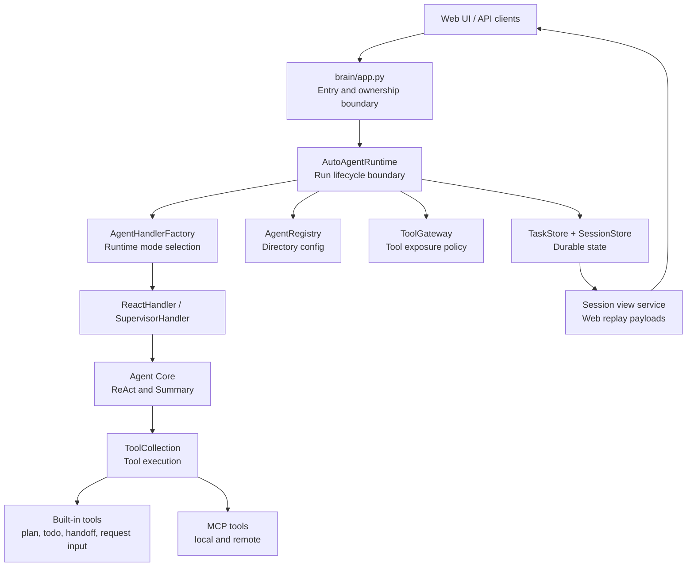
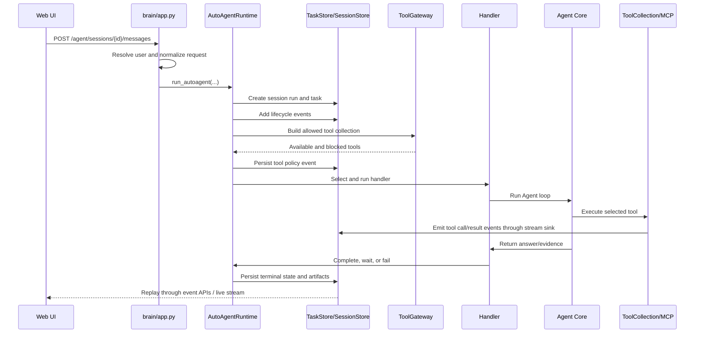

# Agent Runtime Architecture

This document explains the current TaskPilotAgent runtime in terms of layers,
abstractions, implementations, and component relationships. It is meant for
developers who need to read or change Agent behavior without guessing where the
responsibility belongs.

## Design Goal

TaskPilotAgent should behave like a durable task product, not a one-request chat
debugger. A user request should become a task that can be streamed live, replayed
later, retried, cancelled, inspected, and tied back to the authenticated user and
all artifacts it produced.

## Layer Map

## Layer Responsibilities

### 1. Web / API Entry

Primary file: `task-pilot-agent/brain/app.py`

Responsibilities:

- Resolve the current authenticated user.
- Reject access to another user's sessions, tasks, files, and artifacts.
- Normalize request options such as Agent ID, mode, selected tools, approved
  tools, run environment, language, and output style.
- Wire runtime dependencies into `AutoAgentRuntime`.
- Expose session, run, task, tool, MCP, artifact, eval, stream, and WebSocket
  APIs.

This layer should not own Agent reasoning, tool policy, task execution, or event
schema decisions.

### 2. Runtime Lifecycle

Primary file: `task-pilot-agent/brain/core/autoagent_runtime.py`

Responsibilities:

- Clone and normalize the request.
- Create or resume the session.
- Create the task record and session run projection.
- Attach the stream event sink.
- Create the `AgentContext`.
- Load memory and runtime boundary events.
- Build the policy-filtered tool collection.
- Pause for approval when high-risk selected tools require approval.
- Choose and run the Agent handler.
- Persist final output, failure, waiting-input state, artifacts, and terminal
  plan status.

This is the normal request runtime path. New Agent execution behavior should
enter through this boundary unless it is a deliberate internal-only operation.

### 3. Durable State

Primary files:

- `task-pilot-agent/brain/core/tasks.py`
- `task-pilot-agent/brain/core/sessions.py`
- `task-pilot-agent/brain/core/session_view_service.py`
- `task-pilot-agent/brain/core/session_context.py`
- `task-pilot-agent/brain/core/task_memory_context.py`
- `task-pilot-agent/brain/core/context_budget.py`
- `task-pilot-agent/brain/core/task_recovery.py`
- `task-pilot-agent/brain/core/task_runner.py`
- `task-pilot-agent/brain/core/run_events.py`
- `task-pilot-agent/brain/core/plan_snapshots.py`

Responsibilities:

- `TaskStore` records task status, task events, latest plan snapshots, usage,
  artifacts, workspace, and parent-child task relationships for retry and
  handoff runs.
- `TaskStore.start_task` is the guarded transition into running state; runtime
  code should use it so cancelled, failed, or completed tasks are not reopened
  by delayed background workers.
- `SessionStore` records user-visible sessions, messages, runs, run events, and
  session artifacts.
- `session_view_service.py` builds replay payloads for the web UI.
- `session_context.py` builds model-facing session context from recent messages
  and deterministic session summaries.
- `task_memory_context.py` builds model-facing memory and knowledge snippets
  according to the Agent's configured read scope.
- `context_budget.py` owns shared text normalization, truncation, and message
  budget fitting so session history and retrieved context have one length
  boundary.
- `task_recovery.py` rebuilds runnable requests from durable task records and
  recovers queued or interrupted work through a database lease. Recovery has a
  bounded retry counter; exhausted tasks are marked failed and emit a recovery
  failure event instead of being restarted forever.
- `task_runner.py` owns the current process-local background worker registry:
  starting workers, cancelling workers, and cleaning up completed workers.
  Running workers also renew their database lease so startup recovery does not
  steal healthy long tasks. This is the boundary to replace when moving to a
  durable queue.
- `run_events.py` defines the shared event names, frontend aliases, plan event
  set, schema version, and event categories used by runtime recording and
  replay. Serialized task and run events include these fields so the web UI does
  not need to infer event meaning from payload shape alone.
- `plan_snapshots.py` extracts plan payloads from runtime events and builds the
  latest plan snapshot stored on the task record.

Direction:

- Treat `TaskStore` as the primary execution ledger.
- Treat `SessionStore` as a conversation projection for the web UI.
- Avoid adding new state that only lives in memory or only exists in SSE.

### 4. Agent Configuration

Primary files:

- `config/agents/{agent_id}/agent.yaml`
- `config/agents/{agent_id}/system_prompt.md`
- `config/agents/{agent_id}/evals.yaml`
- `task-pilot-agent/brain/core/agent_registry.py`

Responsibilities:

- Load Agent identity, type, mode, prompt, capabilities, tools, denied tools,
  handoffs, memory scope, permissions, output defaults, and eval cases.
- Validate directory ID matching, prompt path safety, supported Agent type,
  handoff targets, and eval parsing.
- Provide runtime snapshots for events and the frontend.
- Select a worker Agent for supervisor runs.

Config files describe product behavior. They must not point to arbitrary Python
class paths.

### 5. Handler Selection

Primary files:

- `task-pilot-agent/brain/core/handlers/factory.py`
- `task-pilot-agent/brain/core/handlers/react.py`
- `task-pilot-agent/brain/core/handlers/supervisor.py`

Responsibilities:

- `AgentHandlerFactory` selects the handler for the current mode and Agent type.
- `ReactHandler` is the main runtime direction.
- `SupervisorHandler` selects and delegates to a configured worker Agent.
- The old plan/execute/summarize compatibility path has been removed.

### 6. Agent Core

Primary files:

- `task-pilot-agent/brain/core/agents/base_agent.py`
- `task-pilot-agent/brain/core/agents/react_agent.py`
- `task-pilot-agent/brain/core/agents/ReActAgentImp.py`
- `task-pilot-agent/brain/core/agents/summary_agent.py`

Responsibilities:

- `BaseAgent` owns common Agent lifecycle and memory writes.
- `ReActAgent` defines the think-act loop contract.
- `ReActAgentImp` asks the model for an answer or tool call, executes tools,
  records evidence, guards repeated identical lookup calls, and syncs plan steps.
- `SummaryAgent` streams the final answer.

Agent code should reason and delegate. It should not bypass task state,
ownership, tool policy, or the runtime boundary.

### 7. Tool Policy And Execution

Primary files:

- `task-pilot-agent/brain/core/tool_policy.py`
- `task-pilot-agent/brain/core/tools/gateway.py`
- `task-pilot-agent/brain/core/tools/collection.py`
- `task-pilot-agent/brain/core/tools/mcp_tool.py`

Responsibilities:

- `tool_policy.py` normalizes selected tools and matches MCP colon/hyphen aliases.
- `ToolGateway` builds the task-scoped, Agent-scoped, approval-aware tool set.
  It is also the boundary for blocked-tool reasons, high-risk approval request
  payloads, and approval waiting messages.
- `ToolCollection` executes tools, enforces allowed tools again at execution
  time, emits tool call/result events, applies timeouts, maps OpenAI-safe names
  back to real tool IDs, checks sandbox path boundaries, and exposes execution
  hooks for before/after/blocked observations.
- `MCPToolFetcher` loads external tools and wraps them as `MCPTool`.

Direction:

- Agents should not construct tools directly.
- All model-visible tools should come through `ToolGateway`.
- All runtime tool calls should go through `ToolCollection`.

### 8. Built-In Runtime Tools

Primary files:

- `task-pilot-agent/brain/core/tools/builtin_plan_tool.py`
- `task-pilot-agent/brain/core/tools/builtin_todo_tool.py`
- `task-pilot-agent/brain/core/tools/builtin_handoff_tool.py`
- `task-pilot-agent/brain/core/tools/builtin_request_input_tool.py`

Responsibilities:

- `builtin:plan_tool` creates, updates, marks, skips, and finishes visible plan
  state.
- `builtin:set_todo_list` updates the visible TODO/progress projection.
- `builtin:handoff` creates child work for another allowed Agent.
- `builtin:request_input` pauses a run and asks the user for missing input.

These tools are product controls. They are not generic MCP tools.

### 9. MCP And Local Tools

Primary files:

- `task-pilot-agent/tools/mcp_local/mcp_server.py`
- `task-pilot-agent/tools/mcp_local/tool/filesystem.py`
- `task-pilot-agent/tools/mcp_local/tool/process_manager.py`
- `task-pilot-agent/tools/mcp_local/tool/management_tools.py`
- `task-pilot-agent/tools/mcp_local/tool/skill_registry.py`
- `task-pilot-agent/tools/aggre_mcp_market/`

Responsibilities:

- Register local and remote capabilities.
- Provide file, search, weather, media, code, report, process, memory, skill,
  config, MCP manager, and browser-oriented operations.
- `skill_registry.py` is the task-local skill lifecycle boundary: scan,
  enable/disable, bounded load, metadata, and usage counters.
- Respect task workspace boundaries for writes and high-risk policy for shell,
  code, process, and config operations.

MCP tools expand capability. They must not bypass ToolGateway, ToolCollection,
task events, or ownership checks.

### 10. Frontend Replay

Primary files:

- `task-pilot-agent/frontend/src/App.vue`
- `task-pilot-agent/frontend/src/styles.css`

Responsibilities:

- Create sessions and submit messages.
- Subscribe to WebSocket/SSE updates.
- Merge historical events with live events.
- Render assistant messages, plan progress, tool calls, tool results, approvals,
  artifacts, status, errors, and final answers.

The frontend should render stable event payloads. It should not need to infer too
much from multiple legacy field shapes.

## Main Request Flow

## Component Relationship Summary

| Component | Owns | Must Not Own |
| --- | --- | --- |
| `brain/app.py` | API boundary, auth checks, dependency wiring | Agent reasoning, direct tool calls |
| `AutoAgentRuntime` | Run lifecycle, state transitions, event sink | HTTP route shape, UI rendering |
| `TaskStore` | Primary task ledger | Model prompting |
| `SessionStore` | Conversation projection | Source-of-truth execution status |
| `TaskRecovery` | Startup recovery from queued/interrupted task records | Agent reasoning |
| `InProcessTaskRunner` | Process-local worker start, cancellation, cleanup | Durable cross-process queue semantics |
| `AgentRegistry` | Agent config loading and validation | Tool execution |
| `AgentHandlerFactory` | Handler selection | Durable storage |
| `ReactHandler` | Main Agent execution flow | Tool filtering policy |
| `SupervisorHandler` | Worker selection and delegation | Arbitrary dynamic code loading |
| `ReActAgentImp` | Model/tool loop | Direct storage writes except via events/tools |
| `SummaryAgent` | Final answer streaming | Task lifecycle |
| `ToolGateway` | Tool exposure policy | Tool implementation details |
| `ToolCollection` | Tool execution and execution events | Agent selection |
| MCP local tools | Capability implementation | Ownership or Agent policy decisions |
| Frontend | Rendering and controls | Source-of-truth status decisions |

## Improvement Backlog From Codex Comparison

The current code already has the right building blocks. The improvement work is
to make the boundaries harder and easier to read.

1. Make `TaskStore` the single primary ledger for runs, while `SessionStore`
   remains a web conversation projection.
2. Keep moving all tool exposure, blocked reasons, approval checks, selected
   tools, and display metadata into `ToolGateway`.
3. Keep all actual tool execution behind `ToolCollection`.
4. Continue promoting plan state as first-class task state. The task metadata now
   keeps the latest plan snapshot; the next step is a dedicated plan model if
   plan editing and resume semantics grow.
5. Add a context budget layer that decides what history, memory, file snippets,
   tool outputs, and summaries are sent to the model. The current first step is
   `session_context.py`, which owns the recent-message window and deterministic
   session summary projection, plus `task_memory_context.py`, which owns
   memory/RAG lookup shaping.
6. Move long-running work away from process-local task dictionaries and toward a
   durable queue or task runner.
7. Keep tightening sandbox and high-risk tool policy around writes, shell,
   process, code execution, and config mutation.
8. Continue the skill lifecycle work. Task-local skills now have scan,
   enable/disable, bounded load, metadata, usage counters, and optional Agent
   association; the next step is automatic prompt injection through Agent
   config.
9. Prefer end-to-end runtime tests over source string tests for new behavior.
10. Stabilize event schemas so the frontend does not need compatibility guesses.

## Change Rules

When adding or changing Agent behavior:

1. Identify the affected layer before editing.
2. Add or update the Agent config only through `config/agents/{agent_id}`.
3. Expose tools through `ToolGateway`, not directly from the Agent.
4. Execute tools through `ToolCollection`, not through MCP clients directly.
5. Record lifecycle, tool, plan, approval, artifact, and failure information as
   task/run events.
6. Keep user ID ownership checks at route boundaries and store queries.
7. Add focused tests for the changed layer and directly connected layer.
