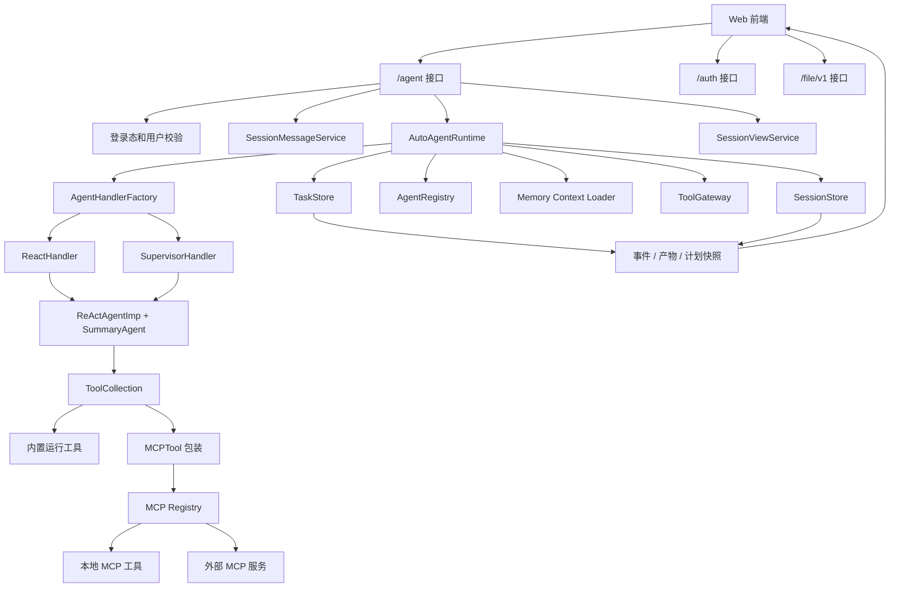
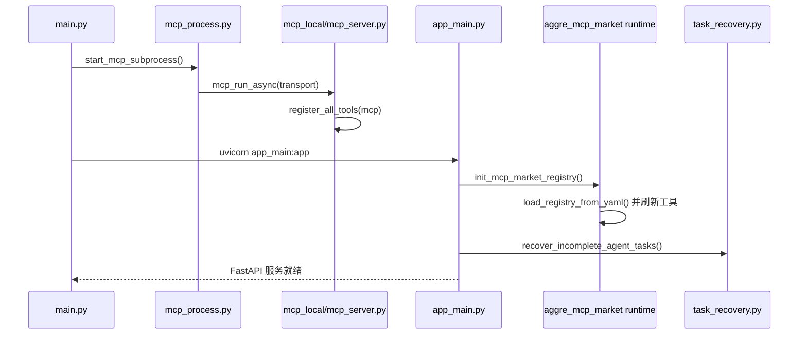
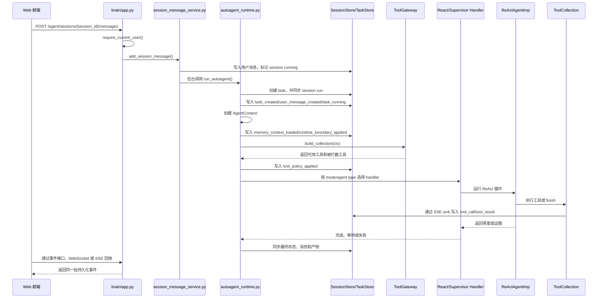
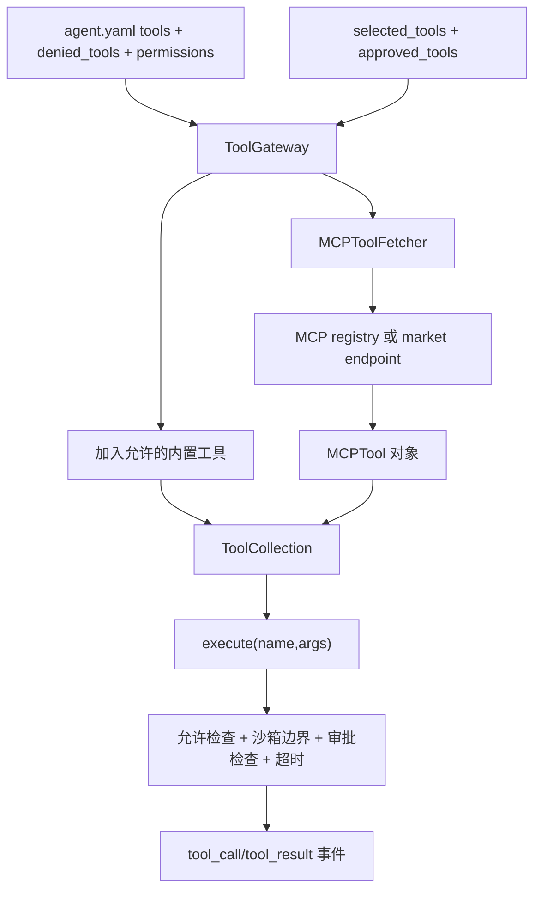
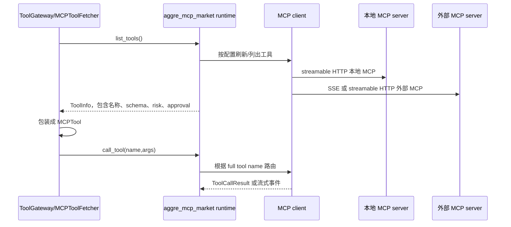
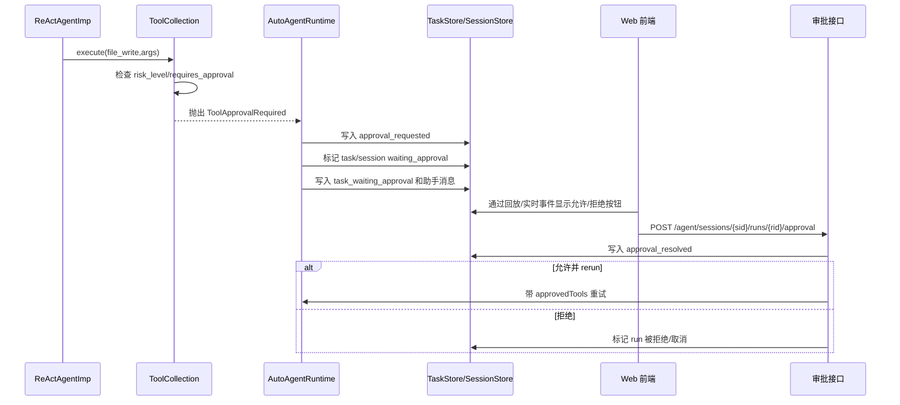
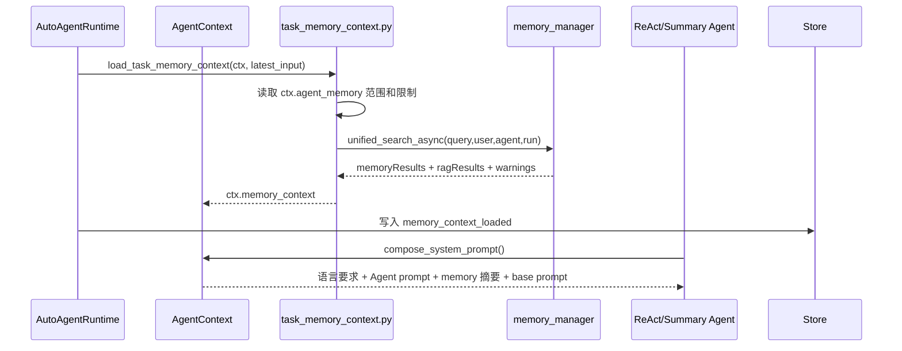
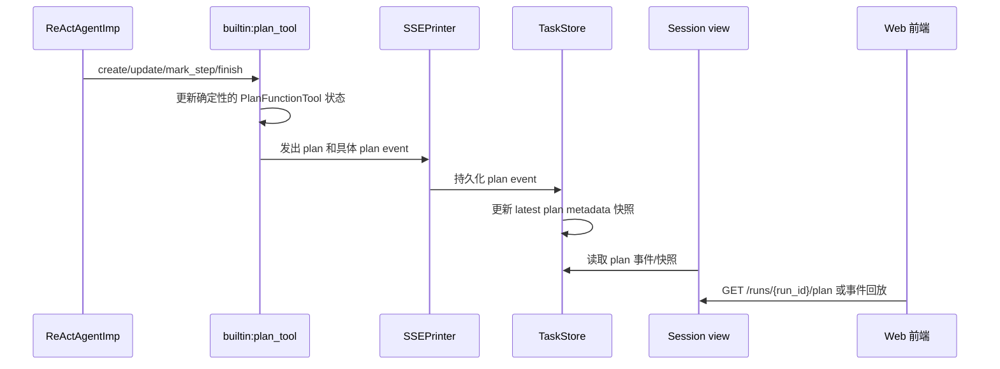
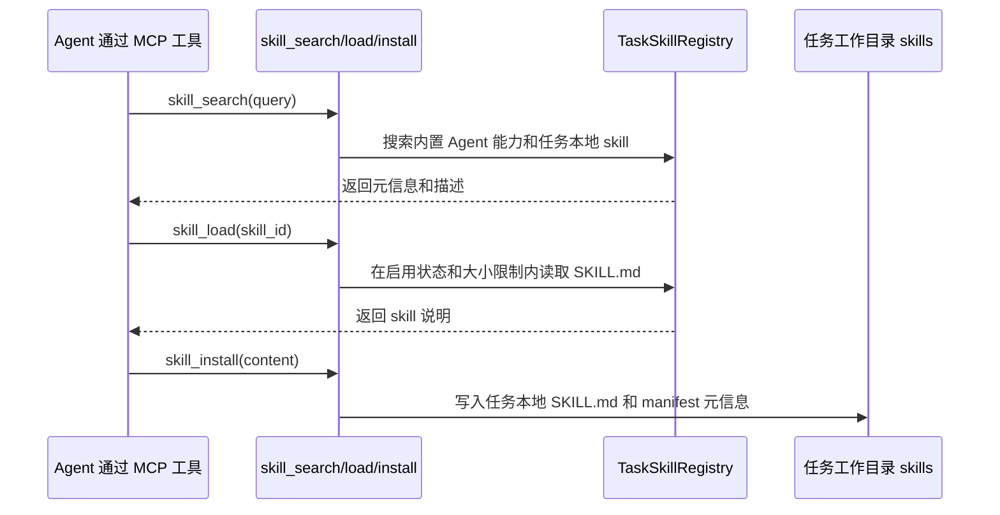

# TaskPilotAgent 运行架构

English version: [`agent-runtime-architecture.md`](agent-runtime-architecture.md)

这份文档说明当前 TaskPilotAgent 是怎么实现的。文中每个关键结论都列了代码依据，避免只按设想描述。

## 系统现在是什么

TaskPilotAgent 现在是一个**会话式 Agent 产品**，底层仍然保留一套持久化的 task/run 执行账本。

- **Session**：用户看到的会话。
- **Message**：会话里的用户消息或助手消息。
- **Run**：一次用户消息触发的一次 Agent 执行。
- **Event**：一次 run 里发生的过程记录，比如状态变化、工具调用、计划进度、审批、产物、错误和最终输出。
- **Task**：当前运行时真正使用的执行账本。Session run 会同步这份账本，给前端做刷新恢复和历史回放。

代码依据：

| 内容 | 代码 |
| --- | --- |
| FastAPI 启动和路由挂载 | [`task-pilot-agent/app_main.py`](../task-pilot-agent/app_main.py), [`task-pilot-agent/main.py`](../task-pilot-agent/main.py) |
| Session/message/run/event 存储 | [`task-pilot-agent/brain/core/sessions.py`](../task-pilot-agent/brain/core/sessions.py) |
| Task/event/artifact 执行账本 | [`task-pilot-agent/brain/core/tasks.py`](../task-pilot-agent/brain/core/tasks.py) |
| 主运行时 | [`task-pilot-agent/brain/core/autoagent_runtime.py`](../task-pilot-agent/brain/core/autoagent_runtime.py) |
| 会话消息入口和等待输入恢复 | [`task-pilot-agent/brain/core/session_message_service.py`](../task-pilot-agent/brain/core/session_message_service.py) |
| 会话详情、事件、产物、计划回放 | [`task-pilot-agent/brain/core/session_view_service.py`](../task-pilot-agent/brain/core/session_view_service.py) |

## 整体分层图

## 启动时序

实现要点：

- `main.py` 先启动本地 MCP 子进程，再启动 Uvicorn。
- `app_main.py` 挂载 `/aggre_mcp_market`、`/auth`、`/agent`、`/file/v1`。
- FastAPI lifespan 会初始化 MCP registry，并恢复未完成的 Agent 任务。

代码依据：

| 内容 | 代码 |
| --- | --- |
| 启动本地 MCP 子进程 | [`task-pilot-agent/main.py`](../task-pilot-agent/main.py), [`task-pilot-agent/mcp_process.py`](../task-pilot-agent/mcp_process.py) |
| FastAPI 路由挂载 | [`task-pilot-agent/app_main.py`](../task-pilot-agent/app_main.py) |
| 初始化 MCP market registry | [`task-pilot-agent/tools/aggre_mcp_market/app.py`](../task-pilot-agent/tools/aggre_mcp_market/app.py), [`task-pilot-agent/tools/aggre_mcp_market/service/runtime.py`](../task-pilot-agent/tools/aggre_mcp_market/service/runtime.py) |
| 注册本地 MCP 工具 | [`task-pilot-agent/tools/mcp_local/mcp_server.py`](../task-pilot-agent/tools/mcp_local/mcp_server.py), [`task-pilot-agent/tools/mcp_local/tool_registrars/all_tools.py`](../task-pilot-agent/tools/mcp_local/tool_registrars/all_tools.py) |

## 一次会话运行时序

关键点：

- 主路径是会话接口：`POST /agent/sessions/{id}/messages`。
- 每条新用户消息会生成一个 run ID，然后调用 `run_autoagent()`。
- 运行时仍会创建 task，因为 task event 是当前最完整的执行账本。
- 前端实时展示和历史回放使用同一批持久化事件。

代码依据：

| 内容 | 代码 |
| --- | --- |
| 会话消息创建 run | [`task-pilot-agent/brain/core/session_message_service.py`](../task-pilot-agent/brain/core/session_message_service.py) |
| runtime 创建 session run 和 task | [`task-pilot-agent/brain/core/autoagent_runtime.py`](../task-pilot-agent/brain/core/autoagent_runtime.py) |
| runtime 把流式事件写入 task event | [`task-pilot-agent/brain/core/autoagent_runtime.py`](../task-pilot-agent/brain/core/autoagent_runtime.py) |
| WebSocket/SSE 事件流 | [`task-pilot-agent/brain/app.py`](../task-pilot-agent/brain/app.py) |
| 前端合并历史事件和实时事件 | [`task-pilot-agent/frontend/src/App.vue`](../task-pilot-agent/frontend/src/App.vue) |

## 接口层

下面这些路径都由 `app_main.py` 挂载。

### `/agent` 接口

| 方法 | 路径 | 功能 |
| --- | --- | --- |
| GET | `/agent/agents` | 列出可用 Agent。 |
| GET | `/agent/agents/diagnostics` | 查看 Agent 配置诊断结果。 |
| GET | `/agent/agents/{agent_id}` | 查看某个 Agent 配置快照。 |
| GET | `/agent/tools` | 列出当前工具，并带上策略和风险信息。 |
| GET | `/agent/mcp/servers` | 查看 MCP 服务状态。 |
| POST | `/agent/mcp/tools/refresh` | 刷新全部 MCP 工具。 |
| POST | `/agent/mcp/servers/{server_id}/refresh` | 刷新单个 MCP 服务。 |
| POST | `/agent/mcp/tools/{tool_id}/dry-run` | 通过同一套策略测试 MCP 工具。 |
| POST | `/agent/sessions` | 创建会话。 |
| GET | `/agent/sessions` | 列出当前用户的会话。 |
| GET | `/agent/sessions/{session_id}` | 查看会话详情、消息、run、事件、产物和待审批信息。 |
| PATCH | `/agent/sessions/{session_id}` | 更新会话信息。 |
| POST | `/agent/sessions/{session_id}/archive` | 归档会话。 |
| DELETE | `/agent/sessions/{session_id}` | 软删除会话，并取消正在运行的工作。 |
| GET | `/agent/sessions/{session_id}/messages` | 分页读取会话消息。 |
| POST | `/agent/sessions/{session_id}/messages` | 发送用户消息，创建或恢复 run。 |
| GET | `/agent/sessions/{session_id}/events` | 读取会话事件，用于历史回放。 |
| GET | `/agent/sessions/{session_id}/stream` | 通过 SSE 推送会话事件。 |
| GET | `/agent/sessions/{session_id}/runs/current` | 获取当前 run。 |
| GET | `/agent/sessions/{session_id}/runs` | 列出会话内所有 run。 |
| GET | `/agent/sessions/{session_id}/runs/{run_id}` | 查看单个 run。 |
| GET | `/agent/sessions/{session_id}/runs/{run_id}/plan` | 查看某个 run 的最新计划快照。 |
| POST | `/agent/sessions/{session_id}/runs/{run_id}/cancel` | 取消 run。 |
| POST | `/agent/sessions/{session_id}/runs/{run_id}/retry` | 用历史输入和配置重试 run。 |
| POST | `/agent/sessions/{session_id}/runs/{run_id}/approval` | 审批或拒绝高风险操作。 |
| GET | `/agent/sessions/{session_id}/artifacts` | 列出会话产物。 |
| GET | `/agent/sessions/{session_id}/artifacts/{artifact_id}` | 下载会话产物。 |
| GET | `/agent/sessions/{session_id}/runs/{run_id}/artifacts` | 列出某次 run 的产物。 |
| GET | `/agent/sessions/{session_id}/tools` | 查看某个会话上下文下可用工具。 |
| POST | `/agent/sessions/{session_id}/tools/test` | 在会话上下文里测试工具。 |
| GET | `/agent/agents/{agent_id}/evals` | 查看 Agent eval 用例。 |
| POST | `/agent/agents/{agent_id}/evals/run` | 执行某个 Agent 的全部 eval。 |
| POST | `/agent/agents/{agent_id}/evals/{case_id}/run` | 执行单个 eval 用例。 |
| POST | `/agent/tasks/{task_id}/eval-result` | 评估一个已完成 task 的结果。 |
| GET | `/agent/tasks` | 兼容旧 task 列表。 |
| POST | `/agent/tasks` | 兼容旧 task 创建。 |
| GET | `/agent/tasks/{task_id}` | 兼容旧 task 详情。 |
| GET | `/agent/tasks/{task_id}/events` | 兼容旧 task 事件列表。 |
| POST | `/agent/tasks/{task_id}/cancel` | 兼容旧 task 取消。 |
| DELETE | `/agent/tasks/{task_id}` | 兼容旧 task 删除。 |
| POST | `/agent/tasks/{task_id}/retry` | 兼容旧 task 重试。 |
| POST | `/agent/tasks/{task_id}/input` | 恢复等待用户输入的 task。 |
| GET | `/agent/tasks/{task_id}/artifacts` | 兼容旧 task 产物列表。 |
| GET | `/agent/tasks/{task_id}/artifacts/{artifact_id}` | 兼容旧 task 产物下载。 |
| GET | `/agent/web/assets/{asset_path}` | 返回前端构建产物。 |
| GET | `/agent/web/autoagent` | 返回 Web 页面。 |
| POST | `/agent/autoagent` | 旧版直接 autoagent 请求。 |
| WS | `/agent/ws/sessions/{session_id}` | 会话事件 WebSocket。 |
| WS | `/agent/ws/autoagent` | 旧版 autoagent WebSocket。 |
| GET | `/agent/web/health` | Web 健康检查。 |

代码依据：[`task-pilot-agent/brain/app.py`](../task-pilot-agent/brain/app.py)。

### `/auth` 接口

| 方法 | 路径 | 功能 |
| --- | --- | --- |
| GET | `/auth/providers` | 列出可用登录提供方。 |
| GET | `/auth/me` | 获取当前登录用户。 |
| POST | `/auth/logout` | 退出当前登录。 |
| POST | `/auth/logout-all` | 退出当前用户的所有登录。 |
| GET | `/auth/users/me` | 查看当前用户资料。 |
| PATCH | `/auth/users/me` | 更新当前用户资料。 |
| GET | `/auth/users/me/identities` | 查看绑定的外部身份。 |
| DELETE | `/auth/users/me/identities/{identity_id}` | 解绑一个外部身份。 |
| GET | `/auth/admin/users` | 管理员查看用户列表。 |
| POST | `/auth/admin/users` | 管理员创建用户。 |
| PATCH | `/auth/admin/users/{user_id}` | 管理员更新用户。 |
| POST | `/auth/admin/users/{user_id}/disable` | 禁用用户。 |
| DELETE | `/auth/admin/users/{user_id}` | 软删除用户。 |
| POST | `/auth/admin/legacy-users` | 创建旧用户映射输入。 |
| POST | `/auth/admin/legacy-users/{legacy_user_id}/map` | 把旧用户映射到 TaskPilot 用户。 |
| GET | `/auth/admin/audit-events` | 查看认证审计事件。 |
| POST | `/auth/admin/cleanup` | 清理认证记录。 |
| POST | `/auth/{provider}/link` | 发起账号绑定。 |
| DELETE | `/auth/{provider}/link/{identity_id}` | 删除账号绑定。 |
| GET | `/auth/{provider}/login` | 发起外部登录。 |
| GET | `/auth/{provider}/callback` | 外部登录回调。 |
| GET | `/auth/whoami` | 旧版/调试身份接口。 |

代码依据：[`task-pilot-agent/auth/router.py`](../task-pilot-agent/auth/router.py)。

### `/aggre_mcp_market` 接口

| 方法 | 路径 | 功能 |
| --- | --- | --- |
| GET | `/aggre_mcp_market/tools` | 列出聚合后的 MCP 工具，包括风险和审批信息。 |
| GET | `/aggre_mcp_market/servers` | 查看 MCP 服务状态。 |
| POST | `/aggre_mcp_market/refresh` | 刷新 registry 工具快照。 |
| GET | `/aggre_mcp_market/prompt` | 根据当前 MCP 工具生成 prompt 片段。 |
| POST | `/aggre_mcp_market/call_tool` | 调用 MCP 工具，可按 SSE 流式返回。 |

代码依据：[`task-pilot-agent/tools/aggre_mcp_market/app.py`](../task-pilot-agent/tools/aggre_mcp_market/app.py)。

### `/file/v1` 接口

| 方法 | 路径 | 功能 |
| --- | --- | --- |
| POST | `/file/v1/get_file` | 按 request/file 信息读取文件元数据。 |
| POST | `/file/v1/upload_file` | 通过 JSON 上传文件。 |
| POST | `/file/v1/upload_file_data` | 上传原始文件数据。 |
| POST | `/file/v1/upload_file_form` | 浏览器 multipart 上传文件。 |
| POST | `/file/v1/get_file_list` | 列出某个 request 下的文件。 |
| GET | `/file/v1/download_file/{request_id}/{file_name}` | 下载文件。 |
| GET | `/file/v1/preview_file/{request_id}/{file_name}` | 预览文件，并做归属校验。 |

代码依据：[`task-pilot-agent/file/file_op.py`](../task-pilot-agent/file/file_op.py)。

## Agent 配置和运行模式

Agent 配置放在 `config/agents/{agent_id}`：

- `agent.yaml`：Agent 身份、类型、mode、工具、禁用工具、handoff、memory、权限和输出默认值。
- `system_prompt.md`：Agent 自己的系统提示词。
- `evals.yaml`：烟测和回归用例。

当前默认配置里有这些 Agent：

- `task-pilot-agent`
- `supervisor_agent`
- `search_agent`
- `browser_agent`
- `data_agent`
- `code_agent`
- `report_agent`

默认 Agent 是 `react_worker`，使用 `mode: react`。它允许通用文件、搜索、浏览器、媒体、报告、配置读取、skill、memory 和远程 MCP 工具；明确禁用 `deepsearch`；通过权限禁用 shell；对高风险工具要求审批。

代码依据：

| 内容 | 代码 |
| --- | --- |
| Agent 模型和配置校验 | [`task-pilot-agent/brain/core/agent_registry.py`](../task-pilot-agent/brain/core/agent_registry.py) |
| 默认 Agent 配置 | [`config/agents/task-pilot-agent/agent.yaml`](../config/agents/task-pilot-agent/agent.yaml) |
| Handler 选择 | [`task-pilot-agent/brain/core/handlers/factory.py`](../task-pilot-agent/brain/core/handlers/factory.py) |
| React handler | [`task-pilot-agent/brain/core/handlers/react.py`](../task-pilot-agent/brain/core/handlers/react.py) |
| Supervisor handler | [`task-pilot-agent/brain/core/handlers/supervisor.py`](../task-pilot-agent/brain/core/handlers/supervisor.py) |

## 工具系统

### 内置运行工具

| 工具 | 作用 | 代码 |
| --- | --- | --- |
| `builtin:plan_tool` | 创建、更新、标记、完成用户可见计划。 | [`builtin_plan_tool.py`](../task-pilot-agent/brain/core/tools/builtin_plan_tool.py) |
| `builtin:set_todo_list` | 把短期进度投影成 TODO 卡片。 | [`builtin_todo_tool.py`](../task-pilot-agent/brain/core/tools/builtin_todo_tool.py) |
| `builtin:handoff` | 把子任务交给允许的其他 Agent。 | [`builtin_handoff_tool.py`](../task-pilot-agent/brain/core/tools/builtin_handoff_tool.py) |
| `builtin:request_input` | 缺信息时暂停 run，并请求用户补充。 | [`builtin_request_input_tool.py`](../task-pilot-agent/brain/core/tools/builtin_request_input_tool.py) |

### 本地 MCP 工具集

这些工具由 `register_all_tools(mcp)` 注册。

| 分类 | 工具 |
| --- | --- |
| 文件系统 | `file_read`, `file_write`, `file_edit`, `file_list`, `file_stat`, `file_glob`, `file_grep`, `directory_create`, `file_copy`, `file_move`, `file_delete` |
| Web / 搜索 / 天气 | `web_search`, `fetch_url`, `web_reader`, `get_current_weather`, `get_weather_forecast` |
| 浏览器 / 媒体 / 报告 / 代码 | `browser_agent`, `audio_tool`, `image_tool`, `video_tool`, `text_to_image`, `report`, `code_interpreter` |
| 进程 / 配置 / MCP 管理 | `shell_exec`, `process_command_*`, `config_read`, `config_update`, `mcp_manager_*` |
| Skill 和 memory | `skill_search`, `skill_load`, `skill_install`, `skill_enable/disable`, `memory_search`, `memory_add`, `memory_delete` |
| 消息和子 Agent | `message_send`, `create_subagent` |

代码依据：

| 内容 | 代码 |
| --- | --- |
| 构建经过策略过滤的工具集合 | [`task-pilot-agent/brain/core/tools/gateway.py`](../task-pilot-agent/brain/core/tools/gateway.py) |
| 执行工具并写入事件 | [`task-pilot-agent/brain/core/tools/collection.py`](../task-pilot-agent/brain/core/tools/collection.py) |
| 包装 MCP 工具 | [`task-pilot-agent/brain/core/tools/mcp_tool.py`](../task-pilot-agent/brain/core/tools/mcp_tool.py) |
| 注册本地 MCP 工具 | [`task-pilot-agent/tools/mcp_local/tool_registrars/all_tools.py`](../task-pilot-agent/tools/mcp_local/tool_registrars/all_tools.py) |
| 文件沙箱逻辑 | [`task-pilot-agent/tools/mcp_local/tool/filesystem.py`](../task-pilot-agent/tools/mcp_local/tool/filesystem.py) |

## MCP 架构

当前实现要点：

- 本地 MCP server 仍然作为独立子进程运行。
- 应用内部也保存了一个 MCP registry 对象，用于列工具、刷新工具、调用工具，不需要内部逻辑都绕 HTTP route。
- 外部 MCP 通过统一的 `MCPClientBase` 接口接入。
- 工具元信息带有 `risk_level` 和 `requires_approval`，registry 会对已知危险工具推断高风险。

代码依据：

| 内容 | 代码 |
| --- | --- |
| registry runtime 单例 | [`task-pilot-agent/tools/aggre_mcp_market/service/runtime.py`](../task-pilot-agent/tools/aggre_mcp_market/service/runtime.py) |
| registry 刷新、缓存、风险推断、调用路由 | [`task-pilot-agent/tools/aggre_mcp_market/service/registry.py`](../task-pilot-agent/tools/aggre_mcp_market/service/registry.py) |
| MCP client 抽象 | [`task-pilot-agent/tools/aggre_mcp_market/mcp_clients/base.py`](../task-pilot-agent/tools/aggre_mcp_market/mcp_clients/base.py) |
| Streamable HTTP MCP client | [`task-pilot-agent/tools/aggre_mcp_market/mcp_clients/http_client.py`](../task-pilot-agent/tools/aggre_mcp_market/mcp_clients/http_client.py) |
| SSE MCP client | [`task-pilot-agent/tools/aggre_mcp_market/mcp_clients/sse_client.py`](../task-pilot-agent/tools/aggre_mcp_market/mcp_clients/sse_client.py) |
| 本地 MCP 子进程 | [`task-pilot-agent/mcp_process.py`](../task-pilot-agent/mcp_process.py) |

## 审批流程

审批有两层拦截：

- 工具暴露前：`ToolGateway` 结合 Agent 配置可以先拦截高风险已选工具，并生成审批请求。
- 工具真正执行前：`ToolCollection` 会检查工具对象上的 `risk_level` 和 `requires_approval`。这保证 MCP registry 识别出来的风险也会生效。

代码依据：

| 内容 | 代码 |
| --- | --- |
| 高风险工具暴露前审批 | [`task-pilot-agent/brain/core/tools/gateway.py`](../task-pilot-agent/brain/core/tools/gateway.py), [`task-pilot-agent/brain/core/autoagent_runtime.py`](../task-pilot-agent/brain/core/autoagent_runtime.py) |
| 工具执行时审批异常 | [`task-pilot-agent/brain/core/tools/collection.py`](../task-pilot-agent/brain/core/tools/collection.py), [`task-pilot-agent/brain/core/agents/ReActAgentImp.py`](../task-pilot-agent/brain/core/agents/ReActAgentImp.py) |
| 审批处理和重试 | [`task-pilot-agent/brain/core/approval_service.py`](../task-pilot-agent/brain/core/approval_service.py) |
| 审批接口 | [`task-pilot-agent/brain/app.py`](../task-pilot-agent/brain/app.py) |
| 前端审批按钮 | [`task-pilot-agent/frontend/src/App.vue`](../task-pilot-agent/frontend/src/App.vue) |
| 审批测试 | [`task-pilot-agent/tests/tasks/test_task_control_api.py`](../task-pilot-agent/tests/tasks/test_task_control_api.py), [`task-pilot-agent/tests/tasks/test_tool_collection_policy.py`](../task-pilot-agent/tests/tasks/test_tool_collection_policy.py) |

## Memory 和知识库检索

实现要点：

- Agent 配置控制 memory 读取范围。
- `AgentContext.compose_system_prompt()` 会把语言要求、Agent prompt、memory/knowledge 摘要注入最终 prompt。
- memory 有降级路径。mem0 或向量检索不可用时，会返回空结果和 warning，不会让正常 run 崩溃。
- memory 也以 MCP 工具形式暴露：`memory_search`、`memory_add`、`memory_delete`。

代码依据：

| 内容 | 代码 |
| --- | --- |
| runtime 加载 memory | [`task-pilot-agent/brain/core/autoagent_runtime.py`](../task-pilot-agent/brain/core/autoagent_runtime.py) |
| memory 范围、搜索和摘要 | [`task-pilot-agent/brain/core/task_memory_context.py`](../task-pilot-agent/brain/core/task_memory_context.py) |
| prompt 注入 | [`task-pilot-agent/brain/core/context.py`](../task-pilot-agent/brain/core/context.py) |
| memory manager 和降级 | [`task-pilot-agent/memory/memory_mgr.py`](../task-pilot-agent/memory/memory_mgr.py) |
| RAG 检索器 | [`task-pilot-agent/memory/rag_retriever.py`](../task-pilot-agent/memory/rag_retriever.py) |
| memory MCP 工具 | [`task-pilot-agent/tools/mcp_local/tool/management_tools.py`](../task-pilot-agent/tools/mcp_local/tool/management_tools.py) |

## Plan 流程

实现要点：

- Plan 是 ReAct/Supervisor 里的工具，不是独立执行模式。
- `run_events.py` 定义了计划事件名称，并把 plan command 映射成 `plan_created`、`plan_step_completed`、`plan_completed` 等事件。
- `ReActAgentImp` 可以在工具结果后同步计划步骤状态。
- `session_view_service.py` 向前端暴露 run 的最新计划。

代码依据：

| 内容 | 代码 |
| --- | --- |
| Plan 工具 | [`task-pilot-agent/brain/core/tools/builtin_plan_tool.py`](../task-pilot-agent/brain/core/tools/builtin_plan_tool.py), [`task-pilot-agent/brain/core/tools/plan_tool.py`](../task-pilot-agent/brain/core/tools/plan_tool.py) |
| Plan 事件类型 | [`task-pilot-agent/brain/core/run_events.py`](../task-pilot-agent/brain/core/run_events.py) |
| 最新计划快照 | [`task-pilot-agent/brain/core/plan_snapshots.py`](../task-pilot-agent/brain/core/plan_snapshots.py) |
| 工具调用后同步步骤 | [`task-pilot-agent/brain/core/agents/ReActAgentImp.py`](../task-pilot-agent/brain/core/agents/ReActAgentImp.py) |
| Plan 回放接口 | [`task-pilot-agent/brain/app.py`](../task-pilot-agent/brain/app.py), [`task-pilot-agent/brain/core/session_view_service.py`](../task-pilot-agent/brain/core/session_view_service.py) |

## Skill 流程

实现要点：

- Skill 通过本地 MCP management tools 暴露，不是单独 runtime mode。
- 任务本地 skill 存在任务工作目录里，ID 会被安全化，读取有大小限制。
- Agent 配置可以像控制其他工具一样允许或禁用 skill 工具。

代码依据：

| 内容 | 代码 |
| --- | --- |
| 任务本地 skill registry | [`task-pilot-agent/tools/mcp_local/tool/skill_registry.py`](../task-pilot-agent/tools/mcp_local/tool/skill_registry.py) |
| Skill MCP 工具 | [`task-pilot-agent/tools/mcp_local/tool/management_tools.py`](../task-pilot-agent/tools/mcp_local/tool/management_tools.py) |
| 工具注册 | [`task-pilot-agent/tools/mcp_local/tool_registrars/all_tools.py`](../task-pilot-agent/tools/mcp_local/tool_registrars/all_tools.py) |
| 工具策略暴露 | [`task-pilot-agent/brain/core/tools/gateway.py`](../task-pilot-agent/brain/core/tools/gateway.py) |

## 前端回放和控制

Vue 前端不是事实来源，它主要做展示和操作：

- 创建 session、发送 message。
- 优先打开 WebSocket，失败时回退到 SSE。
- 合并历史事件和实时事件。
- 渲染助手消息、计划进度、工具调用、工具结果、审批、产物、状态、错误和最终答案。

代码依据：

| 内容 | 代码 |
| --- | --- |
| WebSocket/SSE 客户端 | [`task-pilot-agent/frontend/src/App.vue`](../task-pilot-agent/frontend/src/App.vue) |
| 进度和事件渲染 | [`task-pilot-agent/frontend/src/App.vue`](../task-pilot-agent/frontend/src/App.vue) |
| 审批按钮 | [`task-pilot-agent/frontend/src/App.vue`](../task-pilot-agent/frontend/src/App.vue) |
| 样式 | [`task-pilot-agent/frontend/src/styles.css`](../task-pilot-agent/frontend/src/styles.css) |

## 当前实现保证

- 受保护接口会先解析当前用户，再读取 session、task、file 或 artifact。
- Session API 是当前产品主路径，task API 保留为兼容路径。
- 工具暴露必须经过 `ToolGateway`。
- 工具执行必须经过 `ToolCollection`。
- MCP 工具的风险和审批信息会进入 Agent runtime。
- 高风险工具可以让 run 暂停并等待用户审批。
- Memory/RAG 不可用时会降级，不会直接打断普通 Agent run。
- Plan 通过结构化事件和最新快照展示。
- 前端从持久化事件渲染，所以刷新和重连能恢复进度。

## 覆盖这些能力的测试

| 内容 | 测试 |
| --- | --- |
| Session/task 控制接口、审批、重试、工具列表 | [`task-pilot-agent/tests/tasks/test_task_control_api.py`](../task-pilot-agent/tests/tasks/test_task_control_api.py) |
| ToolCollection 策略和执行时审批 | [`task-pilot-agent/tests/tasks/test_tool_collection_policy.py`](../task-pilot-agent/tests/tasks/test_tool_collection_policy.py) |
| ToolGateway 行为 | [`task-pilot-agent/tests/tasks/test_tool_gateway.py`](../task-pilot-agent/tests/tasks/test_tool_gateway.py) |
| Agent 配置校验 | [`task-pilot-agent/tests/tasks/test_agent_registry.py`](../task-pilot-agent/tests/tasks/test_agent_registry.py) |
| SessionStore | [`task-pilot-agent/tests/tasks/test_session_store.py`](../task-pilot-agent/tests/tasks/test_session_store.py) |
| TaskStore 和产物 | [`task-pilot-agent/tests/tasks/test_task_store.py`](../task-pilot-agent/tests/tasks/test_task_store.py) |
| 前端源码级行为 | [`task-pilot-agent/tests/tasks/test_autoagent_web.py`](../task-pilot-agent/tests/tasks/test_autoagent_web.py) |
| 本地 MCP 文件沙箱 | [`task-pilot-agent/tests/tasks/test_mcp_filesystem_tools.py`](../task-pilot-agent/tests/tasks/test_mcp_filesystem_tools.py) |
| Memory 降级 | [`task-pilot-agent/tests/memory/test_memory_degradation.py`](../task-pilot-agent/tests/memory/test_memory_degradation.py) |
| Auth 和用户隔离 | [`task-pilot-agent/tests/auth/`](../task-pilot-agent/tests/auth/) |
