# TaskPilot External Login And User Design

## Completion Criteria

This document is complete when it can guide implementation of third-party login without additional architecture decisions:

- It defines how TaskPilot users, external provider accounts, sessions, tasks, memories, files, and artifacts relate.
- It explains how a new external user, returning external user, logged-in user binding a provider, and existing legacy user are mapped.
- It includes full flow diagrams and sequence diagrams.
- It defines the database structures needed for users, identities, sessions, OAuth state, provider configuration, and future external API authorization.
- It lists the API changes and resource ownership checks needed across Agent, task, file, and frontend flows.
- It provides a TODO list in implementation order with acceptance checks.

## Design Goal

TaskPilot needs a real user identity layer. Google is only the first external login method. Microsoft, WeChat, GitHub, enterprise SSO, or future providers should plug into the same identity layer.

After a provider proves who the person is, TaskPilot must create or find its own `user_id` and use that `user_id` everywhere internally.

The core rule:

```text
External provider account -> user identity binding -> TaskPilot user_id -> tasks / memory / files / artifacts
```

The frontend must not decide `user_id`. It can only carry the browser cookie issued by TaskPilot. The backend resolves the current user from that cookie and writes the resolved `user_id` into task, memory, and file records.

## Provider Protocol Constraints Used By This Design

- Server-side web apps should use an authorization code flow where the provider supports it.
- OIDC providers should use scopes such as `openid profile email` and return an ID token.
- OIDC ID tokens must be validated before trust: audience, issuer, expiration, signature, and nonce.
- OAuth callback `state` must be one-time and verified before exchanging the code.
- Provider identity must be linked by a stable provider subject, not by email, display name, phone number, or avatar.
- Email is profile data only. It can change and should not be used as the primary account key.

References:

- [Google OAuth 2.0 for Web Server Applications](https://developers.google.com/identity/protocols/oauth2/web-server)
- [Google OpenID Connect](https://developers.google.com/identity/openid-connect/openid-connect)
- [Microsoft identity platform OAuth 2.0 and OIDC](https://learn.microsoft.com/en-us/entra/identity-platform/v2-protocols)
- [Microsoft identity platform OIDC](https://learn.microsoft.com/en-us/entra/identity-platform/v2-protocols-oidc)

## Current TaskPilot State

Current useful pieces:

- `task_pilot_task.user_id` already exists and can bind tasks to a user.
- `AgentContext.user_id` already exists and is used by Agent memory and message history.
- Memory message records already support `user_id` and `conversation_id`.
- Task artifacts are attached to a task, so they can be protected through task ownership.

Current gaps:

- `GptQueryReq.user_id` can be supplied by the frontend. This is not trusted identity.
- Task list and task detail APIs can be queried without checking the current logged-in user.
- File records are primarily bound by `request_id`, not by authenticated owner.
- File preview and download endpoints do not enforce user ownership.
- There is no local user table, external identity table, session table, provider registry, or OAuth callback state table.

## High-Level Architecture

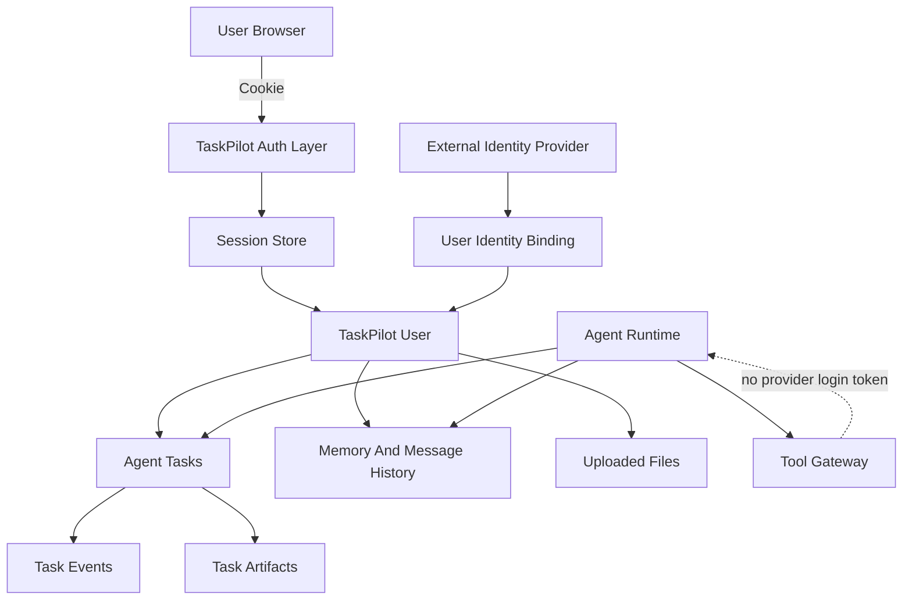

Important boundaries:

- Provider login token stays in the auth layer.
- Agent runtime receives `user_id`, `task_id`, user preferences if needed, and allowed tools.
- Agent prompts, task events, logs, and tool arguments must not contain provider tokens, session cookies, or OAuth refresh tokens.

## External Provider And TaskPilot User Relationship

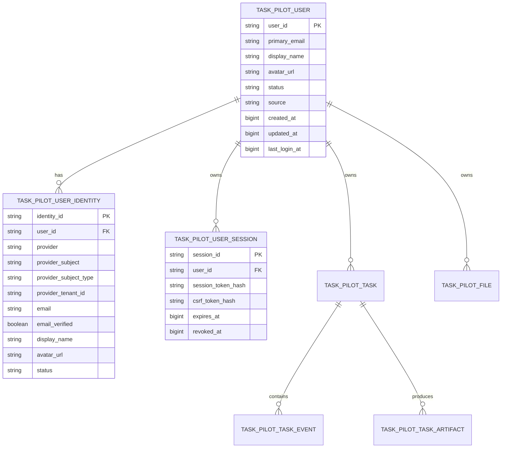

Relationship rules:

- One TaskPilot user can have multiple identities, such as Google, Microsoft, WeChat, GitHub, email password, or enterprise SSO.
- For each provider account, `provider + provider_subject` maps to exactly one TaskPilot `user_id`.
- `(provider, provider_subject)` must be unique.
- `email` is profile data only. It is useful for display and hints, but not for automatic identity ownership.

## Generic External Identity Provider Layer

The auth layer should be built around a provider registry and provider adapters. Google should be implemented as the first adapter, not as a special case in task or user code.

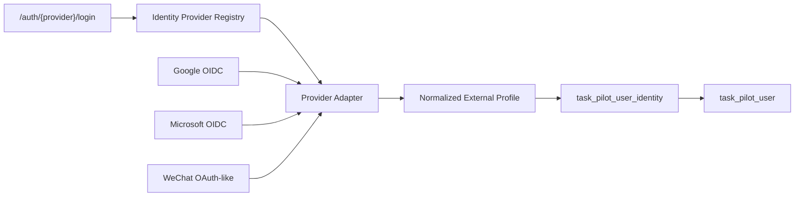

Provider adapter responsibilities:

- Build the provider authorization URL.
- Persist and verify `state`; persist and verify `nonce` when the provider supports OIDC.
- Exchange authorization code for provider tokens.
- Validate ID tokens for OIDC providers.
- Fetch userinfo when needed.
- Normalize provider-specific data into a common `ExternalIdentityProfile`.
- Choose a stable `provider_subject`.
- Redact tokens before logging, task events, or frontend responses.

Normalized profile shape:

```text
ExternalIdentityProfile
- provider                 # google, microsoft, wechat, github, enterprise_oidc
- provider_subject         # stable account identifier after provider-specific normalization
- provider_subject_type    # sub, oid_tid, unionid, openid_appid, provider_user_id
- provider_app_id          # OAuth app/client/appid if relevant
- provider_tenant_id       # tenant/domain/corp id when relevant
- email
- email_verified
- display_name
- avatar_url
- locale
- raw_profile              # sanitized profile claims only, no tokens
```

Provider subject rules:

| Provider | Protocol | Recommended `provider_subject` | Notes |
|---|---|---|---|
| Google | OIDC | `sub` | Google states `sub` is stable for the Google Account; do not use email. |
| Microsoft | OIDC | `issuer + ":" + sub` by default | For tenant-scoped enterprise mode, adapter may use `tid + ":" + oid` when `oid` and `tid` are present and the tenant policy requires it. |
| WeChat website login | OAuth-like | Prefer `unionid` | If `unionid` is unavailable, use `appid + ":" + openid` and mark `provider_subject_type = openid_appid`. |
| GitHub | OAuth2 | GitHub numeric/string user id | Do not use username because usernames can change. |
| Enterprise OIDC | OIDC | Provider-configured stable claim | Default to `sub`; allow admin to choose a different immutable claim only when documented by the IdP. |

WeChat-specific rule:

- If a user first logs in with `openid_appid` and later a `unionid` becomes available, do not silently merge accounts. Add a controlled upgrade path:
  - Find whether `wechat + unionid` already exists.
  - If not, attach unionid to the same user and keep old openid mapping as secondary.
  - If it exists on another user, require explicit merge/admin handling.

Provider config can start in `config/config.yaml` and later move to a DB table if admin UI is needed.

Example config shape:

```yaml
auth:
  providers:
    google:
      enabled: true
      protocol: oidc
      client_id_env: GOOGLE_CLIENT_ID
      client_secret_env: GOOGLE_CLIENT_SECRET
      issuer: https://accounts.google.com
      scopes: [openid, profile, email]
      subject_strategy: sub

    microsoft:
      enabled: false
      protocol: oidc
      client_id_env: MICROSOFT_CLIENT_ID
      client_secret_env: MICROSOFT_CLIENT_SECRET
      issuer: https://login.microsoftonline.com/common/v2.0
      scopes: [openid, profile, email]
      subject_strategy: issuer_sub

    wechat:
      enabled: false
      protocol: oauth2_custom
      client_id_env: WECHAT_APP_ID
      client_secret_env: WECHAT_APP_SECRET
      scopes: [snsapi_login]
      subject_strategy: unionid_then_appid_openid
```

## Data Structures

Use the same database connection as the existing task and file tables. Prefer table names under the existing `task_pilot_*` convention.

### `task_pilot_user`

Stores the TaskPilot internal user.

| Field | Type | Required | Notes |
|---|---:|---:|---|
| `id` | bigint | yes | DB auto ID |
| `user_id` | string(128) | yes | Public internal ID, for example `usr_...`; unique |
| `primary_email` | string(320) | no | Current display email |
| `display_name` | string(256) | no | Current display name |
| `avatar_url` | string(2048) | no | Current avatar |
| `locale` | string(32) | no | User locale |
| `status` | string(32) | yes | `active`, `disabled`, `deleted` |
| `source` | string(32) | yes | `google`, `microsoft`, `wechat`, `legacy`, `admin`, `dev` |
| `metadata` | text/json | no | Safe profile metadata only |
| `created_at` | bigint | yes | ms timestamp |
| `updated_at` | bigint | yes | ms timestamp |
| `last_login_at` | bigint | no | ms timestamp |
| `deleted_at` | bigint | no | soft delete timestamp |

Indexes:

- Unique: `user_id`
- Index: `primary_email`
- Index: `status`

### `task_pilot_user_identity`

Stores the relationship between an external account and a TaskPilot user.

| Field | Type | Required | Notes |
|---|---:|---:|---|
| `id` | bigint | yes | DB auto ID |
| `identity_id` | string(128) | yes | Public identity ID; unique |
| `user_id` | string(128) | yes | FK to `task_pilot_user.user_id` |
| `provider` | string(64) | yes | `google`, `microsoft`, `wechat`, `github`, `enterprise_oidc` |
| `provider_subject` | string(255) | yes | Stable provider account identifier after adapter normalization |
| `provider_subject_type` | string(64) | yes | `sub`, `issuer_sub`, `oid_tid`, `unionid`, `openid_appid`, `provider_user_id` |
| `provider_app_id` | string(255) | no | OAuth client/app/appid when relevant |
| `provider_tenant_id` | string(255) | no | Microsoft tenant, enterprise tenant, WeChat open platform account, or provider domain |
| `email` | string(320) | no | Current provider email when available |
| `email_verified` | boolean | yes | Provider verification flag when available |
| `display_name` | string(256) | no | From provider profile |
| `avatar_url` | string(2048) | no | From provider profile |
| `raw_profile` | text/json | no | Sanitized claims only, no tokens |
| `status` | string(32) | yes | `active`, `unlinked`, `disabled` |
| `created_at` | bigint | yes | ms timestamp |
| `updated_at` | bigint | yes | ms timestamp |
| `last_seen_at` | bigint | no | last provider login |

Indexes:

- Unique: `(provider, provider_subject)`
- Index: `user_id`
- Index: `email`
- Index: `status`

### `task_pilot_user_session`

Stores TaskPilot login sessions. The cookie contains an opaque random token. The database stores only the token hash.

| Field | Type | Required | Notes |
|---|---:|---:|---|
| `id` | bigint | yes | DB auto ID |
| `session_id` | string(128) | yes | Public session ID; unique |
| `user_id` | string(128) | yes | FK to user |
| `session_token_hash` | string(128) | yes | SHA-256 or HMAC hash of cookie token |
| `csrf_token_hash` | string(128) | no | For unsafe requests if CSRF protection is enabled |
| `user_agent_hash` | string(128) | no | Optional audit |
| `ip_hash` | string(128) | no | Optional audit |
| `created_at` | bigint | yes | ms timestamp |
| `last_seen_at` | bigint | yes | ms timestamp |
| `expires_at` | bigint | yes | ms timestamp |
| `revoked_at` | bigint | no | set on logout or admin revoke |
| `metadata` | text/json | no | Safe audit metadata |

Indexes:

- Unique: `session_id`
- Unique: `session_token_hash`
- Index: `user_id`
- Index: `expires_at`

Cookie policy:

- Name: `tpa_session`
- Value: opaque random token, not `user_id`
- `HttpOnly`: true
- `Secure`: true in production
- `SameSite`: `Lax` for same-site app flows
- `Path`: `/`
- Expiration: match `expires_at`

### `task_pilot_oauth_state`

Stores one-time OAuth login state. Do not keep this in process memory because the app may run multiple workers.

| Field | Type | Required | Notes |
|---|---:|---:|---|
| `id` | bigint | yes | DB auto ID |
| `state_hash` | string(128) | yes | hash of OAuth state; unique |
| `nonce_hash` | string(128) | yes | hash of OpenID nonce |
| `purpose` | string(32) | yes | `login`, `link` |
| `user_id` | string(128) | no | present for link flow |
| `redirect_after` | string(2048) | no | validated relative path only |
| `created_at` | bigint | yes | ms timestamp |
| `expires_at` | bigint | yes | short TTL, for example 10 minutes |
| `consumed_at` | bigint | no | set after callback |
| `metadata` | text/json | no | safe data only |

Indexes:

- Unique: `state_hash`
- Index: `expires_at`
- Index: `consumed_at`

### Optional Future Table: `task_pilot_external_connection`

This table is not required for login. Add it only when Agent tools need access to provider APIs such as Google Drive, Gmail, Calendar, Microsoft Graph, GitHub, or WeChat APIs.

| Field | Type | Notes |
|---|---:|---|
| `connection_id` | string(128) | unique |
| `user_id` | string(128) | owner |
| `identity_id` | string(128) | provider identity |
| `provider` | string(64) | google, microsoft, wechat, github, enterprise_oidc |
| `provider_subject` | string(255) | copied from identity for audit/debug |
| `scopes` | text/json | granted API scopes |
| `access_token_encrypted` | text | encrypted at rest |
| `refresh_token_encrypted` | text | encrypted at rest |
| `expires_at` | bigint | token expiry |
| `revoked_at` | bigint | disconnect timestamp |

Do not expose these tokens to Agent prompts, task events, logs, or frontend local storage.

### Existing Table Changes

#### `task_pilot_task`

Already has `user_id`. Change behavior:

- On task creation, always set `user_id` from authenticated session.
- Ignore or reject frontend-provided `user_id` for normal user requests.
- For internal eval or admin tasks, use explicit service identities such as `eval-runner` through protected internal paths.

#### `task_pilot_file`

Add owner fields:

| Field | Type | Notes |
|---|---:|---|
| `user_id` | string(128) | owner |
| `task_id` | string(128) | optional, attached task |
| `conversation_id` | string(128) | optional grouping |

Change behavior:

- Upload requires current user.
- Preview/download checks `file.user_id == current_user.user_id`.
- If file belongs to a task, also verify task ownership.

#### `task_pilot_task_artifact`

No direct `user_id` is required if every artifact belongs to a task. Artifact download must check the owning task first.

## Core User CRUD Logic

### Create User

Allowed creation paths:

1. First successful external provider login.
2. Admin-created user, if needed later.
3. Legacy migration job for existing historical records.
4. Dev-only fallback user when auth is disabled locally.

Create rules:

- Generate a new internal `user_id`.
- Create `task_pilot_user`.
- If the user comes from an external provider, create `task_pilot_user_identity`.
- Create a login session.
- Do not create a user if provider callback, token exchange, or identity validation fails.

### Read User

Read paths:

- `GET /auth/me`: current user only.
- Admin user detail: future admin-only endpoint.
- Internal service lookup by `user_id`: used by task, file, memory, and audit layers.

Normal users should not list all users.

### Update User

Update paths:

- On each provider login, update profile fields from the normalized external profile:
  - email
  - email verification flag
  - display name
  - avatar
  - provider tenant/domain/app metadata
  - last login time
- User settings update later:
  - display preference
  - locale
  - output style
  - product preferences

Do not overwrite user-owned preferences with provider profile data.

### Disable User

Used for admin block or risk control:

- Set user `status = disabled`.
- Revoke all sessions.
- Deny new login, even if provider identity is valid.
- Keep tasks, events, files, and artifacts for audit.

### Delete User

Prefer soft delete:

- Set `status = deleted`.
- Set `deleted_at`.
- Revoke all sessions.
- Hide user from normal product views.
- Keep task records unless a separate data deletion policy is implemented.

Hard deletion should be a separate privacy/export workflow because tasks, memories, files, and artifacts may need cascading cleanup.

### Bind External Identity

Used when a logged-in TaskPilot user adds another login method:

- Verify provider callback.
- Normalize provider profile.
- Find `(provider, provider_subject)`.
- If it is not bound, bind it to current `user_id`.
- If it is already bound to the same `user_id`, treat as success.
- If it is bound to another `user_id`, reject and show account conflict.

### Unbind External Identity

Allowed only if the user has another login method or admin override. Otherwise the user could lock themselves out.

### Merge Users

Do not merge automatically by email. If needed later, implement admin-only merge:

- Select source user and target user.
- Move identities, sessions, tasks, files, memory ownership, and user settings.
- Write audit events.
- Disable source user.

## External Login Mapping Rules

The binding decision must run inside a database transaction. The unique key `(provider, provider_subject)` prevents race conditions if the same user opens two login callbacks.

### Mapping Matrix

| Situation | Action |
|---|---|
| Provider identity exists and user is active | Update profile, create session for existing `user_id` |
| Provider identity exists and user is disabled/deleted | Deny login |
| Provider identity does not exist and browser has no TaskPilot session | Create new TaskPilot user, create identity, create session |
| Provider identity does not exist and browser has active TaskPilot session | Bind provider identity to current `user_id` |
| Provider identity exists but is bound to another user while current user is logged in | Reject as account conflict |
| Email matches an existing user but provider subject is new | Do not auto-merge; require explicit account claim or admin merge |
| Legacy `user_id` exists from old records but no verified owner | Do not auto-attach to external provider user |

### First-Time External User

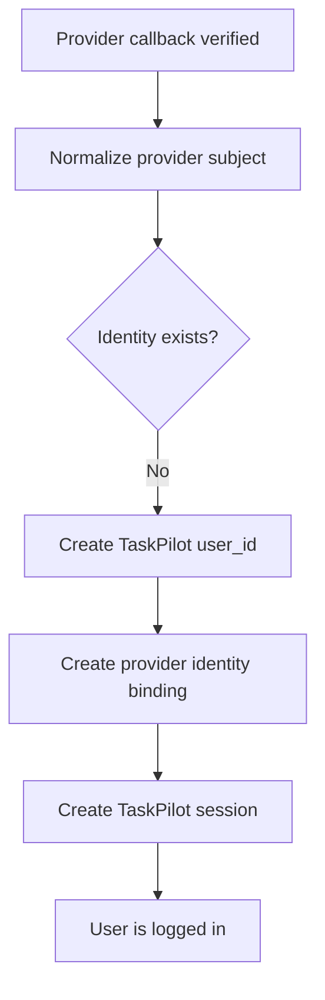

Google example:

```text
Google sub = 107691503500...
No identity row exists.
Create user_id = usr_01H...
Create identity: google + 107691503500... -> usr_01H...
Create session cookie.
```

### Returning External User

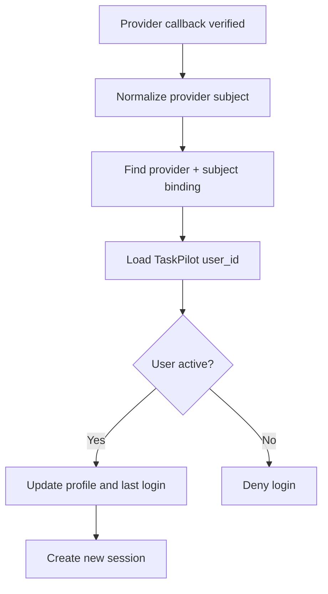

Google example:

```text
Google sub = 107691503500...
Found identity: google + 107691503500... -> usr_01H...
Login usr_01H...
```

### Logged-In User Binds External Provider

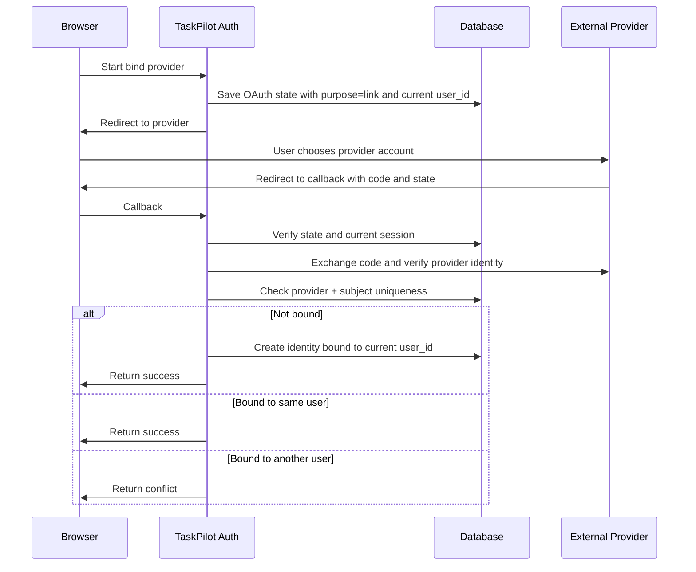

### Existing Legacy Users

There are two likely legacy cases.

#### Legacy Case A: Existing Tasks Have Random Anonymous `user_id`

This is likely for current web submissions because missing `user_id` is auto-filled with a UUID.

Recommended behavior:

- Do not attach those historical tasks to the new external-provider user automatically.
- Keep them as legacy anonymous tasks.
- After login rollout, only authenticated tasks appear in "My Tasks".

Optional later feature:

- Add a one-time "claim legacy tasks" flow if the old browser has a signed claim token.
- Without proof, do not claim by `conversation_id`, `request_id`, or guessed task ID.

#### Legacy Case B: Existing Tasks Have Known Business `user_id`

If there is an old trusted user ID source outside this codebase:

1. Create `task_pilot_user` rows with `source = legacy`.
2. Set `user_id` equal to the old trusted ID or store the old ID in metadata and generate new `usr_*`.
3. Do not bind external identities by email automatically.
4. On first external-provider login, if email or phone matches a legacy user, show a claim flow:
   - User confirms claim.
   - Optional admin or email-domain rule approves.
   - Then create `user_identity` mapping.

Legacy mapping flow:

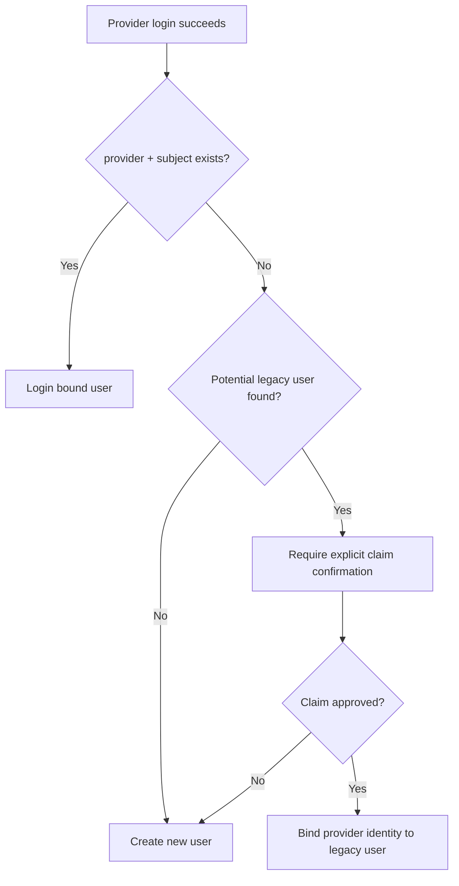

## Login Flow

### End-To-End Flow

```mermaid
flowchart TD
    A[Open TaskPilot] --> B[Frontend calls /auth/me]
    B --> C{Logged in?}
    C -- No --> D[Show provider login buttons]
    D --> E[GET /auth/{provider}/login]
    E --> F[TaskPilot creates state and nonce]
    F --> G[Redirect to provider]
    G --> H[User signs in with provider]
    H --> I[Provider redirects to /auth/{provider}/callback]
    I --> J[TaskPilot verifies state]
    J --> K[Exchange code for tokens]
    K --> L[Validate provider identity]
    L --> M[Map provider subject to TaskPilot user_id]
    M --> N[Create TaskPilot session]
    N --> O[Set HttpOnly cookie]
    O --> P[Redirect back to app]
    C -- Yes --> P
    P --> Q[TaskPilot workspace]
```

### Login Sequence

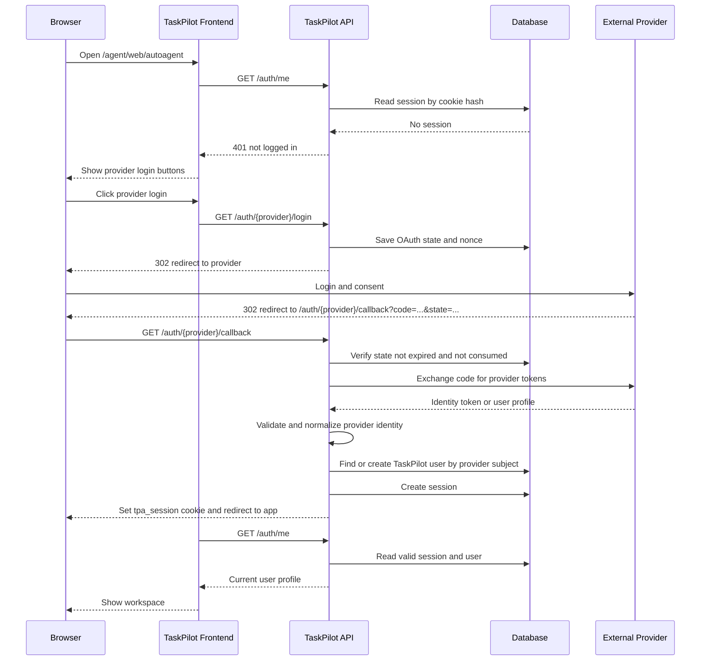

## Task And Resource Ownership Flow

### Submit Agent Task

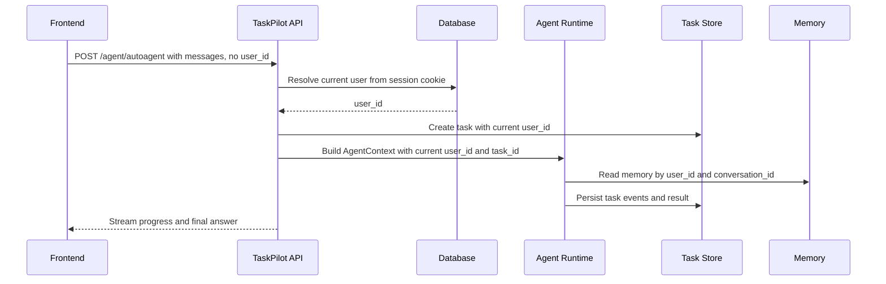

Backend rule:

```text
request.user_id from frontend is ignored for normal user APIs.
current_user.user_id from session is the only trusted value.
```

### List And Read Tasks

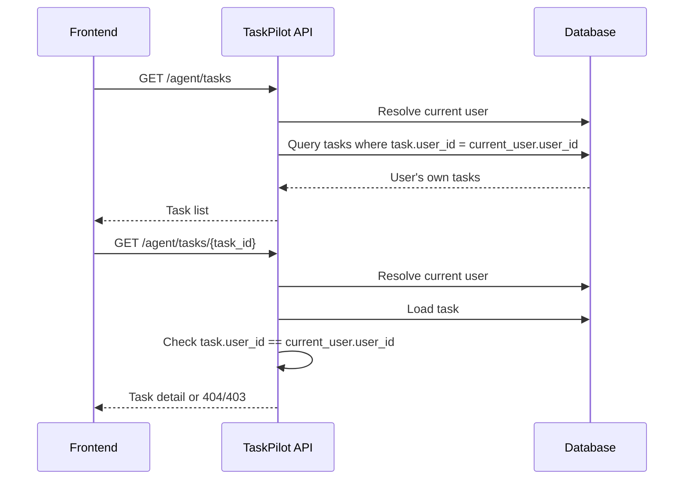

### Upload, Preview, Download Files

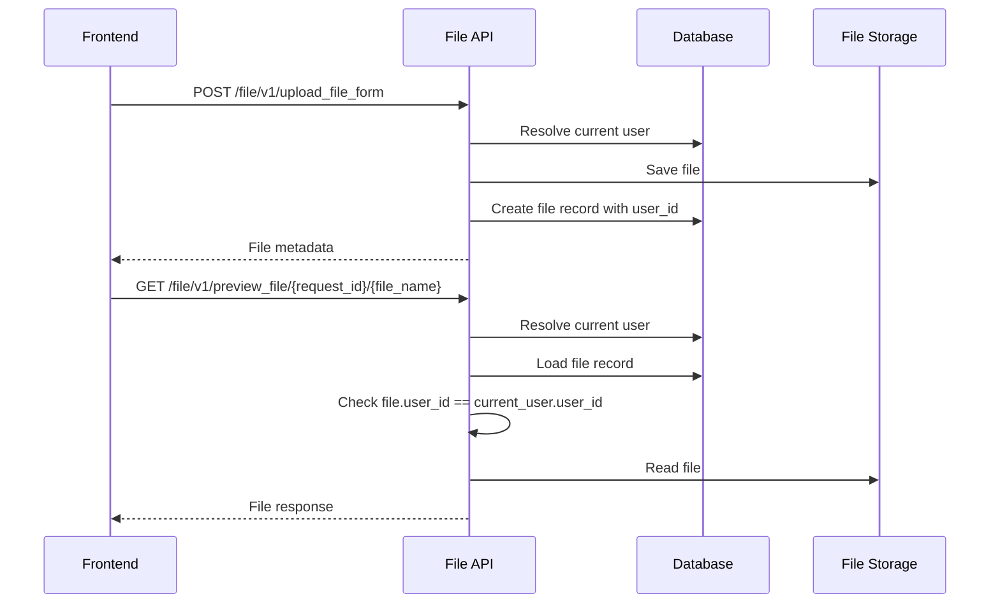

## API Design

### Auth APIs

| Method | Path | Auth | Purpose |
|---|---|---|---|
| GET | `/auth/{provider}/login` | optional | Start provider login |
| GET | `/auth/{provider}/callback` | no cookie required | Provider callback |
| POST | `/auth/{provider}/link` | required | Start linking provider to current user |
| DELETE | `/auth/{provider}/link/{identity_id}` | required | Unlink provider if another login method exists |
| GET | `/auth/me` | optional | Return current user or 401 |
| POST | `/auth/logout` | required | Revoke current session |
| POST | `/auth/logout-all` | required | Revoke all sessions for current user |

Google-friendly aliases such as `/auth/google/login` can exist because `google` is the provider path value. Do not create provider-specific business logic outside the auth provider adapter.

### Protected Agent APIs

These should require current user by default:

- `POST /agent/autoagent`
- `WS /agent/ws/autoagent`
- `POST /agent/tasks`
- `GET /agent/tasks`
- `GET /agent/tasks/{task_id}`
- `GET /agent/tasks/{task_id}/events`
- `POST /agent/tasks/{task_id}/cancel`
- `DELETE /agent/tasks/{task_id}`
- `POST /agent/tasks/{task_id}/retry`
- `POST /agent/tasks/{task_id}/input`
- `GET /agent/tasks/{task_id}/artifacts`
- `GET /agent/tasks/{task_id}/artifacts/{artifact_id}`

Read and mutation APIs must check ownership before returning or changing data.

### Internal Or Admin Exceptions

Some existing endpoints are used for evals or diagnostics. Do not leave them publicly writable after auth rollout.

Recommended split:

- Public app routes: require user session.
- Internal eval routes: require explicit internal key, admin session, or local-only flag.
- Health routes: stay public.
- Static frontend assets: stay public.

## Backend Component Design

Recommended modules:

```text
task-pilot-agent/auth/
  models.py              # SQLAlchemy models
  schemas.py             # response schemas
  service.py             # user, identity, session operations
  providers/
    base.py              # IdentityProviderAdapter protocol and normalized profile
    oidc.py              # generic OIDC adapter
    google.py            # Google adapter config defaults
    microsoft.py         # Microsoft adapter config defaults
    wechat.py            # WeChat custom OAuth adapter
  dependencies.py        # get_current_user, require_current_user
  router.py              # /auth routes
  security.py            # token generation, hashing, cookie helpers
```

Key service methods:

```text
AuthService.create_or_update_external_user(profile, current_user_id=None)
AuthService.create_session(user_id, request)
AuthService.get_current_user_from_cookie(request)
AuthService.revoke_session(session_token)
AuthService.bind_identity(user_id, provider, provider_subject, profile)
AuthService.disable_user(user_id)
AuthService.soft_delete_user(user_id)
```

## Frontend Changes

Startup:

1. Call `GET /auth/me`.
2. If 401, show enabled provider login buttons.
3. If logged in, load agents, tools, tasks, and current workspace.

Submission:

- Remove `user_id` from normal task payloads.
- Keep `conversation_id`, messages, selected Agent, selected tools, language, and output style.
- Browser automatically sends same-origin cookie.

Task list:

- Remove normal user-facing `user_id` filter.
- Admin-only user filtering can be added later.

Logout:

- Call `POST /auth/logout`.
- Clear frontend state.
- Return to login view.

## Security Rules

- Never trust frontend `user_id`.
- Never store provider access tokens or refresh tokens in browser local storage.
- Never put provider tokens, cookies, or session IDs into task events, Agent prompts, tool calls, or logs.
- Use one-time OAuth state and nonce.
- Expire OAuth state quickly.
- Store only session token hash in DB.
- Rotate session on login.
- Revoke sessions on logout, disable, or delete.
- Check owner before every task, file, and artifact read or mutation.
- Treat email as mutable profile data, not account identity.
- For future provider API access, request scopes only when the user uses a provider-specific tool. Do not request Drive/Gmail/Microsoft Graph/WeChat data scopes during basic login.

## Error Handling

| Case | Response |
|---|---|
| User not logged in | 401 |
| Session expired | 401, frontend returns to login |
| Task belongs to another user | Prefer 404 to avoid leaking existence |
| Provider callback state invalid | 400, no login |
| Provider identity token or profile invalid | 401, no login |
| Provider identity bound to another user | 409 account conflict |
| User disabled | 403 |
| File belongs to another user | Prefer 404 |

## Configuration

Add config and env support:

```text
GOOGLE_CLIENT_ID
GOOGLE_CLIENT_SECRET
GOOGLE_REDIRECT_URI
MICROSOFT_CLIENT_ID
MICROSOFT_CLIENT_SECRET
MICROSOFT_REDIRECT_URI
WECHAT_APP_ID
WECHAT_APP_SECRET
WECHAT_REDIRECT_URI
AUTH_SESSION_COOKIE_NAME=tpa_session
AUTH_SESSION_TTL_SECONDS=2592000
AUTH_COOKIE_SECURE=true
AUTH_REQUIRED=true
AUTH_DEV_USER_ID=dev-user
```

Local development can allow `AUTH_REQUIRED=false`, but production should require auth.

## Implementation TODO List

### Phase 1: Database And Models

Status: Not started

Tasks:

- Add auth SQLAlchemy models for users, identities, sessions, and OAuth state.
- Add `user_id`, `task_id`, and `conversation_id` to file records.
- Add unique indexes for `user_id`, `(provider, provider_subject)`, session token hash, and state hash.
- Add provider registry/config structure for Google first, with Microsoft and WeChat placeholders.
- Add migration or startup schema compatibility for SQLite and MySQL.

Acceptance:

- Tables can be created on SQLite local DB and MySQL target DB.
- Unique constraints prevent duplicate provider identity binding.
- Existing task table remains compatible.

### Phase 2: Auth Service

Status: Not started

Tasks:

- Implement secure random token generation.
- Implement token hashing.
- Implement session create/read/revoke.
- Implement user create/read/update/disable/soft delete.
- Implement identity bind/unbind.
- Implement transaction-safe `create_or_update_external_user`.
- Implement provider adapter interface and normalized profile model.

Acceptance:

- First provider profile creates user and identity.
- Existing provider identity logs into the same user.
- Binding conflict returns a clear error.
- Disabled user cannot log in.

### Phase 3: Provider OAuth Router And Google Adapter

Status: Not started

Tasks:

- Add `/auth/{provider}/login`.
- Add `/auth/{provider}/callback`.
- Implement Google as the first enabled provider adapter.
- Add OAuth state and nonce persistence.
- Exchange authorization code for provider tokens.
- Verify provider identity.
- Create TaskPilot session cookie.
- Add `/auth/me` and `/auth/logout`.

Acceptance:

- Login works across multiple app workers because state is in DB.
- Invalid state is rejected.
- Invalid provider identity is rejected.
- Cookie is HttpOnly and Secure in production config.

### Phase 3B: Additional Provider Adapters

Status: Not started

Tasks:

- Add Microsoft adapter using the generic OIDC adapter and Microsoft config defaults.
- Add WeChat adapter using custom OAuth exchange and `unionid_then_appid_openid` subject strategy.
- Add provider-level tests for subject normalization.
- Keep provider enablement controlled by config.

Acceptance:

- Disabled providers do not appear on the frontend.
- Microsoft login produces a normalized profile and stable provider subject.
- WeChat login prefers `unionid` and falls back to `appid:openid`.
- Provider-specific token shapes do not leak into users, tasks, events, or logs.

### Phase 4: Current User Dependency

Status: Not started

Tasks:

- Add `get_current_user` and `require_current_user`.
- Add optional dev fallback only when `AUTH_REQUIRED=false`.
- Update router registration to include auth router.
- Decide public routes: health, auth login/callback, frontend assets.

Acceptance:

- Protected routes return 401 without valid session.
- Logged-in requests resolve the same `user_id` every time.
- Dev fallback cannot accidentally run in production when auth is required.

### Phase 5: Protect Agent And Task APIs

Status: Not started

Tasks:

- Change task creation to use `current_user.user_id`.
- Ignore or reject request body `user_id` for normal users.
- Filter task list by current user.
- Check ownership for detail, events, cancel, retry, delete, input, artifacts, and artifact download.
- Keep eval/internal flows behind internal auth or local-only config.

Acceptance:

- User A cannot list, open, cancel, retry, delete, or download User B's task.
- New task records always contain the authenticated `user_id`.
- `AgentContext.user_id` uses authenticated user.
- Memory lookup and writes use authenticated user.

### Phase 6: Protect File APIs

Status: Not started

Tasks:

- Bind uploaded files to current user.
- Add owner checks for get, list, preview, and download.
- Attach files to task where possible.
- Backfill or isolate old files without user owner.

Acceptance:

- User A cannot preview or download User B's file.
- New uploaded files have `user_id`.
- Existing legacy files do not become public by accident.

### Phase 7: Frontend Login Experience

Status: Not started

Tasks:

- On startup, call `/auth/me`.
- Show enabled provider login buttons when not logged in.
- Show user avatar/name when logged in.
- Add logout button.
- Remove normal `user_id` field from task filters.
- Stop sending `user_id` in task or supplemental input payloads.

Acceptance:

- Logged-out user sees login entry.
- Logged-in user sees their workspace.
- Submitting a task works without frontend `user_id`.
- Task history only shows the current user's tasks.

### Phase 8: Legacy User Mapping

Status: Not started

Tasks:

- Identify whether existing production data has trusted old `user_id` values.
- For anonymous/random old users, leave records as legacy and hidden from logged-in "My Tasks".
- For trusted old users, create `task_pilot_user` rows with `source=legacy`.
- Add optional claim flow only if there is proof of ownership.
- Do not auto-merge by email.

Acceptance:

- No old anonymous task is silently attached to a provider account.
- Trusted legacy users can be mapped deliberately.
- Conflicts are visible and reversible by admin.

### Phase 9: Tests

Status: Not started

Minimum tests:

- First provider login creates user, identity, and session.
- Returning provider login reuses the same user.
- Same provider account cannot bind to two users.
- Disabled user cannot log in.
- Missing session returns 401 on protected APIs.
- Task list is filtered by current user.
- Task detail rejects another user's task.
- Artifact download rejects another user's task artifact.
- File preview/download rejects another user's file.
- Frontend task submit no longer sends `user_id`.

Acceptance:

- Auth tests pass.
- Existing task control tests pass after updating expected auth behavior.
- File ownership tests cover allowed and denied users.

### Phase 10: Production Hardening

Status: Not started

Tasks:

- Add session cleanup job.
- Add OAuth state cleanup job.
- Add audit events for login, logout, bind, unbind, disable, delete.
- Add rate limits for login callback and session validation.
- Add token redaction tests for logs and task events.
- Add production config check: auth required, secure cookie enabled, enabled provider credentials present.

Acceptance:

- Expired sessions and OAuth states are cleaned.
- Sensitive tokens do not appear in logs, events, or frontend responses.
- Production startup fails clearly if required auth config is missing.

## Recommended Development Order

1. Add DB models and service tests.
2. Implement session and current-user dependency.
3. Implement generic provider login route and the Google adapter.
4. Protect Agent task creation and task read/write APIs.
5. Protect file APIs.
6. Update frontend login state and remove frontend `user_id`.
7. Add legacy migration or claim flow only after basic login is stable.
8. Add future provider API authorization only when a specific provider tool needs it.

## Final Product Behavior

After this design is implemented:

- A user logs in with an enabled provider.
- TaskPilot maps the provider subject to one internal `user_id`.
- Every task, memory record, uploaded file, and artifact is owned by that `user_id`.
- The user can leave and return later to their own task history.
- Another logged-in user cannot access those tasks or files.
- Agent never receives login secrets.
- Future Google Drive/Gmail/Calendar, Microsoft Graph, GitHub, or WeChat tool authorization can be added separately without changing the login identity model.
