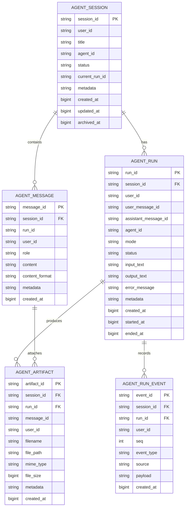
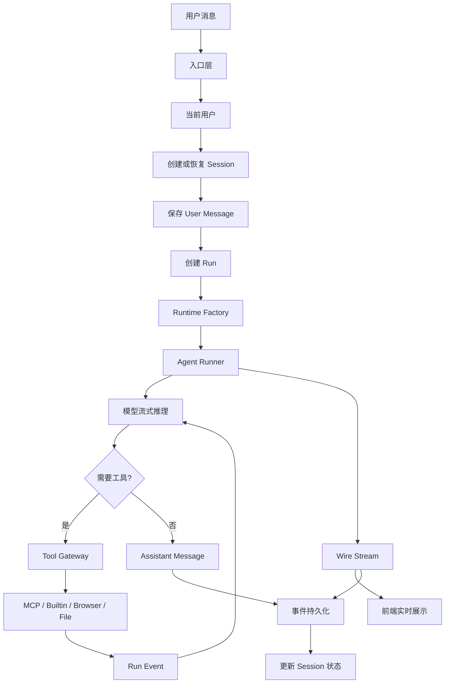
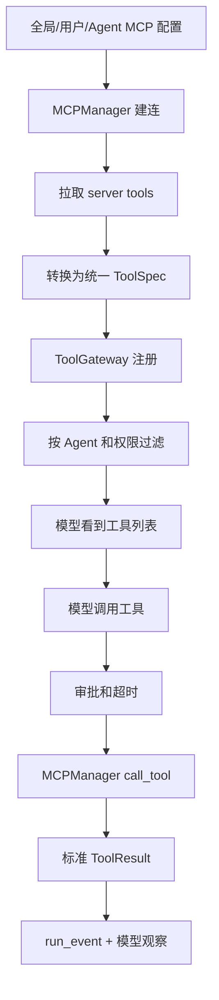
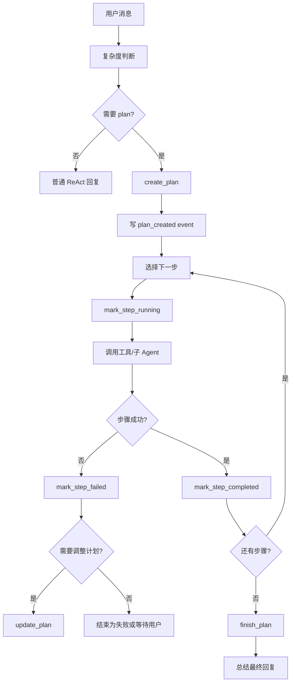

# TaskPilot 会话式 Agent 架构设计

## 1. 文档目标

本文档定义 TaskPilot 从“任务式 Agent 产品”转向“会话式 Agent 产品”的目标架构和实施方案。

这里的核心变化是：

```text
旧主线：用户创建任务 -> 查看任务执行过程 -> 查看任务结果
新主线：用户进入会话 -> 连续发送消息 -> Agent 在会话中持续工作和回复
```

设计参考 `lyk/qagent_complete_guide.md` 中 QAgent 的主骨架：

- 多入口统一成标准用户消息。
- 会话是长期状态中心。
- Agent Runtime 在会话内组装模型、工具、记忆、MCP、权限和扩展能力。
- 所有过程以统一事件流输出给前端。
- 会话历史和事件备份都持久化，支持刷新恢复、断线重连和继续追问。

本文档不要求一次性删除现有 task 代码。相反，本设计要求先把现有 task 能力降级为“会话中的一次运行记录”，用兼容方式完成迁移。

## 2. 完成标准

这块设计完成并可以进入实施时，应满足以下标准：

- 用户看到的主对象是会话，不是任务。
- 用户可以创建会话、打开会话、继续追问、查看历史消息、查看工具过程和文件产物。
- 每次用户输入会创建一次 Agent run。
- 一次 run 内部可以有工具调用、搜索、文件处理、浏览器操作、等待用户输入、错误和最终回复。
- 前端断开后，后端 run 可以继续执行。
- 用户重新打开同一会话时，能先恢复历史，再接实时输出。
- Agent 要支持更多 MCP 工具和内置工具，并且这些工具对模型呈现为统一工具能力。
- 复杂问题不能只靠一次自由推理完成，必须支持 plan -> step -> tool -> review -> final 的分阶段执行模式。
- 任务式接口和旧前端在迁移期间仍可兼容运行。
- 用户隔离、文件隔离、工具权限、敏感信息脱敏不能倒退。
- 测试覆盖会话创建、消息保存、run 创建、事件保存、断线恢复、跨用户拒绝、兼容旧 task API。

## 3. 背景和问题

### 3.1 当前系统状态

当前 TaskPilot 已经有很多可复用能力：

- `AgentContext.user_id`
- `AgentContext.sessionId`
- `AgentContext.run_id`
- `AgentContext.task_id`
- `GptQueryReq.conversation_id`
- `TaskStore`
- task record
- task event
- task artifact
- SSE streaming
- WebSocket autoagent
- MCP 工具集合
- Agent registry
- ReAct / plans_executor
- 任务状态、事件、产物、重试、取消、等待输入
- Google 登录和用户隔离

但是当前产品主线仍然是 task：

```text
autoagent request
-> trace_id
-> task_id = trace_id
-> TaskStore.create_task()
-> AgentContext(task_id=task_id, run_id=conversation_id)
-> SSE event 写入 task_event
-> 前端以 taskId 加载详情、事件、产物、重试、取消
```

这里的 `conversation_id` 已经存在，但它目前更像一个辅助字段，不是产品主对象。

### 3.2 当前任务式主线的问题

任务式主线适合“提交一个明确任务，然后等待结果”的产品，但不适合通用 Agent 的长期交互。

主要问题：

- 用户心智被迫切成一个个任务，不像自然对话。
- 每次追问容易变成新任务，历史上下文和产物关联不自然。
- 任务详情页强调执行过程，不强调持续会话。
- 断线恢复、后台运行、继续追问都应属于会话能力，但现在分散在 task 上。
- 计划、步骤、工具、子 Agent 容易被误当成产品主对象。
- 将来接入 Gateway、Scheduler、浏览器、外部渠道时，如果仍以 task 为中心，会反复做适配。

### 3.3 新方向

新方向是：

```text
Session 是用户看到和管理的主对象。
Message 是会话里的对话内容。
Run 是一次用户消息触发的 Agent 执行过程。
Event 是 run 中的过程记录。
Artifact 是 run 或 session 产生的文件和结果。
```

任务不再是用户入口，而是兼容层或内部运行记录。

## 4. 设计原则

### 4.1 会话优先

所有用户可见历史都围绕 session 展示。

用户看到的是：

- 我的会话列表
- 会话标题
- 最后一条消息
- 当前是否运行中
- 是否等待我输入
- 产生了哪些文件
- 可以继续说什么

用户不应先理解 task、trace、run、event 才能使用产品。

### 4.2 Run 是过程，不是产品主对象

一次用户消息会产生一次 run。

Run 记录 Agent 如何处理这条消息：

- 用了哪个 Agent
- 用了哪个模型
- 调了哪些工具
- 产出了哪些文件
- 最终回答是什么
- 是否失败或取消

Run 需要被持久化和可回放，但它不是第一层用户入口。

### 4.3 事件流是事实来源

实时输出、历史回放、调试追踪都依赖 event。

事件必须结构化保存，而不是只保存一段文本。

事件至少要支持：

- 文本流式输出
- 工具开始
- 工具输入摘要
- 工具结果摘要
- 搜索结果
- 文件产物
- 等待用户输入
- 错误
- run 完成
- run 取消

### 4.4 兼容优先

不要一开始删除 `TaskStore` 和 `/agent/tasks/*`。

第一阶段先做映射：

```text
conversation_id -> session_id
task_id         -> run_id
task_event      -> run_event
task_artifact   -> run_artifact
```

在新结构稳定前，旧接口可以继续用旧表。

### 4.5 工具系统不重写

MCP、本地工具、权限控制、文件沙箱、Agent registry、ReAct runtime 继续保留。

需要改的是上下文归属：

```text
旧：工具调用属于 task
新：工具调用属于 session + run
```

工具执行仍然必须通过 ToolGateway / ToolCollection，不允许出现绕过工具注册和权限过滤的新路径。

### 4.6 用户隔离不能降级

所有 session、message、run、event、artifact 必须带 `user_id` 或可通过上级记录确定 `user_id`。

任何读取、写入、取消、重试、下载、预览都必须验证当前用户拥有该 session。

### 4.7 工具能力可扩展

会话式 Agent 不能只依赖当前少量本地 MCP 工具。它要能像 QAgent 一样，把不同来源的能力统一成可调用工具：

- 内置工具。
- 本地 MCP 工具。
- 远程 MCP 工具。
- 浏览器工具。
- 文件和命令工具。
- 多媒体工具。
- 用户交互工具。
- 子 Agent 工具。
- 未来插件工具。

模型不应该关心工具来自哪里。对模型来说，所有工具都应该有统一的：

- 名称。
- 描述。
- 输入 schema。
- 输出结构。
- 风险等级。
- 是否需要审批。
- 是否可用于当前 Agent。

### 4.8 复杂问题要进入计划模式

简单问题可以直接回答。

复杂问题必须允许 Agent 进入计划模式。计划模式不是回到旧的“任务产品”，而是一次 run 内部的执行策略。

复杂问题包括：

- 多步骤研究。
- 文件处理和报告生成。
- 需要搜索、读取、汇总多个来源。
- 需要写文件或运行命令。
- 需要等待用户确认。
- 需要多个 Agent 分工。
- 需要长时间运行或可恢复执行。

这类问题应走：

```text
识别复杂度
-> 创建计划
-> 执行步骤
-> 每步记录状态和证据
-> 失败时调整计划
-> 最后汇总答案
```

计划是 run 的内部状态和事件，不是产品主入口。

## 5. 目标心智模型

### 5.1 用户视角

用户打开产品后看到：

```text
左侧：会话列表
中间：当前会话聊天区
右侧：工具过程 / 文件 / 运行详情
```

用户可以：

- 新建会话
- 选择 Agent
- 上传文件
- 发送消息
- 继续追问
- 查看搜索和工具过程
- 查看生成文件
- 中断当前回复
- 重新生成上一条回复
- 归档会话

### 5.2 系统视角

系统处理一次消息：

```text
POST message
-> create user message
-> create run
-> start Agent runner
-> write run events
-> stream wire events
-> create assistant message
-> mark run completed
-> update session summary
```

### 5.3 数据关系



## 6. 分层架构

### 6.1 总体分层

```text
Entry Layer
  -> Auth / User Context
  -> Session Service
  -> Runtime Factory
  -> Agent Runner
  -> Tool Gateway
  -> Wire/Event Stream
  -> Session Store
  -> Memory / Compaction
```

对应职责：

| 层 | 职责 |
| --- | --- |
| Entry | 接收 Web、API、Gateway、Scheduler 的消息 |
| Auth | 解析当前用户并检查会话权限 |
| Session Service | 创建会话、保存消息、创建 run、恢复历史 |
| Runtime Factory | 组装 Agent、模型、工具、MCP、权限、记忆 |
| Agent Runner | 驱动模型和工具循环 |
| Tool Gateway | 工具注册、过滤、调用、错误、权限 |
| Wire/Event Stream | 实时输出和过程事件 |
| Store | 持久化 session、message、run、event、artifact |
| Memory | 长会话压缩、跨会话记忆、召回 |

### 6.2 目标流程图



## 7. 数据模型设计

### 7.1 `agent_session`

会话表是产品主表。

建议表名：

```text
magent_session
```

字段：

| 字段 | 类型 | 说明 |
| --- | --- | --- |
| id | bigint | 自增主键 |
| session_id | varchar(128) | 对外 ID |
| user_id | varchar(128) | 所属用户 |
| title | varchar(512) | 会话标题 |
| agent_id | varchar(128) | 默认 Agent |
| status | varchar(32) | idle/running/waiting_input/archived |
| current_run_id | varchar(128) | 当前运行中的 run |
| last_message_id | varchar(128) | 最后一条消息 |
| last_message_preview | text | 列表摘要 |
| pinned | bool/int | 是否置顶 |
| archived_at | bigint | 归档时间 |
| metadata | longtext/json | 扩展字段 |
| created_at | bigint | 创建时间 |
| updated_at | bigint | 更新时间 |

状态建议：

| 状态 | 含义 |
| --- | --- |
| idle | 可继续输入 |
| running | 当前有 run 执行中 |
| waiting_input | Agent 等待用户补充 |
| archived | 已归档，不在默认列表显示 |

注意：

- session 不保存完整过程。
- session 只保存列表和路由所需摘要。
- 所有详细内容去 message、run、event、artifact 查。

### 7.2 `agent_message`

消息表保存用户和助手之间的对话内容。

建议表名：

```text
magent_message
```

字段：

| 字段 | 类型 | 说明 |
| --- | --- | --- |
| id | bigint | 自增主键 |
| message_id | varchar(128) | 对外 ID |
| session_id | varchar(128) | 所属会话 |
| run_id | varchar(128) | 关联 run，可为空 |
| user_id | varchar(128) | 所属用户 |
| role | varchar(32) | user/assistant/system/tool |
| content | longtext | 文本内容 |
| content_format | varchar(32) | markdown/text/html/json |
| status | varchar(32) | created/streaming/final/error |
| metadata | longtext/json | 文件、模型、token、来源 |
| created_at | bigint | 创建时间 |
| updated_at | bigint | 更新时间 |

消息角色：

| role | 用途 |
| --- | --- |
| user | 用户输入 |
| assistant | Agent 最终回复 |
| system | 系统插入的会话说明，默认不展示 |
| tool | 可选，只有需要把工具结果纳入模型消息时使用 |

消息与事件的区别：

```text
message 给用户和模型看。
event 给 UI 回放、调试和过程展示看。
```

### 7.3 `agent_run`

Run 表保存一次 Agent 执行。

建议表名：

```text
magent_run
```

字段：

| 字段 | 类型 | 说明 |
| --- | --- | --- |
| id | bigint | 自增主键 |
| run_id | varchar(128) | 对外 ID |
| session_id | varchar(128) | 所属会话 |
| user_id | varchar(128) | 所属用户 |
| user_message_id | varchar(128) | 触发本 run 的用户消息 |
| assistant_message_id | varchar(128) | 本 run 生成的助手消息 |
| trace_id | varchar(128) | 日志追踪 ID |
| agent_id | varchar(128) | 使用的 Agent |
| mode | varchar(64) | react/supervisor/plans_executor |
| output_style | varchar(64) | markdown/html/ppt/table |
| status | varchar(32) | queued/running/waiting_input/completed/failed/cancelled |
| input_text | longtext | 输入摘要 |
| output_text | longtext | 最终输出 |
| error_message | longtext | 错误 |
| work_dir | varchar(2048) | 工作目录 |
| metadata | longtext/json | 工具选择、模型、配置快照 |
| created_at | bigint | 创建时间 |
| started_at | bigint | 开始时间 |
| ended_at | bigint | 结束时间 |

Run 状态可以沿用当前 task 状态：

```text
queued
running
waiting_input
completed
failed
cancelled
```

### 7.4 `agent_run_event`

事件表保存 run 的完整过程。

建议表名：

```text
magent_run_event
```

字段：

| 字段 | 类型 | 说明 |
| --- | --- | --- |
| id | bigint | 自增主键 |
| event_id | varchar(128) | 对外 ID |
| session_id | varchar(128) | 所属会话 |
| run_id | varchar(128) | 所属 run |
| user_id | varchar(128) | 所属用户 |
| seq | int | 会话内递增序号 |
| event_type | varchar(64) | 事件类型 |
| source | varchar(64) | agent/tool/system/sse |
| message_id | varchar(128) | 关联消息 |
| payload | longtext/json | 结构化内容 |
| created_at | bigint | 创建时间 |

关键要求：

- `seq` 必须单调递增，用于断线后从某个位置恢复。
- payload 必须走脱敏。
- tool 参数和结果需要摘要化，避免日志爆炸。
- token、cookie、OAuth code、API key 不允许进入 payload。

### 7.5 `agent_artifact`

文件产物表保存用户上传、工具生成和远程链接。

建议表名：

```text
magent_artifact
```

字段：

| 字段 | 类型 | 说明 |
| --- | --- | --- |
| id | bigint | 自增主键 |
| artifact_id | varchar(128) | 对外 ID |
| session_id | varchar(128) | 所属会话 |
| run_id | varchar(128) | 所属 run |
| message_id | varchar(128) | 关联消息，可空 |
| user_id | varchar(128) | 所属用户 |
| filename | varchar(512) | 文件名 |
| file_path | varchar(2048) | 本地路径或远程 URL |
| mime_type | varchar(128) | 类型 |
| file_size | bigint | 大小 |
| description | longtext | 描述 |
| metadata | longtext/json | 额外信息 |
| created_at | bigint | 创建时间 |

文件访问规则：

- 下载必须先校验 session owner。
- 本地文件必须限制在任务/会话工作目录或上传目录内。
- 远程 URL 产物可以跳转，但要记录来源。

## 8. 事件设计

### 8.1 事件基本格式

后端内部统一事件：

```json
{
  "eventId": "evt_xxx",
  "sessionId": "sess_xxx",
  "runId": "run_xxx",
  "seq": 42,
  "type": "tool_result",
  "source": "tool",
  "messageId": "msg_xxx",
  "payload": {},
  "createdAt": 1760000000000
}
```

前端收到的 Wire/SSE 事件可以直接使用同一结构，也可以保留当前 `messageType`，但需要提供映射。

### 8.2 推荐事件类型

| 事件类型 | 说明 |
| --- | --- |
| session_created | 会话创建 |
| session_resumed | 会话恢复 |
| user_message_created | 用户消息保存 |
| run_created | run 创建 |
| run_started | run 开始 |
| assistant_message_started | 助手消息开始流式输出 |
| assistant_text_delta | 助手文本片段 |
| assistant_message_completed | 助手消息完成 |
| agent_started | Agent 开始 |
| agent_completed | Agent 完成 |
| agent_failed | Agent 失败 |
| tool_call_started | 工具调用开始 |
| tool_call_progress | 工具进度 |
| tool_call_completed | 工具调用完成 |
| tool_call_failed | 工具失败 |
| search_result | 搜索结果 |
| artifact_created | 文件产物创建 |
| plan_created | 计划创建 |
| plan_updated | 计划调整 |
| plan_step_started | 计划步骤开始 |
| plan_step_completed | 计划步骤完成 |
| plan_step_failed | 计划步骤失败 |
| plan_step_updated | 计划步骤变化 |
| plan_completed | 计划完成 |
| todo_list_updated | Agent 内部 TODO 更新 |
| approval_requested | 需要用户审批 |
| approval_resolved | 用户批准或拒绝 |
| waiting_input | 等待用户输入 |
| user_input_received | 收到补充输入 |
| subagent_started | 子 Agent 开始 |
| subagent_event | 子 Agent 过程事件 |
| subagent_completed | 子 Agent 完成 |
| run_completed | run 完成 |
| run_failed | run 失败 |
| run_cancelled | run 取消 |
| memory_context_loaded | 记忆上下文加载 |
| memory_updated | 记忆更新 |
| error | 通用错误 |

### 8.3 当前 SSE `messageType` 映射

当前前端已有一些 `messageType`：

| 当前 messageType | 新事件类型 |
| --- | --- |
| result / agent_stream | assistant_text_delta |
| task | agent_progress 或 run_progress |
| deep_search | tool_call_completed 或 search_result |
| file | artifact_created 或 tool_call_completed |
| code | tool_call_completed |
| browser | tool_call_completed |
| notifications | error / waiting_input / run_progress |
| done | run_completed |

迁移期间可以双写：

```json
{
  "messageType": "result",
  "type": "assistant_text_delta",
  "sessionId": "sess_xxx",
  "runId": "run_xxx",
  "taskId": "run_xxx"
}
```

## 9. API 设计

### 9.1 会话 API

#### 创建会话

```http
POST /agent/sessions
```

请求：

```json
{
  "agentId": "default_agent",
  "title": "可选标题",
  "metadata": {}
}
```

响应：

```json
{
  "sessionId": "sess_xxx",
  "title": "新会话",
  "agentId": "default_agent",
  "status": "idle",
  "createdAt": 1760000000000
}
```

规则：

- 必须使用当前登录用户。
- 前端不能传 `user_id`。
- 如果没有 title，默认 `新会话`，第一条用户消息后自动更新。

#### 会话列表

```http
GET /agent/sessions?status=active&keyword=xxx&limit=50&offset=0
```

响应：

```json
{
  "items": [
    {
      "sessionId": "sess_xxx",
      "title": "搜索市场资料",
      "agentId": "search_agent",
      "status": "idle",
      "lastMessagePreview": "这是最后一条摘要",
      "updatedAt": 1760000000000
    }
  ],
  "count": 1
}
```

#### 会话详情

```http
GET /agent/sessions/{session_id}
```

返回会话元信息、最近消息、当前 run、产物摘要。

#### 更新会话

```http
PATCH /agent/sessions/{session_id}
```

可更新：

- title
- pinned
- archived
- agentId
- metadata 中的用户偏好

#### 归档会话

```http
POST /agent/sessions/{session_id}/archive
```

只归档，不删除历史。

#### 删除会话

```http
DELETE /agent/sessions/{session_id}
```

建议第一版先不物理删除，做软删除或 archived。

### 9.2 消息 API

#### 获取消息

```http
GET /agent/sessions/{session_id}/messages?limit=100&before=msg_xxx
```

返回：

```json
{
  "items": [
    {
      "messageId": "msg_user_1",
      "sessionId": "sess_xxx",
      "runId": "run_xxx",
      "role": "user",
      "content": "帮我搜一下...",
      "createdAt": 1760000000000
    },
    {
      "messageId": "msg_assistant_1",
      "sessionId": "sess_xxx",
      "runId": "run_xxx",
      "role": "assistant",
      "content": "我找到这些资料...",
      "createdAt": 1760000001000
    }
  ]
}
```

#### 发送消息并启动 run

```http
POST /agent/sessions/{session_id}/messages
```

请求：

```json
{
  "content": "帮我搜索今天的行业新闻",
  "files": [],
  "agentId": "search_agent",
  "selectedTools": ["mcp_local:web_search"],
  "approvedTools": [],
  "outputStyle": "markdown",
  "mode": "react"
}
```

响应：

```json
{
  "sessionId": "sess_xxx",
  "messageId": "msg_user_xxx",
  "runId": "run_xxx",
  "status": "queued"
}
```

规则：

- 如果 session 已经 running，第一版建议返回 409，不允许并发用户消息。
- 后续可以支持 queue，但不要第一版做复杂。
- 请求会创建 user message，再创建 run。
- 如果 session 还没有标题，用这条 content 生成标题。

### 9.3 Run API

#### 获取当前 run

```http
GET /agent/sessions/{session_id}/runs/current
```

#### 获取 run 列表

```http
GET /agent/sessions/{session_id}/runs
```

#### 获取 run 详情

```http
GET /agent/sessions/{session_id}/runs/{run_id}
```

#### 取消 run

```http
POST /agent/sessions/{session_id}/runs/{run_id}/cancel
```

规则：

- 只能取消 running 或 waiting_input 的 run。
- 如果 run 在内存 runner 中，发送取消信号。
- 如果 run 不在内存，但状态仍 running，标记为 cancelled 并写事件。

#### 重新生成

```http
POST /agent/sessions/{session_id}/runs/{run_id}/retry
```

规则：

- 复用原 user message 创建一个新 run。
- 不覆盖旧 run。
- 新 assistant message 替代展示上的最新回复，但旧 run 可在详情中查看。

#### 处理工具审批

```http
POST /agent/sessions/{session_id}/runs/{run_id}/approval
```

请求：

```json
{
  "approved": true,
  "approvedTools": ["mcp_local:code_interpreter"],
  "approvalType": "high_risk_tools",
  "reason": "用户确认本次允许",
  "rerun": true
}
```

规则：

- 只能处理当前用户拥有的 session 和 run。
- run 必须已经产生过 `approval_requested` event。
- 处理后必须写入 `approval_resolved` event。
- 用户拒绝时，不创建新 run。
- 用户同意且 `rerun=true` 时，复用原输入创建新 run，并把批准工具写入 `approvedTools`。
- 不覆盖旧 run，旧 run 继续保留审批请求和处理结果，方便回放。
- 第一版不做长时间挂起审批，审批后的继续执行通过新 run 完成。

### 9.4 Event API

#### 拉取事件

```http
GET /agent/sessions/{session_id}/events?afterSeq=100&limit=500
```

响应：

```json
{
  "items": [
    {
      "seq": 101,
      "type": "tool_call_started",
      "runId": "run_xxx",
      "payload": {}
    }
  ],
  "nextSeq": 102
}
```

用途：

- 页面刷新恢复。
- WebSocket 断线重连后补事件。
- 历史回放。

### 9.5 实时连接 API

推荐 WebSocket：

```text
GET /agent/ws/sessions/{session_id}?afterSeq=100
```

连接后：

1. 后端校验 session owner。
2. 先补发 `afterSeq` 之后的历史事件。
3. 如果当前 run 还在执行，订阅实时 Wire。
4. 如果没有 run，保持连接等待用户新消息或关闭。

SSE fallback：

```text
GET /agent/sessions/{session_id}/stream?afterSeq=100
```

### 9.6 Artifact API

```http
GET /agent/sessions/{session_id}/artifacts
GET /agent/sessions/{session_id}/artifacts/{artifact_id}
```

也可以支持按 run 过滤：

```http
GET /agent/sessions/{session_id}/runs/{run_id}/artifacts
```

### 9.7 旧 API 兼容

保留：

```text
POST /agent/autoagent
WS   /agent/ws/autoagent
GET  /agent/tasks
GET  /agent/tasks/{task_id}
GET  /agent/tasks/{task_id}/events
POST /agent/tasks/{task_id}/cancel
POST /agent/tasks/{task_id}/retry
```

兼容策略：

```text
旧 request.conversation_id -> session_id
旧 trace_id/task_id         -> run_id
旧 task_event               -> run_event
```

旧接口响应中继续返回 `taskId`，同时新增：

```json
{
  "taskId": "run_xxx",
  "runId": "run_xxx",
  "sessionId": "sess_xxx"
}
```

### 9.8 工具和 MCP API

会话式产品需要让前端知道当前 Agent 能用哪些工具、哪些不可用、为什么不可用。

#### 获取当前 Agent 可用工具

```http
GET /agent/sessions/{session_id}/tools?agent_id=general_agent
```

响应：

```json
{
  "items": [
    {
      "id": "mcp_local:web_search",
      "name": "web_search",
      "displayName": "网页搜索",
      "source": "mcp",
      "riskLevel": "low",
      "requiresApproval": false,
      "available": true,
      "description": "搜索网页并读取页面内容"
    }
  ],
  "unavailable": [
    {
      "id": "mcp_local:shell_exec",
      "displayName": "命令执行",
      "available": false,
      "reason": "当前 Agent 未授权或高风险工具未批准"
    }
  ]
}
```

#### 获取 MCP server 列表

```http
GET /agent/mcp/servers
```

响应：

```json
{
  "source": "registry",
  "toolCount": 17,
  "items": [
    {
      "serverId": "mcp_local",
      "name": "mcp_local",
      "url": "http://127.0.0.1:9009/mcp",
      "protocol": "streamable-http",
      "toolPrefix": "mcp_local",
      "authorizationConfigured": false,
      "status": "ok",
      "toolCount": 17,
      "error": "",
      "lastCheckedAt": 1780730000.0,
      "durationMs": 25
    }
  ]
}
```

#### 刷新 MCP 工具

```http
POST /agent/mcp/servers/{server_id}/refresh
```

用途：

- 重新连接 MCP server。
- 重新拉取工具 schema。
- 更新可用性和不可用原因。

响应：

```json
{
  "refreshed": true,
  "serverId": "mcp_local",
  "refreshScope": "server",
  "source": "registry",
  "toolCount": 17,
  "items": []
}
```

#### 测试 MCP 工具

```http
POST /agent/mcp/tools/{tool_id}/dry-run
```

第一版可以不开放给普通用户，只供开发和管理员使用。

请求：

```json
{
  "agent_id": "search_agent",
  "arguments": {
    "query": "TaskPilotAgent"
  },
  "approved_tools": [],
  "run_environment": "sandbox"
}
```

响应：

```json
{
  "toolName": "mcp_local-web_search",
  "requestedToolName": "mcp_local:web_search",
  "agentId": "search_agent",
  "dryRun": true,
  "ok": true,
  "result": "...",
  "execution": {}
}
```

### 9.9 Plan API

第一版 plan 可以完全通过 event 展示，不一定提供独立 API。

如果前端需要直接读取当前计划，建议提供：

```http
GET /agent/sessions/{session_id}/runs/{run_id}/plan
```

返回：

```json
{
  "planId": "plan_xxx",
  "runId": "run_xxx",
  "status": "active",
  "title": "调研并生成报告",
  "steps": [
    {
      "stepId": "step_1",
      "title": "搜索资料",
      "status": "completed",
      "evidence": []
    }
  ]
}
```

如果用户允许手动调整计划，后续可以增加：

```http
PATCH /agent/sessions/{session_id}/runs/{run_id}/plan
```

第一版不建议让用户直接编辑计划，先只展示和确认。

## 10. Runtime 设计

### 10.1 AgentContext 调整方向

当前 `AgentContext` 里已有：

- `sessionId`
- `run_id`
- `task_id`
- `user_id`
- `agent_id`
- `work_dir`

建议逐步改成：

```text
session_id: 当前会话
run_id: 当前运行
legacy_task_id: 兼容旧 task
```

第一阶段不要强行改所有字段，可以先约定：

```text
AgentContext.sessionId = session_id
AgentContext.run_id    = run_id
AgentContext.task_id   = run_id
```

这样旧工具依赖 `task_id` 仍可工作。

### 10.2 Runtime 输入

创建 Runtime 需要：

```text
user_id
session_id
run_id
agent_id
mode
output_style
messages_for_model
files
selected_tools
approved_tools
run_environment
language
memory_context
work_dir
wire
```

### 10.3 模型上下文构造

模型上下文来自：

- Agent system prompt
- 语言偏好
- 会话历史摘要
- 最近 N 条消息
- 当前用户消息
- 上传文件摘要
- 记忆召回
- 可用工具定义

不要把完整 event 直接塞给模型。

推荐第一版：

```text
messages_for_model =
  compacted_session_summary
  + last 20 messages
  + current user message
```

等长会话能力稳定后再做更细的 compaction。

### 10.4 工具体系目标

会话式 Agent 的能力上限取决于工具系统。我们需要把当前 MCP、本地工具、文件工具、搜索工具扩展成一个统一工具层。

目标结构：

```text
Agent Runtime
  -> ToolGateway
      -> Builtin Tools
      -> Local MCP Tools
      -> Remote MCP Tools
      -> Browser Tools
      -> Skill Tools
      -> Extension Tools
      -> Subagent Tools
```

模型只看到一个统一工具列表，不直接知道工具来自哪个后端。

每个工具必须有：

| 字段 | 说明 |
| --- | --- |
| id | 稳定工具 ID，例如 `builtin:file_read`、`mcp_local:web_search` |
| name | 给模型展示的调用名 |
| display_name | 给用户展示的名称 |
| description | 工具能力说明 |
| input_schema | 输入参数 schema |
| output_schema | 输出结构，至少有摘要约定 |
| source | builtin/mcp/plugin/browser/subagent |
| risk_level | low/medium/high |
| requires_approval | 是否需要审批 |
| permissions | 文件、网络、命令、浏览器等权限 |
| timeout_seconds | 超时 |
| availability | available/unavailable |
| unavailable_reason | 不可用原因 |

### 10.5 内置工具集规划

参考 QAgent 的默认工具分组，TaskPilot 的通用 Agent 至少要支持以下工具族。

| 工具组 | 典型工具 | 用途 | 默认风险 |
| --- | --- | --- | --- |
| 文件读取 | `file_read`、`file_list`、`file_stat`、`glob`、`grep` | 读取文件、列目录、搜索文本 | 低到中 |
| 文件写入 | `file_write`、`file_move`、`file_copy`、`file_delete`、`str_replace` | 生成或修改文件 | 高 |
| 命令执行 | `shell_exec` | 运行测试、安装依赖、检查环境 | 高 |
| 进程管理 | `process_start`、`process_status`、`process_stop`、`process_stdin` | 长进程、dev server、后台服务 | 高 |
| Web 搜索 | `web_search` | 搜索网页并读取页面正文 | 低 |
| URL 读取 | `fetch_url`、`web_reader` | 读取指定 URL | 低 |
| 浏览器 | `browser_open`、`browser_click`、`browser_fill`、`browser_screenshot`、`browser_read` | 页面操作、UI 验证、截图 | 中到高 |
| 计划 | `plan_tool`、`set_todo_list` | 创建计划、更新步骤、展示 TODO | 低 |
| 用户交互 | `ask_user`、`request_input` | 向用户提问、等待补充 | 低 |
| 子 Agent | `task`、`create_subagent`、`handoff` | 委派子任务、动态创建角色 | 低到中 |
| 技能 | `search_skills`、`install_skill`、`load_skill` | 查找和加载任务方法 | 低到中 |
| 配置 | `config_read`、`config_update` | 查询或调整配置 | 中到高 |
| 多媒体 | `read_multimedia`、`image_generate`、`audio_transcribe`、`video_analyze` | 图片、音频、视频处理 | 低到中 |
| 报告 | `report_generate` | 生成 Markdown、HTML、PPT、表格 | 低到中 |
| MCP 管理 | `mcp_manager_list_servers`、`mcp_manager_write_manifest`、`mcp_manager_add_server` | 查看、导出或调整 MCP Server 配置 | 低到高 |
| 消息渠道 | `discover_channels`、`message_send` | 发现可用通知渠道并发送消息 | 低到高 |
| 记忆 / 知识库 | `memory_search`、`memory_add`、`memory_delete`、`knowledge_search`、`knowledge_add`、`knowledge_delete` | 显式检索或维护长期记忆和知识库 | 中 |

当前已经有的工具不需要重写，但要逐步纳入统一命名和统一权限：

| 当前能力 | 目标工具族 |
| --- | --- |
| `file_read/file_write/file_edit/file_glob/file_grep/file_list/file_stat/...` | 文件读取/写入/搜索 |
| `shell_exec` | 命令执行 |
| `process_command_start/process_command_poll/process_command_write/process_command_stop/process_command_list` | 长生命周期进程管理 |
| `web_search` | Web 搜索 |
| `deepsearch` | 深度研究工具，保留但不作为轻量搜索 |
| `report` | 报告 |
| `browser_agent` | 浏览器工具 |
| `code_interpreter` | 代码执行，默认高风险 |
| `audio_tool/image_tool/video_tool/text_to_image` | 多媒体理解和图片生成 |
| `builtin:request_input` | 用户交互 |
| `builtin:handoff/create_subagent` | 子 Agent 委派和配置生成 |
| `skill_search/skill_load/skill_install` | 技能发现、读取和任务本地安装 |
| `config_read/config_update` | 配置读取和受控修改 |
| `mcp_manager_list_servers/mcp_manager_write_manifest/mcp_manager_add_server` | MCP Server 查看、导出和受控修改 |
| `discover_channels/message_send` | 消息渠道发现和发送 |
| `memory_search/memory_add/memory_delete` | 长期记忆显式操作 |
| `knowledge_search/knowledge_add/knowledge_delete` | 知识库显式操作 |

当前实现状态：

- 本地 MCP 已注册文件局部替换、glob、grep、长进程管理、浏览器 Agent、图片生成、技能、配置、MCP 管理、消息渠道、记忆和知识库工具。
- `task-pilot-agent` 默认 Agent 已允许 `builtin:request_input` 和 `builtin:handoff`，可在缺少关键信息时等待用户补充，也可把子任务交给预先配置的专业 Agent。
- `create_subagent` 默认只在任务工作目录生成子 Agent 配置；只有设置 `APP_ALLOW_AGENT_CONFIG_WRITE=1` 时，才允许写入运行时 Agent 配置目录。
- `config_update` 和 `mcp_manager_add_server` 只有设置 `APP_ALLOW_CONFIG_WRITE_TOOLS=1` 时才允许修改真实配置。
- `config_read` 默认隐藏敏感字段；只有设置 `APP_ALLOW_CONFIG_SECRET_READ=1` 时才允许返回敏感值。
- `process_command_*`、`shell_exec`、`code_interpreter`、配置修改、MCP 配置修改、运行时子 Agent 注册仍按高风险工具处理，不能因为通配 MCP 工具匹配而默认放开。
- `skill_install` 当前安装到任务工作目录，作为本次任务可读取的技能说明；它不会自动修改全局 Agent Registry。

### 10.6 MCP 动态工具设计

MCP 工具不固定，取决于当前用户、Agent、配置和可连接的 MCP server。

目标流程：



MCP 配置来源：

| 来源 | 说明 |
| --- | --- |
| 全局配置 | 系统默认 MCP server，例如本地文件、搜索、报告 |
| 用户配置 | 用户自己的 MCP server 和 token |
| Agent 配置 | 某个 Agent 显式允许的 MCP server |
| 会话配置 | 当前会话临时启用的 MCP server |
| 插件配置 | 插件安装后提供的 MCP server |

支持 transport：

- `stdio`
- `http`
- `streamable-http`
- `sse`

命名规则：

```text
mcp_{server_name}:{tool_name}
```

兼容当前命名：

```text
mcp_local:web_search
mcp_local:deepsearch
mcp_local:file_read
```

也要支持市场或展示层的 hyphen 形式：

```text
mcp_local-web_search
```

工具匹配规则：

- Agent 配置可以使用 colon 形式。
- 前端展示可以使用 hyphen 形式。
- 后端策略匹配两者都要识别为同一个工具。

MCP 工具默认策略：

| 工具类型 | 默认策略 |
| --- | --- |
| 纯搜索/读取 | 可直接调用 |
| 文件读取 | 受路径策略限制 |
| 文件写入/删除/移动 | 必须限制在会话工作目录，通常需要审批 |
| shell/command/process | 默认不暴露，暴露时必须高风险审批 |
| 浏览器真实操作 | 点击、输入、执行 JS 需要审批 |
| 外部系统写操作 | 必须审批 |

MCP ToolResult 标准结构：

```json
{
  "ok": true,
  "summary": "一句话结果摘要",
  "content": "给模型继续推理的内容",
  "display": {
    "type": "search_results | file | table | browser | text",
    "blocks": []
  },
  "artifacts": [],
  "metadata": {
    "toolId": "mcp_local:web_search",
    "server": "mcp_local",
    "durationMs": 1234
  }
}
```

### 10.7 Agent 工具过滤

不是所有 Agent 都应该看到所有工具。

过滤顺序：

```text
全量工具
-> 工具可用性检查
-> Agent allow/deny
-> 用户权限
-> 会话权限
-> 风险策略
-> 运行环境策略
-> 最终工具列表
```

示例：

| Agent | 默认工具 |
| --- | --- |
| general_agent | search、read file、report、ask_user、plan_tool |
| search_agent | web_search、fetch_url、ask_user |
| report_agent | file_read、report_generate、web_search |
| code_agent | file_read、file_write、grep、shell_exec、plan_tool |
| browser_agent | web_search、browser_read、browser_click、browser_screenshot |
| data_agent | file_read、code_interpreter、report_generate |

高风险工具不能只靠 prompt 约束，必须在 ToolGateway 过滤。

### 10.8 工具审批和风险控制

审批是工具执行链路的一部分，不是前端装饰。

执行流程：

```text
模型请求工具
-> ToolGateway 校验工具存在
-> 校验 Agent 是否允许
-> 校验参数 schema
-> 校验路径/网络/命令风险
-> 必要时写 approval_requested event
-> 等用户批准或拒绝
-> 执行工具
-> 写 tool_call_completed / failed event
-> 返回模型
```

审批分两类：

| 审批类型 | 说明 |
| --- | --- |
| 路径审批 | 访问会话工作目录外文件时触发 |
| 动作审批 | 写文件、删文件、运行命令、真实浏览器输入、外部系统写操作 |

必须审批的默认工具：

- 文件写入、删除、移动。
- Shell 和进程启动/停止。
- 浏览器点击、输入、执行 JS。
- 配置修改。
- 外部系统写操作。
- 未知 MCP 写操作。

默认不审批但仍要校验的工具：

- Web 搜索。
- URL 读取。
- 文件读取。
- 目录列举。
- grep/glob。
- plan_tool。
- ask_user。

### 10.9 复杂问题 Plan 模式

会话式 Agent 默认可以直接回答，但复杂问题需要进入 plan 模式。

这不是旧的任务式产品，而是 run 内部的执行机制。

#### 10.9.1 什么时候进入 plan 模式

满足任一条件就建议进入 plan：

- 用户要求“完整分析、调研、生成报告、实现并测试”。
- 需要三个以上步骤。
- 需要调用多个工具。
- 需要读写文件。
- 需要运行命令或浏览器验证。
- 需要跨多个来源搜索和比对。
- 需要等待用户选择或审批。
- 需要子 Agent 分工。
- 预计运行时间较长，需要可恢复过程。

不需要 plan 的情况：

- 简单问答。
- 单次搜索。
- 单个文件读取。
- 明确的一步工具调用。
- 用户明确要求快速回答。

#### 10.9.2 Plan 工具能力

推荐工具名：

```text
builtin:plan_tool
```

需要支持：

| 动作 | 说明 |
| --- | --- |
| create_plan | 创建计划和步骤 |
| update_plan | 调整计划 |
| get_plan | 读取当前计划 |
| mark_step_running | 标记步骤开始 |
| mark_step_completed | 标记步骤完成 |
| mark_step_failed | 标记步骤失败 |
| add_step | 新增步骤 |
| skip_step | 跳过步骤 |
| finish_plan | 完成计划 |

每个步骤至少有：

```json
{
  "stepId": "step_1",
  "title": "搜索相关资料",
  "description": "使用 web_search 找到可信来源",
  "status": "pending",
  "expectedOutput": "带来源链接的资料摘要",
  "evidence": []
}
```

#### 10.9.3 Plan 执行流程



#### 10.9.4 Plan 与 Todo 的关系

`plan_tool` 是结构化计划，适合持久化、回放、恢复和评估。

`set_todo_list` 是轻量 TODO 展示，适合 UI 展示当前短期步骤。

建议关系：

```text
plan_tool 负责真实计划状态。
set_todo_list 负责把当前计划投影成前端 TODO 卡片。
```

第一版可以只实现 `plan_tool`，前端用 plan events 渲染 TODO。

#### 10.9.5 Plan 与子 Agent 的关系

复杂任务中，父 Agent 可以把某个 step 委派给子 Agent。

设计方式：

```text
plan step
-> Task / handoff tool
-> child run
-> child events 转成 subagent_event
-> child result 写入 step evidence
-> parent Agent 继续下一步
```

第一版不强制实现完整多 Agent，但 plan 结构要能容纳 `assigned_agent_id` 和 `evidence`。

#### 10.9.6 Plan 的用户可见性

前端应展示：

- 当前计划标题。
- 步骤列表。
- 每步状态。
- 当前正在执行哪一步。
- 每步使用过的工具和证据摘要。
- 失败原因和调整后的计划。

默认折叠细节，失败步骤自动展开。

## 11. 会话历史与压缩

参考 QAgent，历史要拆成两类：

### 11.1 Context

给模型用。

保存形式可以是：

- 最近消息
- 会话摘要
- 关键事实
- 用户偏好
- 工具产物摘要

Context 不需要保存 UI 事件。

### 11.2 Backup

给 UI 和恢复用。

保存形式就是 run event。

Backup 要完整保存：

- 文本片段
- 工具卡片
- 搜索结果
- 文件产物
- 错误
- 等待用户
- 子 Agent 过程

### 11.3 压缩策略

第一版可以简单：

- 每次 run 完成后，如果会话消息数超过阈值，生成 session summary。
- summary 存在 `session.metadata.summary` 或独立表。
- 后续模型上下文使用 summary + 最近消息。

后续增强：

- memory flush
- daily memory
- topic memory
- artifact summary
- user preference memory

## 12. 前端设计

### 12.1 页面结构

会话式 UI 建议：

```text
┌──────────────────────────────────────────────┐
│ Sidebar                                      │
│ - New Chat     ┌──────────────────────────┐  │
│ - Sessions     │ Chat Messages             │  │
│ - Agents       │                           │  │
│ - Tools        │ User / Assistant          │  │
│ - Files        │ Tool Cards inline/collapsed│ │
│                │ Composer                  │  │
│                └──────────────────────────┘  │
│                ┌──────────────────────────┐  │
│                │ Run / Tools / Artifacts   │  │
│                └──────────────────────────┘  │
└──────────────────────────────────────────────┘
```

### 12.2 左侧会话列表

显示：

- 标题
- 最后更新时间
- 最后一条摘要
- 状态
- 是否置顶
- 是否等待用户

交互：

- 新建会话
- 搜索会话
- 归档会话
- 切换 Agent

### 12.3 中间聊天区

显示：

- 用户消息
- 助手消息
- 流式输出
- 关键工具结果卡片
- 等待用户输入卡片

工具过程默认可以折叠，不要打断阅读。

### 12.4 右侧过程区

显示当前 run 的详细过程：

- 当前 Agent
- 当前状态
- 当前计划和步骤
- 工具调用列表
- 搜索结果
- 文件产物
- 错误信息
- token / duration

右侧过程区可以在移动端收起。

计划展示建议：

- 简单问题不显示计划区。
- 复杂问题进入 plan 模式后显示步骤列表。
- 当前步骤高亮。
- 成功步骤显示完成状态。
- 失败步骤自动展开，显示失败原因和重试/调整后的计划。
- 每步下方显示证据摘要，例如搜索来源、文件名、命令结果、子 Agent 摘要。

工具展示建议：

- 工具调用默认折叠。
- 高风险审批、失败工具、用户等待输入默认展开。
- 搜索结果用来源卡片展示。
- 文件产物固定在 artifacts 区，避免埋在长文本里。
- MCP 工具需要显示来源 server，例如 `mcp_local`。

### 12.5 输入区

默认就是聊天输入。

常用能力作为按钮：

- 上传文件
- 搜索网页
- 浏览器
- 生成报告
- 数据分析
- 选择 Agent
- 高级设置

高级设置包括：

- mode
- output style
- run environment
- selected tools
- approved tools

### 12.6 工具和 MCP 面板

前端需要有一个“工具”入口，但不应让普通用户一上来面对大量技术细节。

建议分两层：

第一层，普通用户看到：

- 搜索网页。
- 读取文件。
- 生成报告。
- 浏览器。
- 数据分析。
- 写文件。
- 运行命令。

第二层，高级设置里看到：

- 真实 tool id。
- 来源：builtin / MCP / browser / plugin。
- 风险等级。
- 是否需要审批。
- 当前是否可用。
- 不可用原因。
- 所属 MCP server。

MCP server 状态展示：

| 状态 | 前端表现 |
| --- | --- |
| connected | 正常显示工具 |
| disconnected | 工具置灰，显示“服务未连接” |
| missing_config | 工具置灰，提示缺少配置 |
| auth_required | 工具置灰，提示需要配置授权 |
| error | 展示最近错误摘要 |

### 12.7 Plan 面板

复杂 run 进入 plan 模式时，前端应展示计划。

最低展示：

```text
计划标题
当前状态
步骤列表
每步状态
每步证据摘要
```

推荐交互：

- 正在执行的步骤自动滚动到可见区域。
- 用户可以展开某一步看工具调用。
- 失败步骤显示“失败原因”和“下一步调整”。
- 如果 Agent 等待用户确认计划，显示确认按钮。

第一版不需要支持用户编辑步骤，只需要看得懂 Agent 在干什么。

## 13. 后台运行和重连

### 13.1 Runner Registry

内存中维护：

```text
runningRuns: run_id -> asyncio.Task
sessionSubscribers: session_id -> websocket/sse subscribers
```

旧的：

```text
runningAgentTasks: task_id -> asyncio.Task
```

可以第一阶段继续保留，但 key 改成 run_id。

### 13.2 断线行为

WebSocket 断开：

- 不自动取消 run。
- runner 继续写 event。
- session 状态保持 running。

用户重连：

- 拉取 `afterSeq` 后的事件。
- 如果 run 还在内存，订阅实时事件。
- 如果 run 已结束，直接恢复完整 UI。

### 13.3 取消行为

用户点停止：

- cancel 当前 run。
- Agent runner 接收取消。
- 正在运行的工具尽量中断。
- 写 `run_cancelled` 事件。
- session 回到 idle。

## 14. 等待用户输入

当前有 `builtin_request_input_tool` 和 task waiting_input。

会话式设计中：

```text
Agent 调用 request_input
-> run.status = waiting_input
-> session.status = waiting_input
-> 写 waiting_input event
-> 前端显示提问卡片
-> 用户回复
-> 保存 user message 或 user_input event
-> 恢复同一个 run 或创建 follow-up run
```

第一版建议：

- 用户补充输入后，恢复同一个 run。
- 如果实现复杂，可以先创建 follow-up run，但 UI 上仍展示为同一会话连续对话。

## 15. 文件和工作目录

### 15.1 工作目录

旧：

```text
task_workspace_root / task_id
```

新：

```text
session_workspace_root / session_id / run_id
```

第一阶段可兼容：

```text
task_workspace_root / run_id
```

后续再迁移到 session 目录。

### 15.2 文件归属

上传文件属于：

```text
session_id + message_id
```

生成文件属于：

```text
session_id + run_id
```

下载文件时：

1. 通过 artifact_id 找到 artifact。
2. 通过 session_id 找到 session。
3. 校验 session.user_id == current_user.user_id。
4. 返回文件。

### 7.6 `agent_run_plan`

复杂问题需要显式计划状态。第一版可以只把 plan 写入 event 和 run metadata；如果后续要支持更强的恢复、编辑、可视化和评估，建议增加独立计划表。

建议表名：

```text
magent_run_plan
```

字段：

| 字段 | 类型 | 说明 |
| --- | --- | --- |
| id | bigint | 自增主键 |
| plan_id | varchar(128) | 对外 ID |
| session_id | varchar(128) | 所属会话 |
| run_id | varchar(128) | 所属 run |
| user_id | varchar(128) | 所属用户 |
| title | varchar(512) | 计划标题 |
| objective | longtext | 本次计划要解决什么 |
| status | varchar(32) | active/completed/failed/cancelled |
| current_step_id | varchar(128) | 当前步骤 |
| metadata | longtext/json | 复杂度判断、约束、证据摘要 |
| created_at | bigint | 创建时间 |
| updated_at | bigint | 更新时间 |
| completed_at | bigint | 完成时间 |

### 7.7 `agent_run_plan_step`

建议表名：

```text
magent_run_plan_step
```

字段：

| 字段 | 类型 | 说明 |
| --- | --- | --- |
| id | bigint | 自增主键 |
| step_id | varchar(128) | 对外 ID |
| plan_id | varchar(128) | 所属计划 |
| session_id | varchar(128) | 所属会话 |
| run_id | varchar(128) | 所属 run |
| user_id | varchar(128) | 所属用户 |
| seq | int | 步骤顺序 |
| title | varchar(512) | 步骤标题 |
| description | longtext | 步骤说明 |
| status | varchar(32) | pending/running/completed/failed/skipped |
| assigned_agent_id | varchar(128) | 执行 Agent，可空 |
| expected_output | longtext | 预期产物 |
| result_summary | longtext | 步骤结果摘要 |
| evidence | longtext/json | 工具、文件、来源、命令等证据 |
| error_message | longtext | 失败原因 |
| created_at | bigint | 创建时间 |
| updated_at | bigint | 更新时间 |

第一阶段不一定马上建这两张表，可以先用事件表达：

```text
plan_created
plan_updated
plan_step_started
plan_step_completed
plan_step_failed
plan_completed
```

但设计上必须保留独立计划表的升级空间。

## 16. 与现有 TaskStore 的兼容方案

### 16.1 第一阶段映射

不新增全部表也能先切心智：

```text
conversation_id 作为 session_id
task_id 作为 run_id
magent_task 作为 run 表
magent_task_event 作为 run event 表
magent_task_artifact 作为 artifact 表
```

需要补的只是 session/message 的轻量表。

### 16.2 兼容视图

可以新增 `SessionStore`，但内部复用 TaskStore：

```python
SessionStore.create_session()
SessionStore.add_message()
SessionStore.create_run()
SessionStore.add_event()
```

第一版：

- session/message 用新表。
- run/event/artifact 继续写旧 task 表。

第二版：

- run/event/artifact 迁到新表。
- 旧 task API 从新表读数据。

### 16.3 旧字段映射

| 旧字段 | 新含义 |
| --- | --- |
| task_id | run_id |
| trace_id | run_id 或 trace_id |
| conversation_id | session_id |
| task.status | run.status |
| task.input_text | run.input_text |
| task.output_text | run.output_text |
| task_event | run_event |
| task_artifact | artifact |

## 17. 迁移步骤

### Phase 1: 会话壳

目标：

- 新增 session/message 表。
- 新增会话 API。
- 发送消息时仍调用现有 `_run_autoagent`。
- 让 `conversation_id=session_id`，`trace_id=run_id`。

实现：

1. 新增 `brain/core/sessions.py`。
2. 新增 `AgentSessionRecord`。
3. 新增 `AgentMessageRecord`。
4. 新增 `SessionStore`。
5. 新增 `/agent/sessions` API。
6. `POST /sessions/{id}/messages` 创建 message 和 run request。
7. 内部调用 `_run_autoagent`。

验收：

- 可以创建会话。
- 可以向会话发消息。
- 旧 task 仍生成。
- task.conversation_id 等于 session_id。
- task_id 等于 run_id。
- 会话列表能显示最新消息和状态。

### Phase 2: 事件统一

目标：

- 新增统一 run event 输出结构。
- 当前 SSE event 双写 type/sessionId/runId/seq。
- 事件 API 支持 `afterSeq`。

实现：

1. 在写 task_event 时补 session_id/run_id/seq。
2. 新增 `GET /sessions/{id}/events`。
3. 前端优先按新事件渲染。
4. 保留旧 `messageType`。

验收：

- 刷新页面能从事件恢复。
- 断线后能补缺失事件。
- 工具调用和最终回复都能回放。

### Phase 2.5: 工具和 MCP 统一

目标：

- 建立统一 ToolSpec。
- MCP 工具、内置工具、浏览器工具都通过 ToolGateway 暴露。
- 前端能看到工具可用性、风险和来源。

实现：

1. 定义统一工具描述结构。
2. 当前 MCP 工具转换为 ToolSpec。
3. 当前内置工具转换为 ToolSpec。
4. 支持 colon/hyphen 两种工具 ID 匹配。
5. 增加 MCP server 列表和工具刷新 API。
6. ToolGateway 按 Agent、用户、会话、风险策略过滤工具。
7. 工具调用事件统一写入 session/run event。

验收：

- `web_search`、`deepsearch`、文件工具、报告工具能在同一工具列表里展示。
- 不可用工具显示原因。
- 高风险工具不会默认暴露给普通 Agent。
- MCP server 断开时不会让 Agent 流程崩溃。
- MCP 工具调用有事件、耗时、错误摘要。

### Phase 2.6: Plan 模式

目标：

- 复杂问题能进入 plan 模式。
- Plan 状态能被事件记录和前端展示。
- 每个步骤能绑定工具证据。

实现：

1. 完善 `builtin:plan_tool`。
2. ReAct/Supervisor 在复杂问题时调用 `create_plan`。
3. 每个步骤执行前写 `plan_step_started`。
4. 每个步骤完成后写 `plan_step_completed` 和 evidence。
5. 步骤失败时写 `plan_step_failed`，必要时 `update_plan`。
6. 前端展示当前计划和步骤状态。
7. 简单问题不强制计划。

验收：

- 简单问答不出现计划。
- 复杂搜索/报告类问题会创建计划。
- 计划步骤能逐步更新。
- 工具结果能挂到对应步骤。
- 失败后能调整计划或给出清晰失败原因。

### Phase 3: 前端会话化

目标：

- UI 从任务列表改为会话列表。
- 聊天区以 message 为主。
- 工具过程进入 run detail 或折叠卡片。

实现：

1. 左侧展示 sessions。
2. 中间展示 messages。
3. 发送消息调用 session message API。
4. 当前 run 实时事件更新 assistant message。
5. 右侧展示 run events/artifacts。

验收：

- 用户不用看到 task 概念也能完整使用。
- 可以连续追问。
- 可以打开历史会话继续。

### Phase 4: Run 表正式化

目标：

- 新增 run/event/artifact 新表。
- TaskStore 变成兼容层。

实现：

1. 新增 `magent_run`。
2. 新增 `magent_run_event`。
3. 新增 `magent_artifact`。
4. Agent runner 写新表。
5. 旧 `/tasks` API 从 run 表转换响应。

验收：

- 新接口不再依赖 task 表。
- 旧接口仍通过测试。
- 数据所有权不变。

### Phase 5: 长会话和记忆

目标：

- 支持长会话压缩。
- 支持 session summary。
- 支持跨会话 memory。

实现：

1. 每次 run 完成后检查上下文长度。
2. 超过阈值生成 session summary。
3. 模型上下文用 summary + 最近消息。
4. 关键事实写入 memory。

验收：

- 长会话不因为上下文过长失败。
- 继续追问能保留核心上下文。

## 18. 测试计划

### 18.1 Store 测试

覆盖：

- 创建 session。
- 列出当前用户 session。
- 不能列出其他用户 session。
- 新增 message。
- 创建 run。
- session 状态随 run 更新。
- 归档 session。
- 删除或软删除 session。

### 18.2 API 测试

覆盖：

- 未登录访问 session API 返回 401。
- 用户只能访问自己的 session。
- 创建 session 成功。
- 发送 message 成功并创建 run。
- running 时再次发送返回 409。
- 获取 messages。
- 获取 events。
- cancel 当前 run。

### 18.3 Agent 流程测试

覆盖：

- message -> run -> event -> assistant message。
- 工具调用事件写入 run。
- run failed 后 session 回到 idle 或 failed 可见状态。
- waiting_input 后 session 进入 waiting_input。
- 用户补充输入能继续。

### 18.4 兼容测试

覆盖：

- `/agent/autoagent` 仍可工作。
- `/agent/tasks` 仍可查询。
- `/agent/tasks/{task_id}/events` 仍可回放。
- task ownership 测试仍通过。
- old frontend 仍可基本提交和显示。

### 18.5 前端测试

覆盖：

- 新建会话。
- 切换会话。
- 发送消息。
- 流式回复展示。
- 工具卡片展示。
- 文件产物展示。
- 刷新后恢复历史。
- 移动端不遮挡输入。

### 18.6 工具和 MCP 测试

覆盖：

- 工具列表包含内置工具和 MCP 工具。
- Agent allow/deny 能正确过滤工具。
- 不可用 MCP server 不导致接口失败。
- MCP 工具 schema 能被转换为统一 ToolSpec。
- colon 形式和 hyphen 形式能匹配同一工具。
- 高风险工具默认不可用或需要审批。
- 工具调用成功写入 `tool_call_started` 和 `tool_call_completed`。
- 工具调用失败写入 `tool_call_failed`，并返回可读错误。
- `web_search` 能搜索并读取页面正文。
- 文件写入、命令执行、浏览器点击等高风险工具会触发审批。

### 18.7 Plan 模式测试

覆盖：

- 简单问答不调用 plan。
- 复杂问题调用 `create_plan`。
- 步骤开始、完成、失败事件顺序正确。
- 工具结果能写入步骤 evidence。
- 步骤失败后能 update plan。
- run 完成时 plan 进入 completed。
- run 失败或取消时 plan 状态同步失败或取消。
- 前端能根据 plan events 恢复计划面板。
- 等待用户输入时，plan 当前步骤保持 running 或 waiting_input。

## 19. 风险和处理

### 19.1 双模型期间字段混乱

风险：

- session_id、conversation_id、task_id、run_id 混用。

处理：

- 文档和代码统一约定：

```text
session_id      = conversation_id
run_id          = trace_id
legacy_task_id  = run_id
```

- 新代码只暴露 sessionId/runId。
- 旧接口才暴露 taskId。

### 19.2 事件重复

风险：

- SSE 重连后前端重复展示事件。

处理：

- 每个 event 有 seq。
- 前端用 `sessionId + seq` 去重。
- WebSocket 重连必须带 `afterSeq`。

### 19.3 并发消息复杂度

风险：

- 用户在同一会话中连续发送多条消息，多个 run 同时写事件。

处理：

- 第一版禁止同一会话并发 run。
- running 时发送返回 409 或提示用户等待。
- 后续再做队列。

### 19.4 旧任务功能回归

风险：

- 重试、取消、等待输入、产物下载依赖 task_id。

处理：

- 第一阶段保留 task_id = run_id。
- 所有旧接口继续读 TaskStore。
- 新接口只是包一层。

### 19.5 长会话上下文过大

风险：

- 会话连续聊天后模型上下文超限。

处理：

- 第一版限制最近消息数量。
- 第二版加入 session summary。
- 第三版接 memory flush。

## 20. 实施顺序建议

最稳顺序：

1. `SessionStore` + session/message 表。
2. `/agent/sessions` 基础 API。
3. `/agent/sessions/{id}/messages` 调用现有 `_run_autoagent`。
4. 让 autoagent 写入 session/message 元数据。
5. 新增 `/agent/sessions/{id}/events`，从 task_event 按 conversation_id 聚合。
6. 统一 ToolSpec，先接入当前 MCP 和内置工具。
7. 补 MCP server/tool 可用性 API。
8. 完善 `builtin:plan_tool` 和 plan events。
9. 前端左侧改成会话列表。
10. 聊天区改成 message 展示。
11. 右侧展示 run events、工具、MCP 来源和 plan 面板。
12. run/event/artifact 新表。
13. TaskStore 兼容层。
14. 长会话压缩和 memory。

## 21. 第一阶段最小可交付

第一阶段不要做大而全。建议只交付：

- 创建会话。
- 会话列表。
- 会话详情。
- 向会话发送消息。
- 旧 Agent 流程能跑。
- 会话能看到关联 run。
- 会话能继续追问。
- 旧 task API 不坏。
- 工具列表至少能展示当前已有 MCP 工具。
- 复杂问题可以先写 plan events，但不要求完整子 Agent 分工。

第一阶段数据结构：

```text
magent_session       新增
magent_message       新增
magent_task          继续作为 run
magent_task_event    继续作为 event
magent_task_artifact 继续作为 artifact
```

第一阶段关键映射：

```text
session.session_id = request.conversation_id
run.run_id         = request.trace_id
task.task_id       = run.run_id
```

第一阶段不强求：

- 完整插件市场。
- 完整 Chrome Bridge。
- 多 Agent 并行执行。
- 用户手动编辑计划。
- 所有工具都做成最终统一 ToolSpec。

但第一阶段必须为这些能力留出字段和接口位置。

## 22. 最终目标

最终产品不再让用户围绕任务工作，而是围绕会话工作。

最终架构应是：

```text
User
  -> Session
      -> Message
      -> Run
          -> Event
          -> Artifact
      -> Memory
```

Agent 运行时只关心：

```text
当前用户是谁
当前会话是哪段历史
当前 run 要处理哪条消息
当前可用哪些工具
当前如何把过程写回事件流
```

任务式能力不会消失，只会变成内部过程能力：

```text
计划、步骤、工具调用、子 Agent、报告生成、文件处理
```

它们都属于一次 run，run 又属于一段 session。

这就是 TaskPilot 从任务式 Agent 到会话式 Agent 的主迁移路径。
