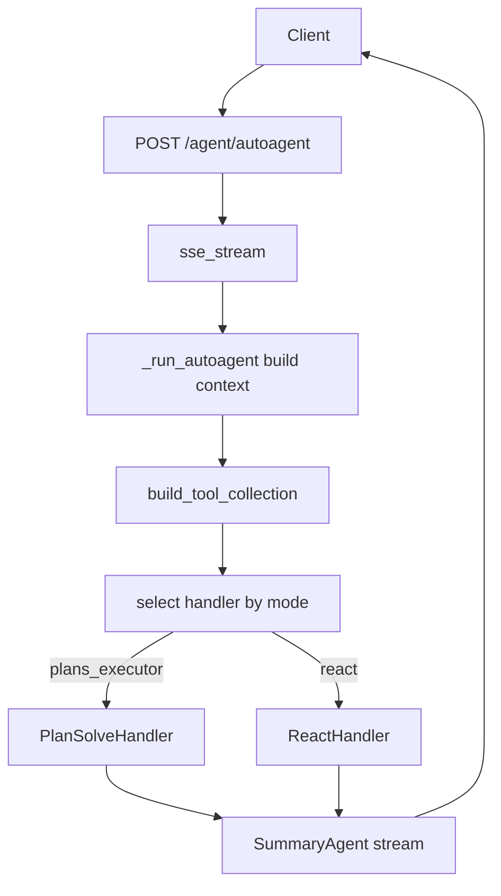
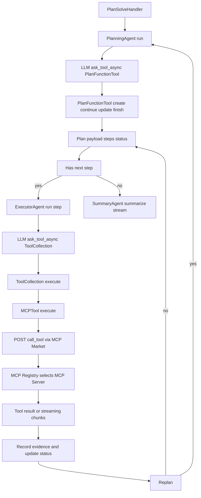
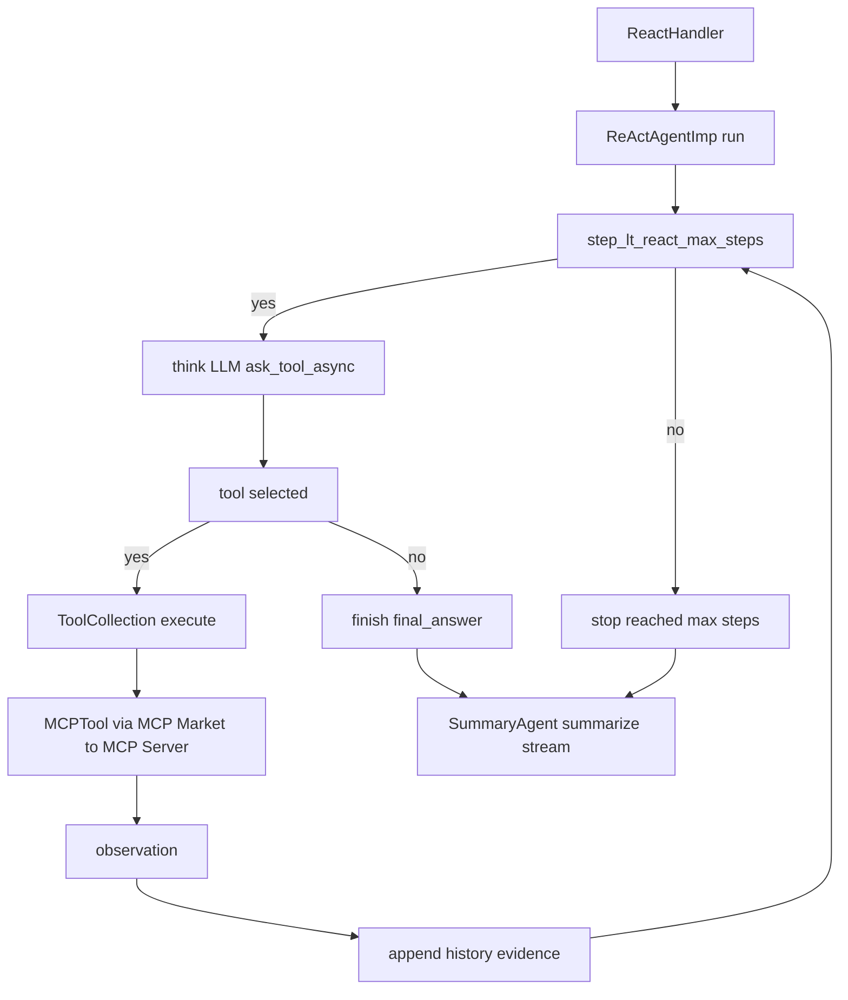

# TaskPilotAgent 服务端（代码目录 `task-pilot-agent/`）

本目录是 TaskPilotAgent 的 FastAPI 服务端实现（包含 Agent 调度、MCP 工具聚合、本地 MCP 工具进程等）。

- 仓库总体使用说明见：`../README.md`
- 配置示例见：`../config/config.yaml.example`

## 核心逻辑（源码导览）

这一节描述服务端的“主链路”，帮助你快速定位核心代码与运行时行为。

### 1) 启动与进程模型

- 入口：`main.py` 启动 FastAPI，同时拉起一个本地 MCP 子进程（见 `mcp_process.py`）。
- FastAPI 应用：`app_main.py`。启动时会设置 `APP_CONFIG_FILE=../config/config.yaml`，因此推荐从 `task-pilot-agent/` 目录启动。
- MCP Market Registry：在 FastAPI lifespan 里调用 `tools/aggre_mcp_market/app.py:init_mcp_market_registry()`，读取 `mcp.mcp_market.mcp_servers` 并定期刷新可用工具列表。

进程拓扑（同一台机器上）：

```text
taskpilotagent-master (main.py)
  ├─ taskpilotagent-mcp-server     (本地 MCP 工具进程，/mcp)
  └─ uvicorn workers x N
       ├─ taskpilotagent-api-worker
       ├─ taskpilotagent-api-worker
       └─ ...
```

关键细节：

- MCP 子进程启动：`multiprocessing.get_context("spawn")` + 启动阶段主动 `initialize()` 探活等待就绪（`mcp_process.py:_wait_for_mcp_ready()`）。
- 多 worker 下 registry 是进程内全局变量：每个 worker 都会各自初始化一份 registry，并各自启动后台 refresh 线程（见 `tools/aggre_mcp_market/app.py`、`tools/aggre_mcp_market/service/registry.py`）。
- 工具调用会跨进程：API worker 内 Agent 选中工具后，会 HTTP 调用本服务的 `/aggre_mcp_market/call_tool`，再由 registry 转发到目标 MCP Server（本地/远程）。

### 2) 请求入口与上下文构建

`POST /agent/autoagent` 的处理在 `brain/app.py`：

1. `sse_stream()` 建立 SSE 队列与心跳（每 10s 推送一次 heartbeat）。
2. `_run_autoagent()` 为请求补齐 `trace_id/user_id/agent_id/conversation_id`，并构造 `AgentContext`（携带 `requestId/run_id/outputStyle/mode` 等）。
3. `_convert_agent_messages()` 处理入参 `messages`：
   - 最后一条必须是 `role=user`，该条内容成为 `ctx.query`
   - 其他历史消息进入 `ctx.messages`，用于 planning/react prompt 的历史对话部分
   - 文件字段：最后一条 user message 的 `uploadFile` 进入 `ctx.productFiles`；其余消息的 `files` 进入 `ctx.taskProductFiles`

### 3) 工具系统：从 Agent 到 MCP Server 的调用链

工具装载发生在 `brain/app.py:build_tool_collection()`：

- 服务会请求 MCP Market：`GET /aggre_mcp_market/tools`，把返回的工具列表包装成 `brain/core/tools/mcp_tool.py:MCPTool`。
- `brain/core/tools/collection.py:ToolCollection.to_openai_tools()` 会把工具转换成 OpenAI function-calling 的 schema，供 LLM 在 `ask_tool_async()` 阶段选择调用。

执行一个工具（无论 `plans_executor` 或 `react`）时，链路大致是：

1. Agent 产生工具调用（name 通常是 MCP 的 `full_name`，例如 `mcp_local:deepsearch`）。
2. `ToolCollection.execute()` 找到对应 `MCPTool` 并执行。
3. `MCPTool.execute()` 调用 MCP Market：`POST /aggre_mcp_market/call_tool`。
4. MCP Market 通过 registry 选择对应 MCP client（SSE / Streamable HTTP），把请求转发到配置的 MCP server（本地 `mcp_local` 或远程 server）。
5. 若下游是流式返回，`MCPTool` 会把 `notifications/message`、`notifications/progress` 等事件转成 SSE 的 `notifications/result/stream` 等消息推送给前端。

补充：本地 MCP 工具由 `tools/mcp_local/mcp_server.py` 提供，包含 `code_interpreter`、`deepsearch`、`audio_tool`、`image_tool`、`video_tool`、`weather` 等。

### 4) 运行模式与调度细节（含流程图）

处理器选择由 `brain/core/handlers/factory.py:AgentHandlerFactory` 完成，按 `mode` 分发：

- 总览（从请求到最终输出）：



- `plans_executor`（兼容旧链路）：`brain/core/handlers/plan_solve.py:PlanSolveHandler`
  - `PlanningAgent` 先产出/更新计划：通过内部 `brain/core/tools/plan_tool.py:PlanFunctionTool` 执行 `create/continue/update/finish`，得到结构化 plan（title/steps/status/notes）
  - 然后逐步执行：每个 step 新建 `ExecutorAgent`，让模型在 `ask_tool_async()` 中选择工具并执行
  - 重规划：按 `core.planner_replan_each_step / core.planner_replan_on_failure / core.planner_max_replans` 控制
  - 最终交给 `SummaryAgent` 汇总（按 `summary_{outputStyle}_prompt`）并流式输出



- `react`：`brain/core/handlers/react.py:ReactHandler`
  - 内部用 `brain/core/agents/ReActAgentImp.py:ReActAgentImp` 做多轮“思考-调用工具-观察”循环
  - 到达 `core.react_max_steps` 或模型选择 finish 时停止
  - 最终仍交给 `SummaryAgent` 输出（避免把中间过程直接当最终答案）

当前默认 `core.agent_id` 指向 `task-pilot-agent`，该 Agent 的目录配置使用 `mode: react`。因此不显式传 `mode` 时，主线会优先跟随 Agent 配置走 ReAct；只有请求明确指定或旧配置没有 Agent mode 时，才会进入兼容的 `plans_executor`。



### 5) SSE 消息协议（前端如何消费）

SSE 输出由 `brain/core/printer.py:SSEPrinter` 统一封装：

- `messageType`: `task` / `plan` / `plan_thought` / `tool_thought` / `tool_result` / `notifications` / `result` 等
- `finish`: `messageType == "result"` 时置为 true
- 结束标记：流结束会额外发送一条 `data: [DONE]`

建议：

- UI 侧把 `task/notifications` 当过程日志，把 `plan` 当可视化计划，把 `result` 拼接成最终输出。
- 某些 MCP 工具会通过 `notifications/message` 推 chunk，本服务会直接把 chunk 转为 `result` 流式输出。

### 6) Prompt / 模型 / 输出样式如何切换

- PromptStore：`llm/prompt_store.py` 从 YAML 读取模板；当 `lang=en` 时会尝试加载 `prompt_en.yaml` 作为覆盖。
- LLMManager：`llm/manager.py` 支持用 `llm.contexts` 为不同阶段选择不同命名 config（planner/executor/summary/react）。
- 输出样式：请求里的 `outputStyle` 会校验，不在 `core.output_styles` 则回退到 `core.default_output_style`；Summary 阶段按 `summary_{outputStyle}_prompt` 选择 prompt key。

### 7) 持久化与状态（消息/文件/记忆）

- 消息历史：`brain/core/agents/base_agent.py:BaseAgent.add_message()` 会写入 `meta_agent_message` 表（见 `memory/message_manager.py`）。
- 文件：`/file/v1/*` 会写入 `meta_agent_file` 表并落盘到 `core.upload_dir`（见 `file/file_table_op.py`）。
- 向量记忆（mem0）：`memory/memory_mgr.py` 会按 `embedder` + `vector_store` 初始化 mem0 client（是否启用由 `memory.search_memory/search_rag` 控制）。

## 代码统计（tools/mcp_local）

当前仓库（`git ls-files`）统计 `task-pilot-agent/tools/mcp_local/`：

- 文件数：`39`
- 总行数：`7267`
- 分布（按一级目录/文件）：`tool/ 5455`、`prompt/ 918`、`util/ 407`、`mcp_server.py 299`、`model/ 159`

其中 Python 代码（`task-pilot-agent/tools/mcp_local/**/*.py`）：

- Python 文件数：`29`
- Python 总行数：`2779`
- 分布：`tool/ 2213`、`util/ 407`、`model/ 159`
